<h3 align="center">Universidad Peruana de Ciencias Aplicadas - Ingeniería de Software - 2025-10</h3>

  

<h3 align="center">1ASI0572 - Desarrollo de Soluciones IOT</h3>
<h3 align="center">NRC: 2941</h3>
<h3 align="center">Profesor: Leon Baca, Marco Antonio</h3>
<h1 align="center">Informe de Trabajo Final</h1>
<h3 align="center">Startup: Integradis</h3>
<h3 align="center">Producto: Greenhouse</h3>

<table align="center" cellpadding="5" cellspacing="0">
  <thead>
    <tr>
      <th>Nombre</th>
      <th>Código</th>
    </tr>
  </thead>
  <tbody>
    <tr>
      <td>Astuyauri Calderon, Jherson David</td>
      <td>U202218451</td>
    </tr>
    <tr>
    <tr>
      <td>Espinoza Rodríguez, Nicolás Antonio</td>
      <td>U202110278</td>
    </tr>
    <tr>
      <td>Galavis Du Bois, Alan Enrique</td>
      <td>U202110223</td>
    </tr>
    <tr>
      <td>Seminario Garbin, Carlo Luca</td>
      <td>U20211A475</td>
    </tr>
    <tr>
      <td>Soto Kong Requena, Andrés Eduardo</td>
      <td>U202116113</td>
    </tr>
  </tbody>
</table>

<h3 align="center">Junio del 2025</h3>

# Registro de versiones del Informe

| Versión | Fecha      | Autor                                                                                                                                                                                      | Descripción de modificación                                                                                                                                            |
| ------- | ---------- | ------------------------------------------------------------------------------------------------------------------------------------------------------------------------------------------ | ---------------------------------------------------------------------------------------------------------------------------------------------------------------------- |
| 1.0     | 3/04/2025  | Galavis Du Bois, Alan Enrique                                                                                                                                                              | Creación del informe y del índice                                                                                                                                      |
| 1.1     | 5/04/2025  | Galavis Du Bois, Alan Enrique                                                                                                                                                              | Redacción de perfil de integrante del equipo                                                                                                                           |
| 1.2     | 6/04/2025  | Galavis Du Bois, Alan Enrique   Astuyauri Calderon, Jherson David                                                                                                                       | Redacción de perfil de integrantes del equipo y del startup                                                                                                            |
| 1.3     | 6/04/2025  | Galavis Du Bois, Alan Enrique                                                                                                                                                              | Redacción de solution profile, antecedentes y problemática                                                                                                             |
| 1.4     | 8/04/2025  | Galavis Du Bois, Alan Enrique                                                                                                                                                              | Redacción de ubiqutous language y bounded context IAM                                                                                                                  |
| 1.5     | 13/04/2025 | Seminario Garbín, Carlo Luca                                                                                                                                                               | Redacción de perfil de integrante del equipo, software architecture diagrams y bounded context mailing                                                                 |
| 1.6     | 15/04/2025 | Soto Kong Requena, Andrés Eduardo                                                                                                                                                          | Elaboración de lean UX problem statements, lean UX assumptions, lean UX hypothesis statements y software architecture diagrams y bounded context mailing               |
| 1.7     | 20/04/2025 | Espinoza Rodríguez Nicolas Antonio                                                                                                                                                         | Elaboración de software architechture diagrams y bounded context crops                                                                                                 |
| 1.8     | 25/04/2025 | Seminario Garbín, Carlo Luca   Espinoza Rodríguez Nicolas Antonio                                                                                                                       | Elaboración de software architechture diagrams y bounded context IoT                                                                                                   |
| 1.9     | 26/04/2025 | Galavis Du Bois, Alan Enrique                                                                                                                                                           | Redacción de Project Report Collaboration Insights, redacción de Candidate Context Discovery, Domain Message Flows Modeling, Bounded Context Canvases, Context Mapping |
| 2.0     | 15/05/2025 | Astuyauri Calderon, Jherson David   Espinoza Rodríguez, Nicolás Antonio   Galavis Du Bois, Alan Enrique   Seminario Garbin, Carlo Luca   Soto Kong Requena, Andrés Eduardo | Elaboración de wireflow diagrams y userflow diagrams, elaboración de Applications UX/UI Design, Redacción del capítulo 6.1 Sprint 1                                    |
| 3.0     | 18/05/2025 | Astuyauri Calderon, Jherson David   Espinoza Rodríguez, Nicolás Antonio   Galavis Du Bois, Alan Enrique   Seminario Garbin, Carlo Luca   Soto Kong Requena, Andrés Eduardo | Redacción del capítulo 6.2 Sprint 2, desarrollo de la version final de la landing page, despliegue inicial de la web-app y mobile-app, y desarrollo del backend        |

# Project Report Collaboration Insights

El proceso de colaboración en el informe se realizó mediante commits constantes al repositorio de la organización Integradis.

Link para acceder al repositorio en GitHub: [https://github.com/Greenhouse-IoT/upc-pre-202510-1asi0572-2941-integradis-report-tb1](https://github.com/Greenhouse-IoT/upc-pre-202510-1asi0572-2941-integradis-report-tb1)

### TB1

| Integrante                          | Tareas Asignadas                                                                                                                                                                                                                                                                      |
| ----------------------------------- | ------------------------------------------------------------------------------------------------------------------------------------------------------------------------------------------------------------------------------------------------------------------------------------- |
| Astuyauri Calderon, Jherson David   | Redacción de perfil de integrante del equipo, competidores, análisis competitivo, estrategias y tácticas frente a competidores, entrevistas, user personas, user task matrix, user journey mapping, empathy mapping, as-is scenario mapping, to-be scenario mapping                   |
| Espinoza Rodríguez, Nicolás Antonio | Redacción de perfil de integrante del equipo, Strategic-Level Domain-Driven Design, EventStorming, Candidate Context Discovery, Domain Message Flows Modeling, Bounded Context Canvases, Context Mapping, Bounded Context Crops                                                       |
| Galavis Du Bois, Alan Enrique       | Redacción de perfil de integrante del equipo, descripción del startup, solution profile, antecedentes y problemática, ubiqutous language, user stories, product backlog, bouded context IAM e IoT                                                                                     |
| Seminario Garbin, Carlo Luca        | Redacción de perfil de integrante del equipo, impact mapping, software architechture system landscape diagram, software architecture context level diagrams, software architecture container level diagrams, software architecture deployment diagrams, bounded context mailing e IoT |
| Soto Kong Requena, Andrés Eduardo   | Redacción de perfil de integrante del equipo, lean UX problem statements, lean UX assumptions, lean UX hypothesis statements, lean UX, segmentos objetivo, bounded context memberships                                                                                                |

### TP1

| Integrante                          | Tareas Asignadas                                                                                                                                                                               |
| ----------------------------------- | ---------------------------------------------------------------------------------------------------------------------------------------------------------------------------------------------- |
| Astuyauri Calderon, Jherson David   | Elaboración de wireflow diagrams y userflow diagrams                                                                                                                                           |
| Espinoza Rodríguez, Nicolás Antonio | Elaboración de Applications UX/UI Design                                                                                                                                                       |
| Galavis Du Bois, Alan Enrique       | Redacción de Style Guidelines, General Style Guidelines, Web, Mobile and IoT Style Guidelines. Elaboración de Sprint Planning 1, Aspect Leaders and Collaborators y del Sprint Backlog 1       |
| Seminario Garbin, Carlo Luca        | Redacción de software configuration management, software development environment configuration, source code management, source code style guide & conventions                                  |
| Soto Kong Requena, Andrés Eduardo   | Redacción de development evidence for sprint review, testing suite evidence for sprint review, evidence for sprint review, execution evidence, services evidence y team collaboration insights |

### TB2

| Integrante                          | Tareas Asignadas                                                                                                                         |
| ----------------------------------- | ---------------------------------------------------------------------------------------------------------------------------------------- |
| Astuyauri Calderon, Jherson David   | Redacción de Aspect Leaders and Collaborators, diseño de entrevistas                                                                     |
| Espinoza Rodríguez, Nicolás Antonio | Redacción de Development Evidence for Sprint Review, Testing Suite Evidence for Sprint Review, Team Collaboration Insights during Sprint |
| Galavis Du Bois, Alan Enrique       | Realización de validation interviews, redacción de execution evidence for sprint review                                                  |
| Seminario Garbin, Carlo Luca        | Elaboracion del video About The Product, redacción del sprint planning 2 y sprint backlog 2                                              |
| Soto Kong Requena, Andrés Eduardo   | Registro de Entrevistas, Evaluaciones segun heuristicas,                                                                                 |

## GitHub Collaboration Insights

GitHub Collaboration proporciona analíticas de los commits realizados por las cuentas de los integrantes del equipo. Estas cuentas son:

- JHS-Sama24 (Jherson Astuyauri)
- trabajosUPC-AlanGalavis (Alan Galavis)
- EspinozaNaer (Nicolás Espinoza)
- CarloLSG (Carlo Seminario)
- asotito231 (Andrés Soto)

A continuación, se presentan evidencias de la colaboración de los integrantes a partir de los gráficos otorgados por GitHub Collaboration.

**TB1:**

**TP1:**

**TB2:**

Adicionalmente, GitHub presenta un timeline de las ramas principales y los procesos de merge a los que se han sometido. Todas las ramas se
crearon tomando en cuenta el diseño de GitFlow para una buena organización cuando se usa un software de control de versiones. Se
explican las ramas más prominentes:

- main: Es representada por el color negro. Se trata de la rama principal del proyecto y se actualiza para cada entregable.
- develop: Se trata de la rama principal para el proceso del desarrollo del proyecto. Sobre esta rama se hace merge de todos los capítulos, se resuelven conflictos y se corrobora que no haya ningún error.
- capitulo-1: Incluye el contenido del capítulo 1 del informe.
- capitulo-2: Incluye el contenido del capítulo 2 del informe.
- capitulo-3: Incluye el contenido del capítulo 3 del informe.
- capitulo-4: Incluye el contenido del capítulo 4 del informe.
- capitulo-5: Incluye el contenido del capítulo 5 del informe.
- capitulo-6: Incluye el contenido del capítulo 6 del informe.

**TB1:**

**TP1:**

**TB2:**

# Contenido

1. [**Capítulo I: Introducción.**](#1.)  

- 1.1. [Startup Profile.](#1.1.)  
  - 1.1.1. [Descripción del startup.](#1.1.1.) 
  - 1.1.2.[Perfiles de los integrantes del equipo.](#1.1.2.) 
- 1.2. [Solution Profile.](#1.2.) 
  - 1.2.1. [Antecedentes y Problemática.](#1.2.1.) 
  - 1.2.2. [Lean UX Process.](#1.2.2.) 
    - 1.2.2.1. [Lean UX Problem Statements.](#1.2.2.1.) 
    - 1.2.2.2. [Lean UX Assumptions.](#1.2.2.2.) 
    - 1.2.2.3. [Lean UX Hypothesis Statements.](#1.2.2.3.) 
    - 1.2.2.4. [Lean UX Canvas.](#1.2.2.4.) 
- 1.3. [Segmentos objetivo.](#1.3.) 

2. [**Capítulo II: Requirements Elicitation & Analysis.**](#2.) 

- 2.1. [Competidores.](#2.1.) 
  - 2.1.1. [Análisis competitivo.](#2.1.1.) 
  - 2.1.2. [Estrategias y tácticas frente a competidores.](#2.1.2.) 
- 2.2. [Entrevistas.](#2.2.) 
  - 2.2.1. [Diseño de entrevistas.](#2.2.1.) 
  - 2.2.2. [Registro de entrevistas.](#2.2.2.) 
  - 2.2.3. [Análisis de entrevistas.](#2.2.3.) 
- 2.3. [Needfinding.](#2.3.) 
  - 2.3.1. [User Personas.](#2.3.1.) 
  - 2.3.2. [User Task Matrix.](#2.3.2.) 
  - 2.3.3. [User Journey Mapping.](#2.3.3.) 
  - 2.3.4. [Empathy Mapping.](#2.3.4.) 
  - 2.3.5. [As-is Scenario Mapping.](#2.3.5.) 
- 2.4. [Ubiqutous Language.](#2.4.) 

3. [**Capítulo III: Requirements Specification.**](#3.) 

- 3.1. [To-Be Scenario Mapping.](#3.1.) 
- 3.2. [User Stories.](#3.2.) 
- 3.3. [Impact Mapping.](#3.3.) 
- 3.4. [Product Backlog.](#3.4.) 

4. [**Capítulo IV: Solution Software Design.**](#4.) 

- 4.1. [Strategic-Level Domain-Driven Design.](#4.1.) 
  - 4.1.1. [EventStorming.](#4.1.1.) 
    - 4.1.1.1. [Candidate Context Discovery.](#4.1.1.1.) 
    - 4.1.1.2. [Domain Message Flows Modeling.](#4.1.1.2.) 
    - 4.1.1.3. [Bounded Context Canvases.](#4.1.1.3.) 
  - 4.1.2. [Context Mapping.](#4.1.2.) 
  - 4.1.3. [Software Architecture.](#4.1.3.) 
    - 4.1.3.1. [Software Architecture System Landscape Diagram.](#4.1.3.1.) 
    - 4.1.3.2. [Software Architecture Context Level Diagrams.](#4.1.3.2.) 
    - 4.1.3.3. [Software Architecture Container Level Diagrams.](#4.1.3.3.) 
    - 4.1.3.4. [Software Architecture Deployment Diagrams.](#4.1.3.4.) 
- 4.2. [Tactical-Level Domain-Driven Design.](#4.2.) 
  - 4.2.1. [Bounded Context: Crops](#4.2.1.) 
    - 4.2.1.1. [Domain Layer.](#4.2.1.1.) 
    - 4.2.1.2. [Interface Layer.](#4.2.1.2.) 
    - 4.2.1.3. [Application Layer.](#4.2.1.3.) 
    - 4.2.1.4. [Infrastructure Layer.](#4.2.1.4.) 
    - 4.2.1.5. [Bounded Context Software Architecture Component Level Diagrams.](#4.2.1.5.) 
    - 4.2.1.6. [Bounded Context Software Architecture Code Level Diagrams.](#4.2.1.6.) 
      - 4.2.1.6.1. [Bounded Context Domain Layer Class Diagrams.](#4.2.1.6.1.) 
      - 4.2.1.6.2. [Bounded Context Database Design Diagram.](#4.2.1.6.1.) 
  - 4.2.2. [Bounded Context: IAM](#4.2.2.) 
    - 4.2.2.1. [Domain Layer.](#4.2.2.1.) 
    - 4.2.2.2. [Interface Layer.](#4.2.2.2.) 
    - 4.2.2.3. [Application Layer.](#4.2.2.3.) 
    - 4.2.2.4. [Infrastructure Layer.](#4.2.2.4.) 
    - 4.2.2.5. [Bounded Context Software Architecture Component Level Diagrams.](#4.2.2.5.) 
    - 4.2.2.6. [Bounded Context Software Architecture Code Level Diagrams.](#4.2.2.6.) 
      - 4.2.2.6.1. [Bounded Context Domain Layer Class Diagrams.](#4.2.2.6.1.) 
      - 4.2.2.6.2. [Bounded Context Database Design Diagram.](#4.2.2.6.2.) 
  - 4.2.3. [Bounded Context: Mailling](#4.2.3.) 
    - 4.2.3.1. [Domain Layer.](#4.2.3.1.) 
    - 4.2.3.2. [Interface Layer.](#4.2.3.2.) 
    - 4.2.3.3. [Application Layer.](#4.2.3.3.) 
    - 4.2.3.4. [Infrastructure Layer.](#4.2.3.4.) 
    - 4.2.3.5. [Bounded Context Software Architecture Component Level Diagrams.](#4.2.3.5.) 
    - 4.2.3.6. [Bounded Context Software Architecture Code Level Diagrams.](#4.2.3.6.) 
      - 4.2.3.6.1. [Bounded Context Domain Layer Class Diagrams.](#4.2.3.6.1.) 
      - 4.2.3.6.2. [Bounded Context Database Design Diagram.](#4.2.3.6.2.) 
  - 4.2.4. [Bounded Context: Memberships](#4.2.4.) 
    - 4.2.4.1. [Domain Layer.](#4.2.4.1.) 
    - 4.2.4.2. [Interface Layer.](#4.2.4.2.) 
    - 4.2.4.3. [Application Layer.](#4.2.4.3.) 
    - 4.2.4.4. [Infrastructure Layer.](#4.2.4.4.) 
    - 4.2.4.5. [Bounded Context Software Architecture Component Level Diagrams.](#4.2.4.5.) 
    - 4.2.4.6. [Bounded Context Software Architecture Code Level Diagrams.](#4.2.4.6.) 
      - 4.2.4.6.1. [Bounded Context Domain Layer Class Diagrams.](#4.2.4.6.1.) 
      - 4.2.4.6.2. [Bounded Context Database Design Diagram.](#4.2.4.6.2.) 
  - 4.2.5. [Bounded Context: IoT](#4.2.5.) 
    - 4.2.5.1. [Domain Layer.](#4.2.5.1.) 
    - 4.2.5.2. [Interface Layer.](#4.2.5.2.) 
    - 4.2.5.3. [Application Layer.](#4.2.5.3.) 
    - 4.2.5.4. [Infrastructure Layer.](#4.2.5.4.) 
    - 4.2.5.5. [Bounded Context Software Architecture Component Level Diagrams.](#4.2.5.5.) 
    - 4.2.5.6. [Bounded Context Software Architecture Code Level Diagrams.](#4.2.5.6.) 
      - 4.2.5.6.1. [Bounded Context Domain Layer Class Diagrams.](#4.2.5.6.1.) 
      - 4.2.5.6.2. [Bounded Context Database Design Diagram.](#4.2.5.6.2.) 

5. [**Capítulo V: Solution UI/UX Design.**](#5.) 
   - 5.1. [Style Guidelines.](#5.1.) 
     - 5.1.1. [General Style Guidelines.](#5.1.1.) 
     - 5.1.2. [Web, Mobile and IoT Style Guidelines.](#5.1.2.) 
   - 5.2. [Information Architecture.](#5.2.) 
     - 5.2.1. [Organization Systems.](#5.2.1.) 
     - 5.2.2. [Labeling Systems.](#5.2.2.) 
     - 5.2.3. [SEO Tags and Meta Tags.](#5.2.3.) 
     - 5.2.4. [Searching Systems.](#5.2.4.) 
     - 5.2.5. [Navigation Systems.](#5.2.5.) 
   - 5.3. [Landing Page UI Design.](#5.3.) 
     - 5.3.1. [Landing Page Wireframe.](#5.3.1.) 
     - 5.3.2. [Landing Page Mock-up.](#5.3.2.) 
   - 5.4. [Applications UX/UI Design.](#5.4.) 
     - 5.4.1. [Applications Wireframes.](#5.4.1.) 
     - 5.4.2. [Applications Wireflow Diagrams.](#5.4.2.) 
     - 5.4.3. [Applications Mock-ups.](#5.4.3.) 
     - 5.4.4. [Applications User Flow Diagrams.](#5.4.4.) 
   - 5.5. [Applications Prototyping.](#5.5.) 
6. [**Capítulo XI: Solution Software Design.**](#6.) 

- 6.1. [Software Configuration Management.](#6.1.) 
  - 6.1.1. [Software Development Environment Configuration.](#6.1.1.) 
  - 6.1.2. [Source Code Management.](#6.1.2.) 
  - 6.1.3. [Source Code Style Guide & Conventions.](#6.1.3.) 
  - 6.1.4. [Software Deployment Configuration.](#6.1.4.) 
- 6.2. [Landing Page, Services & Applications Implementation.](#6.2.) 
  - 6.2.1. [Sprint 1.](#6.2.1.) 
    - 6.2.1.1. [Sprint Planning 1.](#6.2.1.1.) 
    - 6.2.1.2. [Aspect Leaders and Collaborators.](#6.2.1.2.) 
    - 6.2.1.3. [Sprint Backlog 1.](#6.2.1.3.) 
    - 6.2.1.4. [Development Evidence for Sprint Review.](#6.2.1.4.) 
    - 6.2.1.5. [Testing Suite Evidence for Sprint Review.](#6.2.1.5.) 
    - 6.2.1.6. [Execution Evidence for Sprint Review.](#6.2.1.6.) 
    - 6.2.1.7. [Services Documentation Evidence for Sprint Review.](#6.2.1.7.) 
    - 6.2.1.8. [Software Deployment Evidence for Sprint Review.](#6.2.1.8.) 
    - 6.2.1.9. [Team Collaboration Insights during Sprint.](#6.2.1.9.) 
  - 6.2.2. [Sprint 2.](#6.2.2.) 
    - 6.2.2.1. [Sprint Planning 2.](#6.2.2.1.) 
    - 6.2.2.2. [Aspect Leaders and Collaborators.](#6.2.2.2.) 
    - 6.2.2.3. [Sprint Backlog 2.](#6.2.2.3.) 
    - 6.2.2.4. [Development Evidence for Sprint Review.](#6.2.2.4.) 
    - 6.2.2.5. [Testing Suite Evidence for Sprint Review.](#6.2.2.5.) 
    - 6.2.2.6. [Execution Evidence for Sprint Review.](#6.2.2.6.) 
    - 6.2.2.7. [Services Documentation Evidence for Sprint Review.](#6.2.2.7.) 
    - 6.2.2.8. [Software Deployment Evidence for Sprint Review.](#6.2.2.8.) 
    - 6.2.2.9. [Team Collaboration Insights during Sprint.](#6.2.2.9.) 

[**Conclusiones.**](#conclusiones) 
[**Bibliografía.**](#referencias) 
[**Anexos.**](#referencias) 

# Student Outcome

<table cellpadding="5" cellspacing="0">
  <thead>
    <tr>
      <th>Criterio específico</th>
      <th>Acciones realizadas</th>
      <th>Conclusiones</th>
    </tr>
  </thead>
  <tbody>
    <tr>
      <td>Trabaja en equipo para proporcionar liderazgo en forma conjunta</td>
      <td>
      <i>TB1</i> 
      <b>Astuyauri Calderón, Jherson David:</b>
      Lideré la elaboración del Capítulo II: Requirements Elicitation & Analysis, incluyendo el análisis competitivo, diseño de entrevistas y herramientas UX como User Personas y Empathy Mapping. Guié al equipo hacia decisiones centradas en el usuario,   fomentando el liderazgo compartido y el consenso en todo momento 
       
      <i>TP1</i> 
      <b>Astuyauri Calderón, Jherson David:</b>
       Apoyé en el diseño de los wireflows y userflows tanto de la aplicación web como móvil. Participé activamente en la organización de las ideas del equipo y en el levantamiento de flujos centrados en la experiencia de usuario. 
       
      <i>TB2</i> 
      <b>Astuyauri Calderón, Jherson David: En el desarrollo del segundo entregable técnico (TB2), lideré la documentación de los servicios desarrollados, la planificación de roles (aspect leaders and collaborators), y la creación de la evidencia del testing suite y colaboración del equipo. También guié la sección de entrevistas de validación y redacté las conclusiones del capítulo final. </b>
       
       
      <i>TB1</i> 
      <b>Espinoza Rodríguez, Nicolás Antonio:</b>
      Durante el presente trabajo se colaboró en equipo para la definición de los bounded context que conforman la totalidad de la aplicación. Los diagramas se realizaron en conjunto y combinando la experiencia anterior de los miembros del equipo.  
      <i>TP1</i> 
      <b>Espinoza Rodríguez, Nicolás Antonio:</b>
      Se realizó la colaboración en equipo para el desarrollo del figma con los mockups del proyecto. Durante este proceso de diseño en base a los requisitos de las historia de usuario, se involucró mucho trabajo en equipo para la validación de requisitos y la creación de un producto con el mayor estándar de calidad  
      <i>TB2</i> 
      <b>Espinoza Rodríguez, Nicolás Antonio:</b>
        
      <i>TB1</i> 
      <b>Galavis Du Bois, Alan Enrique:</b>
      Durante el desarrollo del proyecto, me aseguré de comunicar y orientar a mis compañeros de equipo el alcance, restricciones y objetivos del trabajo, con la finalidad de proponer un proyecto que responda al problema definido. 
       
      <i>TP1</i> 
      <b>Galavis Du Bois, Alan Enrique:</b>
      Me aseguré de participar activamente en la organización del proyecto, al igual que en la colaboración con el cliente para validar que el desarrollo de la solución se ajuste con los requisitos esperados. 
       
      <i>TB2</i> 
      <b>Galavis Du Bois, Alan Enrique:</b> 
      Colabore durante el desarrollo de la mobile app, encargandome de las diferentes vistas, la integracion con la IA y la conexion con el backend para enviar y recibir los datos.
       
       
      <i>TB1</i> 
      <b>Seminario Garbín, Carlo Luca:</b>
      Se realizó un inicio de prototipo de dispositivos IoT para poder experimentar e iniciar el desarrollo del trabajo con tiempo. 
       
      <i>TP1</i> 
      <b>Seminario Garbín, Carlo Luca:</b>
      Se realizó el despliegue del backend para que mis compañeros puedan hacer uso de las funcionalidades y hacer un flujo de trabajo más óptimo, comunicando bugs o caídas para poder darles mantenimiento. 
       
      <i>TB2</i> 
      <b>Seminario Garbín, Carlo Luca:</b> Me encargue de desarrollar el edge device e embedded applications para recibir la informacion desde un esp32 a nuestro back desplegado
       
       
      <i>TB1</i> 
      <b>Soto Kong Requena, Andrés Eduardo:</b> Fui responsable de la definición y desarrollo de los bounded context correspondientes a los módulos de Mail y Memberships. A través de su enfoque en la estructuración de estos contextos, contribuyó significativamente a la organización y modularización de la aplicación, asegurando una integración coherente con los demás componentes del sistema. 
       
      <i>TP1</i> 
      <b>Soto Kong Requena, Andrés Eduardo:</b> Fui responsable de la definición y desarrollo de los bounded context correspondientes a los módulos de Mail y Memberships. A través de su enfoque en la estructuración de estos contextos, contribuyó significativamente a la organización y modularización de la aplicación, asegurando una integración coherente con los demás componentes del sistema. 
       
      <i>TB2</i> 
      <b>Soto Kong Requena, Andrés Eduardo:</b> Me encargue de documentar las entrevistas de validaciones de cada sector especifico entrevistado, asi como las plataformas presentadas a los mismos.
       
       
      </td>
      <td>El equipo trabajó de manera colaborativa y eficiente, asumiendo roles clave en diversas áreas del proyecto. Se lideró el análisis de requisitos y la implementación de herramientas UX, mientras que se definieron y estructuraron los bounded contexts de la aplicación. Además, se orientó al equipo sobre los objetivos del proyecto, se desarrolló un prototipo de IoT de manera temprana y se aseguraron módulos integrados y coherentes para una solución efectiva. En conjunto, se logró una ejecución fluida y alineada con el problema a resolver.</td>
    </tr>
    <tr>
    <tr>
      <td>Crea un entorno colaborativo e inclusivo, establece metas, planifica tareas y cumple objetivos. </td>
      <td>
      <i>TB1</i> 
      <b>Astuyauri Calderón, Jherson David:</b>
      Desarrollé y estructuré gran parte del Capítulo II, gestionando tareas como el As-is Scenario Mapping y la planificación del análisis de entrevistas. Promoví un entorno inclusivo con metas claras y coordinación efectiva para cumplir los objetivos del equipo 
       
      <i>TP1</i> 
      <b>Astuyauri Calderón, Jherson David:</b>
      Apoyé en la elaboración de los wireflows y userflows de ambas aplicaciones, organizando tareas por prioridad y asegurando entregables claros. 
       
        <i>TB2</i> 
      <b>Astuyauri Calderón, Jherson David: Coordiné múltiples entregables clave como el Testing Suite, la documentación de servicios, y las evidencias de colaboración del equipo. Gestioné el contenido final del capítulo de conclusiones y validé la planificación de entrevistas. Aporté al entorno colaborativo al clarificar objetivos, planificar tareas técnicas y asegurar el cumplimiento de los entregables. </b>  
      <i>TB1</i> 
      <b>Espinoza Rodríguez, Nicolás Antonio:</b>
      Se consideró como primer sprint del equipo el desarrollo de los artefactos de gestión y el planeamiento del proyecto. Se realizó el proceso del planning poker y se lograron estimar las historias de usuario que conforman nuestro backlog y alcance del proyecto.   
      <i>TP1</i> 
      <b>Espinoza Rodríguez, Nicolás Antonio:</b>
      Se delegó a cada miembro del equipo el desarrollo de un apartado de los mock-ups. Luego, se procedió con la compartición de ideas y feedback respecto a las partes desarrolladas del figma del proyecto. En este entorno, se establecieron objetivos a alcanzar, tareas a realizar y metas conjuntas del equipo.  
      <i>TB1</i> 
      <b>Galavis Du Bois, Alan Enrique:</b>
      Me aseguré de repartir el trabajo de manera equitativa y de acuerdo al perfil de cada integrante del equipo, de forma que todos los miembros puedan cumplir con sus tareas con éxito 
       
      <i>TP</i> 
      <b>Galavis Du Bois, Alan Enrique:</b>
      Establecí el WIP limit, sobre el cual el equipo definirá la cadencia de trabajo necesaria para cumplir con todo el sprint backlog. Se cumplió en su totalidad el objetivo del sprint. 
       
      <i>TB2</i> 
      <b>Galavis Du Bois, Alan Enrique:</b>
      Me encargue de realizar las entrevistas de usabilidad de las diferentes interfaces presentadas a cada uno de los usuarios establecidos que haran uso de las aplicaciones. 
       
      <i>TB1</i> 
      <b>Seminario Garbín, Carlo Luca:</b>
      Colabaré con mis compañeros expresando las ideas colaborativas para la integración de IoT, de modo que podamos lograr una solución adecuada para el contexto. 
       
      <i>TP1</i> 
      <b>Seminario Garbín, Carlo Luca:</b>
      Apoyé distribuyendo el trabajo entre el equipo escuchando propuestas y aportando ideas para avanzar de forma colaborativa en base a metas y objetivos. 
       
      <i>TB2</i> 
      <b>Seminario Garbín, Carlo Luca:</b> Me encargue del despliegue en su totalidad de las diferentes aplicaciones desarrolladas configurando la plataforma de despliegue de amazon web services
       
      <i>TB1</i> 
      <b>Soto Kong Requena, Andrés Eduardo</b>: Colabore para obtener un entorno colaborativo e inclusivo, asegurándose de que todas las metas fueran claras y alcanzables. Se encargó de coordinar tareas clave en el proceso de planificación, estableciendo un flujo de trabajo organizado y apoyando al equipo en el cumplimiento de los objetivos establecidos. 
       
      <i>TP</i> 
      <b>Soto Kong Requena, Andrés Eduardo</b>: Me encargue de aportar ideas para integraciones, asi como el desarrollo en codigo de la webapp. 
       
      <i>TB2</i> 
      <b>Soto Kong Requena, Andrés Eduardo</b>: Me encargue de desarrollar las heuristicas de desarrollo ux y ui. Asi como implementar las mismas en la aplicaciones web y desarrollar funcionalidades de la misma.
      </td>
      <td>El equipo trabajó de manera colaborativa e inclusiva, estableciendo metas claras y alcanzables para cumplir los objetivos del proyecto. Se promovió un ambiente de trabajo organizado y se gestionaron tareas clave como la planificación de entrevistas, el desarrollo de artefactos de gestión y la estimación de historias de usuario. Además, se distribuyó el trabajo de manera equitativa según las habilidades de cada miembro, se propusieron ideas colaborativas para la integración de IoT, y se garantizó una coordinación efectiva para lograr una solución adecuada y alineada con los objetivos del equipo.</td>
    </tr>
  </tbody>
</table>

<h1 id='1.'>1. Capítulo I: Introducción</h1>
<h2 id='1.1.'>1.1. Startup Profile</h2>
En esta sección se presenta la descripción del startup y los perfiles de los miembros del equipo.
<h3 id='1.1.1.'>1.1.1. Descripción de la Startup</h3>
Integradis es una startup que busca modernizar el proceso de documentación de actividades y automatizar la medición de parámetros ambientales en las fábricas productoras de champiñones del Perú. El equipo identificó que el uso de sensores manuales y mantener una documentación escrita en la industria actual no solo es arcaico e ineficiente, sino que puede llevar a mediciones imprecisas, lo cual impacta directamente en la calidad y cantidad de la producción final. Bajo este contexto, el equipo identificó una oportunidad para brindar una solución IoT que permita llevar un mejor control sobre estos procesos, con el fin de mitigar los errores asociados al factor humano, y de fomentar el registro digital de procesos.
 

<b>Misión:</b> Agilizar e impulsar la digitalización de la documentación y monitoreo de los principales procesos de las fábricas productoras de champiñones del Perú.

<b>Visión:</b> Dentro de los próximos 6 años, ser reconocidos como un modelo de negocio sostenible, líder en el desarrollo de plataformas que modernicen la cadena de producción de champiñones a nivel nacional.

Valores:

- Adaptabilidad: Estamos siempre dispuestos a adaptarnos a las necesidades de nuestros usuarios, a los cambios del mercado y las nuevas tendencias en el sector de agricultura.
- Confianza: Trabajamos de manera constante para generar confianza y seguridad en todas nuestras actividades.
- Constancia: Nos esforzamos por mantener una constante mejora en la calidad de nuestros servicios.
- Disponibilidad: Contamos con un equipo disponible gran parte del día para atender todas las necesidades, dudas o problemas que tengan nuestros usuarios en los diferentes productos o servicios que ofrecemos.

<h3 id='1.1.2.'>1.1.2. Perfiles de integrantes del equipo</h3>

| Foto                                                                                                        | Nombres y apellidos                    | Código de alumno | Carrera                | Descripción                                                                                                                                                                                                                                                                                                                                                                                                                                                                                                                                                                                                                                                                                          |
| ----------------------------------------------------------------------------------------------------------- | -------------------------------------- | ---------------- | ---------------------- | ---------------------------------------------------------------------------------------------------------------------------------------------------------------------------------------------------------------------------------------------------------------------------------------------------------------------------------------------------------------------------------------------------------------------------------------------------------------------------------------------------------------------------------------------------------------------------------------------------------------------------------------------------------------------------------------------------- |
|  | **Jherson David Astuyauri Calderón**   | U202218451       | Ingeniería de Software | Hola, soy Jherson Astuyauri. Tengo 20 años y actualmente curso el séptimo ciclo de la carrera de Ingeniería de Software. Elegí esta carrera porque me apasiona la tecnología y su impacto en la evolución del mundo, así como en la mejora de la calidad de vida de las personas. Actualmente, me interesan especialmente las áreas de inteligencia artificial y ciberseguridad. Puedo aportar al equipo con los conocimientos técnicos que he adquirido a lo largo de los cursos previos, además de mi capacidad para trabajar en equipo de manera efectiva, con una actitud proactiva y responsabilidad.                                                                                           |
|   | **Nicolás Antonio Espinoza Rodríguez** | U202110278       | Ingeniería de Software | Mi nombre es Nicolás Espinoza. Tengo 21 años y estoy estudiando la carrera de ingeniería de software en la UPC desde el año 2021. Soy una persona creativa e imaginativa, lo que me ayuda a aportar soluciones para resolver los problemas en común. También, me considero empático y colaborativo, lo que facilita el trabajo en equipo con mis compañeros. Finalmente, me considero una persona ordenada y con ambición, lo que ayuda a trazar metas posibles y significativas para la solución que queremos presentar como equipo. Soy competente en los lenguajes de programación C++, Python y Javascript. Además, tengo conocimiento de tecnologías ágiles y software de control de versiones. |
|            | **Alan Enrique Galavís Du Bois**       | U202110223       | Ingeniería de Software | Mi nombre es Alan Galavis, tengo 21 años y actualmente curso el noveno ciclo de la carrera de Ingeniería de Software en la Universidad Peruana de Ciencias Aplicadas. Mi formación académica se ha centrado en el diseño y desarrollo de proyectos de alta calidad, desde simples landing pages hasta aplicaciones web y móviles con RESTful APIs. Para este proyecto puedo aportar con mi capacidad de crear un software eficiente y escalable que brinda las mejores experiencias de usuario. Mi compromiso y conocimientos en gestión de proyectos ágiles me permiten colaborar de manera exitosa en equipos de trabajo.                                                                          |
|      | **Carlo Luca Seminario Garbín**        | U20211A475       | Ingeniería de Software | Mi nombre es Carlo Luca Seminario, tengo 21 años de edad y actualmente curso el noveno ciclo de la carrera de ingeniería de software en la Universidad Peruana de Ciencias Aplicadas (UPC). Considero que soy una persona que es capaz de trabajar bajo presión, además de ser responsable y perseverante. En cuanto a cualidades para la realización del trabajo considero que soy bueno identificando problemáticas y buscando soluciones, a lo que le puedo sumar los conocimientos adquiridos en cursos de programación y prácticas                                                                                                                                                              |
|                  | **Andrés Eduardo Soto Kong Requena**   | U202116113       | Ingeniería de Software | Soy Andres Soto, tengo 21 años. Me encuentro cursando el 9no ciclo de la carrera de ingenieria de software en la Universidad Peruana de Ciencias Aplicadas (UPC). Adicionalmente me encuentro trabajando como desarrollador de componentes para una plataforma CRM. Considero que tengo habilidades de comunicacion y desarrollo de problemas. Por otro lado me gusta desarrollar aplicaciones web dentro de mi tiempo libre.                                                                                                                                                                                                                                                                        |

<h2 id='1.2.'>1.2. Solution Profile</h2>
<h3 id='1.2.1.'>1.2.1. Antecedentes y problemática</h3>
A continuación, se presentan las secciones de Antecedentes y Problemática, y Lean UX Process. La primera consta del enunciado de problema y una descripción de los puntos más importantes que debe resolver la solución, del mismo modo se presentan los objetivos y restricciones que delimitan el alcance del proyecto. La segunda sección es el resultado de la ejecución del Lean UX Process sobre el dominio del problema.

#### **What? (¿Qué?)**

**¿Cuál es el problema?**

Actualmente, las fábricas de champiñones del Perú emplean un registro manual de las actividades que realizan. Esta práctica es difícil de mantener, poco sostenible con el medio ambiente y susceptible a ineficiencias relacionadas con errores humanos, así como a la pérdida de documentos físicos.
Por otro lado, los administradores de dichas empresas no cuentan con un método confiable para recibir en tiempo real los reportes del estado de los cultivos. Como consecuencia, los administradores se ven en la necesidad de realizar con gran frecuencia visitas a las fábricas, las cuales en su mayoría están ubicadas en zonas lejanas.

#### **When? (¿Cuándo?)**

**¿Cuándo sucede el problema?**

El problema está presente al momento de entablar un análisis del estado y evolución de los procesos llevados a cabo en la fábrica. Debido a que los registros están en formato físico, se necesita buscar entre los archivos de la fábrica y revisar individualmente cada uno de los informes, lo cual resulta tedioso dado el volumen extenso de información registrada a lo largo del tiempo. Además, está presente al momento de medir y ajustar los parámetros de las naves de cultivo, ya que, actualmente, los trabajadores deben de utilizar periódicamente sensores manuales para controlar las condiciones ambientales, lo cual está sujeto a errores asociados al factor humano.

#### **Where? (¿Dónde?)**

**¿Dónde surge el problema?**

El problema se manifiesta en las fábricas de champiñones ubicadas a nivel nacional, y, por lo tanto, en cada una de las áreas que la componen (Patio de preparación del compost, búnker, túnel de pasteurización y naves).

#### **Who? (¿Quién?)**

**¿Quiénes están involucrados? ¿Quién lo utilizará?**

Los usuarios del sistema serían los técnicos encargados de la supervisión y cuidado de los cultivos, y los administradores de las fábricas champiñoneras en Perú. Por un lado los administradores de la fábrica utilizarán la plataforma para visualizar las mediciones registradas por sus trabajadores y por el sistema IoT. Por otro lado, los técnicos supervisores registrarán los procesos que no pueden ser medidos a través de sensores ni controlados por medio de actuadores, como el listado de materiales para elaborar el compost, y las actividades realizadas en el patio. Los datos recopilados en la aplicación permitirá que los trabajadores tomen decisiones estratégicas informadas sobre la asignación de recursos, la programación de tareas y la identificación de áreas de mejora en la producción.

#### **Why? (¿Por qué?)**

**¿Cuál es la causa del problema?**

La causa principal del problema es la ausencia de un programa que permita registrar con facilidad y de manera digital las actividades de la fábrica. Excel no se presenta como una alternativa viable, puesto que son pocos los trabajadores de las fábricas de champiñones que cuentan con la experiencia y habilidades necesarias para utilizarlo eficientemente.

#### **How? (¿Cómo?)**

**¿Cómo se utilizará el producto?**

Los técnicos y administradores tendrán la posibilidad de acceder a la aplicación a través de sus dispositivos móviles o desde un navegador. La aplicación móvil será usada por técnicos supervisores para registrar datos en formularios digitales específicos para los procesos que no pueden ser automatizados por sensores y actuadores, como la preparación del sustrato (compost), la siembra o el proceso de pasteurización en el túnel. Los datos se almacenarán en una base de datos segura y se presentarán en gráficos y listas fácil de entendimiento para el usuario cuando éste lo solicite.
Por otro lado, los administradores de las fábricas utilizarán la aplicación web para supervisar de manera remota los informes periódicos registrados por los técnicos y por el sistema IoT, con el objetivo de tener una visión general en tiempo real del estado de la producción.

**¿Cómo lograremos desarrollar la correcta gestión de cultivos de champiñones dentro de la plataforma?**

El proceso de cultivo de champiñones está dividido en cuatro etapas distintas: La preparación de la mezcla del compost en el patio, la cocción de la mezcla en el búnker, la pasteurización del compost en el túnel y la incubación, cobertura, inducción y cosecha de los champiñones en las naves de crecimiento. La aplicación abarca cada una de estas fases y la distingue de manera adecuada. Cabe recalcar que el sistema IoT únicamente se enfocará en la última etapa del cultivo de champiñones, es decir, aquellos procesos que se realizan en las naves de cultivo. Específicamente, se utilizarán sensores IoT para medir la temperatura y humedad del ambiente.
Las fábricas mantienen un seguimiento del estado y progreso de las actividades realizadas en cada una de las fases de cultivo, por ello, es fundamental que los técnicos supervisores utilicen nuestra aplicación para presentar informes periódicos correspondientes a sus labores. La aplicación, a su vez, permitirá visualizar reportes estadísticos para evaluar el rendimiento y la eficiencia de cada fase del proceso de producción de champiñones.

#### **How much? (Cuánto)**

**¿Cuál es la magnitud del problema?**

Según Agro Perú (2023), en el año 2022, el Perú exportó 850 toneladas de champiñones secos por un valor de USD 7,1 millones. Ello representó un aumento del 11 % en volumen y 4 % en valor más que en el año 2021. Estos datos indican que el número de exportaciones aparenta ser próspero, lo que confirma la solidez del mercado seleccionado.
Sin embargo, una encuesta realizada por Cajo y Rosales (2022) revela que, de las 58 empresas agroindustriales peruanas, el 33.9% no administra ni actualiza de manera adecuada el inventario, las características y los cambios en los cultivos. Por otro lado, el resto de las empresas aún realiza estos procesos de forma manual y, por tanto, con márgenes de error muy altos por el factor humano. Por esta razón, resulta necesario el acceso a un software amigable (aplicación móvil) con un proceso de automatización adecuado para agilizar y monitorear el registro de las fases involucradas en la producción de cultivos de estas industrias.
De acuerdo con The Yield Lab (2019), el reto para los startups de la industria agrícola es alcanzar soluciones para la producción de alimentos de una forma más sustentable y eficiente debido al incremento de la demanda en Latinoamérica. Es ahí que se ve implicada Greenhouse como alternativa de solución.

**¿Qué porcentaje del personal de la industria champiñonera se verá beneficiado por el servicio?**

El sistema puede ser utilizado por múltiples técnicos, supervisores y administradores, quiénes incorporan al personal de las fábricas dedicadas a la producción de champiñones. No hay un límite preciso en cuanto al número de usuarios; sin embargo, se estima que alrededor del 35% de usuarios dentro de este sector se verán beneficiados de la implementación de la aplicación.

<h3 id='1.2.2.'>Lean UX Process</h3>
<h4 id='1.2.2.1.'>1.2.2.1. Lean UX Problem Statements</h4>

El propósito de Greenhouse es proporcionar a las fábricas champiñoneras del Perú un sistema de monitoreo de cultivos. Técnicos supervisores y administradores del personal trabajador contarán con la capacidad de registrar los procesos productivos implicados en la producción de champiñones.
El problema está presente al momento de realizar el registro de procesos que se llevan a cabo durante el cultivo de champiñones, dado que actualmente las fábricas champiñoneras llevan un registro manual y físico. La ineficiencia del registro y la dependencia del personal técnico y de supervisión a los métodos manuales, como registros en papel y hojas de cálculo digitales, involucra un índice de ocurrencia significativo de omisiones, errores de transcripción y falta de consistencia en la información relevante para la gestión de las fases posteriores de cultivo.
Hemos observado que la falta de precisión en la recopilación y supervisión de datos altera la capacidad de tomar decisiones informadas en tiempo real, lo que repercute en la eficiencia de la producción. Adicionalmente, esta ausencia de confiabilidad en los datos resulta en impactos negativos en la certificación de calidad de la fábrica, la trazabilidad de los cultivos y, en última instancia, en el desempeño competitivo frente al resto de la industria champiñonera peruana en los mercados nacionales e internacionales.
A partir de lo anterior, resulta posible plantear la principal interrogante que el proyecto propone resolver:

**¿Cómo podríamos impulsar la digitalización del registro y monitoreo de la información proveniente de los procesos implicados en la producción de champiñones?**

<h4 id='1.2.2.2.'>1.2.2.2. Lean UX Assumptions</h4>

**Business Assumptions:**

**Creemos que** nuestros usuarios necesitan una forma más eficiente de registrar y monitorear los procesos productivos implicados en el cultivo industrial de champiñones.

**Estas necesidades se pueden resolver con** el desarrollo de una plataforma móvil y web que integre tecnologías IoT y que permita el acceso oportuno y confiable a la documentación de procesos en las fábricas champiñoneras del Perú.

**El valor #1 que mi cliente quiere de mi servicio es** registrar las actividades y medición de parámetros involucrados en cada fase productiva dentro del cultivo de champiñones y visualizar los datos relacionados a los procesos registrados a lo largo del tiempo.

**El cliente también puede obtener beneficios adicionales como** disminuir la intervención humana en la medición de parámetros ambientales en cuartos de cultivo. Notificar a los administradores en caso de que los trabajadores deseen realizar cambios o correcciones a la información documentada.

**Voy a adquirir la mayoría de mis clientes** mediante publicidad en redes sociales y campañas de retención en las fábricas del sector productivo de champiñones en el Perú.

**Haré dinero a través de** un modelo de suscripción de diferentes categorías para el uso de la aplicación por parte de las empresas.

**Mi competencia principal en el mercado serán** las plataformas propias de agroempresas direccionadas al monitoreo o control de cultivos agrícolas.

**Los venceremos debido a** que nuestra plataforma incluye el registro de procesos productivos de cultivos a partir de la segmentación de fases involucradas en el desarrollo exclusivamente de la industria de champiñones, y a través de la automatización del monitoreo de parámetros ambientales a través de tecnología IoT.

**El mayor riesgo es** que el segmento objetivo no se muestre dispuesto e interesado en automatizar los procesos productivos de cultivo. Las razones vendrían a ser de un contexto interno social: problemas de adaptación, pensamiento estático y dificultad en el manejo de herramientas tecnológicas.

**Resolveremos esto a través de** un diseño dinámico e intuitivo para el usuario. De igual forma, se realizará una revisión constante de la plataforma y actualizaciones en caso de inserción de funcionalidades adicionales o mejoras.

**User Assumptions:**

¿Quién es el usuario?
Los usuarios son, en primera parte, el personal técnico supervisor y administrativo que trabajan en las fábricas champiñoneras del Perú. Una vez se obtenga acogida en fábricas que se adhieren a la metodología de la plataforma durante su cultivo, se planea extender la funcionalidad para incluir una variedad de metodologías usadas por diferentes empresas en la industria champiñonera.

¿Qué problemas tiene nuestro producto? ¿Resolver?
Un problema que enfrenta actualmente la aplicación radica en la ausencia de la identificación automática de etapas involucradas dentro de los cultivos de champiñones. En ese sentido, los técnicos supervisores deben realizar dicha especificación de manera manual, es decir, deben registrar cuando el cultivo cambie de fase. Para resolver este problema, se conversará con los trabajadores de la industria para coordinar alertas que puedan ayudar al producto a distinguir de manera automática los cambios de etapa.

¿Qué características son importantes?
Las características más importantes de la plataforma son: el registro y monitoreo de las fases productivas e insumos involucrados en los cultivos de champiñones. Asimismo, se busca presentar gráficos que faciliten el análisis efectivo de datos históricos y actualizados a tiempo real con el objetivo de mitigar las pérdidas financieras.

¿Dónde encaja nuestro producto en su trabajo o vida?
El producto encaja en los trabajadores del sector agrícola industrial peruano. En su horario de trabajo, la aplicación será un apoyo principal durante el desempeño de sus tareas. El trabajador ahorrará mucho tiempo gracias a las funcionalidades de revisión y redacción de registros, lo que le ayudará al no tener que ir a consultar fuentes físicas para la información que necesita o que desea registrar.

¿Cuándo y cómo es nuestro producto? ¿Usado?
El servicio será utilizado por el segmento objetivo cuando surja la necesidad de registrar la información involucrada en los procesos de producción de champiñones o en el análisis de datos históricos para la trazabilidad de metas a largo plazo.

¿Cómo debe verse nuestro producto y cómo debe comportarse?
El producto debe verse como la primera opción de registro digital para procesos de producción de champiñones. Se cree que esta primera opción debería ser intuitiva y fácil de usar, dado que la mayoría de los trabajadores de la industria no se encuentran acostumbrados al uso de herramientas digitales. Para apoyar este concepto de facilidad de uso, se planea la división de los registros en varias etapas que reflejan el estado de los cultivos en fábrica. Gracias a esta división, el usuario no podrá perderse en la aplicación y retomará su ritmo de uso rápidamente.
Adicionalmente, la aplicación debe de contar con una interfaz sencilla, con un diseño llamativo y capaz de otorgar una buena experiencia de usuario. En cuanto al comportamiento, debe de encargarse de maximizar la conexión entre todo el personal de la fábrica, sin generar retrasos ni deficiencia comunicativa.

**Feature Assumptions:**

**Creemos que** nuestros clientes necesitan una aplicación con una interfaz de usuario intuitiva y fácil de usar que permita a los técnicos supervisores y administradores adaptarse a su uso sin dificultad.
**Creemos que** el programa debe proporcionar notificaciones y alertas que mantendrán a los usuarios administradores informados de manera oportuna sobre los eventos y procesos críticos en la fábrica champiñonera.
**Creemos que** la aplicación debe de tener la capacidad de integrarse con los sistemas de gestión de recursos y producción existentes en la fábrica, lo que facilitará la recopilación y análisis de datos en tiempo real.
**Creemos que** el programa debe incluir herramientas de generación de informes y gráficos que permitirán a los usuarios visualizar fácilmente los datos de producción y tomar decisiones basadas en información visualmente clara.

<h4 id='1.2.2.3.'>1.2.2.3. Lean UX Hypothesis Statements</h4>

**Hypothesis Statement 01:**

**Creemos que** los usuarios objetivo hallarán útil la aplicación y estarán dispuestos a adoptarla para llevar a cabo un registro digital de los procesos productivos involucrados en el cultivo de champiñones.

**Sabremos que** hemos tenido éxito.

**Cuando**, dentro del primer trimestre de lanzamiento se evidencie que más del 80% de opiniones totales sobre la aplicación en redes sociales son positivas.

**Hypothesis Statement 02:**

**Creemos que** la aplicación facilitará a los usuarios la gestión y seguimiento de los eventos y procesos críticos de su fábrica.

**Sabremos que** hemos tenido éxito.

**Cuando** las opiniones que expresen los usuarios sobre las notificaciones sean en más del 85% positivas en las redes sociales.

**Hypothesis Statement 03:**

**Creemos que** la disponibilidad de datos en tiempo real y reportes estadísticos a través de la aplicación permitirá a los administradores tomar decisiones más informadas y estratégicas sobre la asignación de recursos y mejoras en la producción.

**Sabremos que** hemos tenido éxito.

**Cuando** durante el primer semestre del lanzamiento los reportes de errores y opiniones negativas sean menos del 10% del total de opiniones.

**Hypothesis Statement 04:**

**Creemos que** la aplicación web mejorará la calidad de los datos de producción al reducir errores en los datos de entrada y registros inconsistentes en comparación con métodos manuales.

**Sabremos que** hemos tenido éxito.

**Cuando** se perciba una reducción del 50% en el margen de error de registro de datos de procesos productivos dentro de la plataforma.

<h4 id='1.2.2.4.'>1.2.2.4. Lean UX Canvas</h4>

El Lean UX Canvas es una herramienta utilizada en el campo del diseño centrado en el usuario (UX) y la metodología Lean para crear y desarrollar productos de manera más eficiente y efectiva. Su objetivo es proporcionar un marco estructurado para la colaboración entre equipos multidisciplinarios.

| Lean UX Canvas                                                                                                                                                                                                                                                                                                                                                                                                                                                                                                                                                                                                                                                                                                                                                                                                                                                                                                                                                                                                                                                                                                                                                                                                                                                                                                                                                                                                                                                                                                                             | Startup: Integradis                                                                                                                                                                                                                                                                                                                                                                                                                                                                                                                                                                  | Fecha: 28/08/2024 Iteración 1                                                                                                                                                                                                                                                                                                                                                                                                                                                                                                                                                                                                               |
| ------------------------------------------------------------------------------------------------------------------------------------------------------------------------------------------------------------------------------------------------------------------------------------------------------------------------------------------------------------------------------------------------------------------------------------------------------------------------------------------------------------------------------------------------------------------------------------------------------------------------------------------------------------------------------------------------------------------------------------------------------------------------------------------------------------------------------------------------------------------------------------------------------------------------------------------------------------------------------------------------------------------------------------------------------------------------------------------------------------------------------------------------------------------------------------------------------------------------------------------------------------------------------------------------------------------------------------------------------------------------------------------------------------------------------------------------------------------------------------------------------------------------------------------ | ------------------------------------------------------------------------------------------------------------------------------------------------------------------------------------------------------------------------------------------------------------------------------------------------------------------------------------------------------------------------------------------------------------------------------------------------------------------------------------------------------------------------------------------------------------------------------------ | ------------------------------------------------------------------------------------------------------------------------------------------------------------------------------------------------------------------------------------------------------------------------------------------------------------------------------------------------------------------------------------------------------------------------------------------------------------------------------------------------------------------------------------------------------------------------------------------------------------------------------------------- |
| **1. Problema de negocios:** El problema está presente al momento de realizar el registro de procesos que se llevan a cabo durante el cultivo de champiñones, dado que actualmente las fábricas champiñoneras llevan un registro manual y físico. La ineficiencia del registro y la dependencia del personal técnico y de supervisión a los métodos manuales, como registros en papel y hojas de cálculo digitales, involucra un índice de ocurrencia significativo de omisiones, errores de transcripción y falta de consistencia en la información relevante para la gestión de las fases posteriores de cultivo.                                                                                                                                                                                                                                                                                                                                                                                                                                                                                                                                                                                                                                                                                                                                                                                                                                                                                                                        | **5. Ideas de la solución:** Proporcionar una plataforma que ofrezca a las fábricas de champiñones una alta disponibilidad de la información, al poder realizar los registros en la plataforma desde la comodidad de cualquier dispositivo y estos sean actualizados en tiempo real, generando estadísticas y mediciones que proporcionan una facilidad en el análisis de los datos además de una mayor fidelidad al contar con las validaciones necesarias, de modo que se pueda agilizar y automatizar el proceso de producción del champiñón.                                     | **2. Resultados comerciales:** Se evidenciará con la reducción del margen de error de registros de datos de procesos en un 70% dentro de la plataforma. Además de mejorar la producción de los cultivos de champiñones tanto en cantidad como en calidad en un 5%. Disminuir el tiempo de búsqueda y comparaciones de cultivos de registros de cultivos en un 60%, logrando un impacto en la toma de decisiones del sector administrativo.                                                                                                                                                                                                  |
| **3. Usuarios y Clientes:** Personal administrativo y técnicos supervisores de las empresas de champiñones en el Perú.                                                                                                                                                                                                                                                                                                                                                                                                                                                                                                                                                                                                                                                                                                                                                                                                                                                                                                                                                                                                                                                                                                                                                                                                                                                                                                                                                                                                                     |                                                                                                                                                                                                                                                                                                                                                                                                                                                                                                                                                                                      | **4. Beneficios del usuario:** Minimizar el margen de error en el registro de datos con el propósito de garantizar una mayor precisión en la información registrada. Evitar la necesidad de recibir fotografías de los registros a través de plataformas como WhatsApp u otros servicios de mensajería, además de posibilitar el monitoreo en tiempo real de los mismos. Eliminar la exigencia de una búsqueda física en las instalaciones de la planta para acceder a los registros de cultivos previos. Disponer de la capacidad de visualizar estadísticas que proporcionen una evaluación de la calidad del cultivo de manera sencilla. |
| **6. Hipótesis:**   - Creemos que los usuarios objetivo hallarán útil la aplicación y estarán dispuestos a adoptarla para llevar a cabo un registro digital de los procesos productivos involucrados en el cultivo de champiñones. Sabremos que hemos tenido éxito cuando, dentro del primer trimestre de lanzamiento se visualiza que más del 80% de opiniones totales sobre la aplicación en redes sociales son positivas.   - Creemos que la aplicación facilitará a los usuarios la gestión y seguimiento de los eventos y procesos críticos de su fábrica. Sabremos que hemos tenido éxito cuando las opiniones que expresen los usuarios sobre las notificaciones sean en más del 85% positivas en las redes sociales.   - Creemos que la disponibilidad de datos en tiempo real y reportes estadísticos a través de la aplicación permitirá a los administradores tomar decisiones más informadas y estratégicas sobre la asignación de recursos y mejoras en la producción. Sabremos que hemos tenido éxito cuando durante el primer semestre del lanzamiento los reportes de errores y opiniones negativas sean menos del 10% del total de opiniones.   - Creemos que la aplicación web mejorará la calidad de los datos de producción al reducir errores en los datos de entrada y registros inconsistentes en comparación con métodos manuales. Sabremos que hemos tenido éxito cuando se perciba una reducción del 50% en el margen de error de registro de datos de procesos productivos dentro de la plataforma. | **7. ¿Qué es lo más importante que debemos aprender primero?** Aprender sobre los procesos de producción involucrados en los cultivos de champiñones. Conocer qué mediciones son necesarias en cada fase del proceso de producción y cómo es que estás son llevadas a cabo, es decir cada cuanto tiempo. Adquirir conocimientos sobre los estándares de calidad en el proceso de producción. Además, es crucial entender cuáles son los aspectos principales para el cliente, lo que implica conocer sus preferencias, necesidades y expectativas en relación con el producto final. | **8. ¿Cuál es la menor cantidad de trabajo que necesitamos para resolver las dudas y para hacer lo siguiente más importante?** Contactar con los stakeholders tanto el segmento de administradores como el de técnicos supervisores para llevar a cabo entrevistas que nos faciliten el levantamiento de los requisitos. Para así poder definir el alcance y planificar nuestras historias de usuarios de acuerdo a las prioridades del cliente.                                                                                                                                                                                            |

<h2 id='1.3.'>1.3. Segmentos objetivo</h2>

En esta sección se incluye la descripción de los segmentos asociados al dominio del problema, para lo cual se incluyen características demográficas e información estadística como sustento.

<h3 id='1.3.1'>1.3.1 Stakeholders</h3>

- **Stakeholder Internos:** El equipo Integradis y resto de integrantes del equipo de desarrollo.
- **Stakelholder Externos:** Personal técnico supervisor y administrador de las industrias enfocadas en el cultivo de champiñones, estudiantes y/o profesionales en carreras involucradas en agronomía, personal de gerencia en agroempresas comerciales.

  <td valign="top" align="center">
     
  </td>

<h3 id='1.3.2'>1.3.2 Segmento objetivo</h3>

La industria de producción y comercialización de champiñones comestibles en Perú es relativamente nueva. A pesar de la ausencia de fuentes que proporcionen cifras exactas sobre el número de fábricas de hongos en el país, se reconoce la presencia en el mercado de importantes empresas, tales como Paccu, Chipola, Micoti, Don Hongo, entre otras.

De la misma manera, resulta complicado estimar con precisión el número de trabajadores dentro del sector mencionado. En base a la información proporcionada, en cambio, es posible realizar una generalización. Según Empresas RUC (2024), para enero de 2024, la empresa peruana Paccu S.A. contaba con una plantilla de 158 empleados.

Dado el contexto planteado anteriormente, se identificaron dos segmentos objetivo claramente diferenciados:

Por un lado, se encuentra el **personal técnico supervisor de la planta productora de champiñones.** Este grupo se encarga de llevar a cabo y documentar las actividades que desarrollaron dentro de su área de responsabilidad, tales como la preparación de insumos para el compost, la configuración y monitoreo de maquinaria, etc. Además, son responsables de elaborar informes periódicos sobre el estado de los cultivos.

Por otro lado, se encuentran **los administradores de la fábrica**, quienes están encargados de supervisar el rendimiento y desempeño de los técnicos supervisores, al igual que de analizar los informes recibidos para obtener conclusiones sobre el estado y evolución de la producción de champiñones.

<h1 id='2.'>2. Capítulo II: Requirements Elicitation & Analysis.</h1>
<h2 id='2.1.'>2.1. Competidores</h2>

Crear una plataforma de registro de procesos para fábricas productoras de alimentos no es una idea nueva, por lo tanto, existen competidores potenciales en el mercado. Identificar sus fortalezas y debilidades permite proponer una solución más eficiente. Entre los principales competidores cabe destacar:

- Agroptima  
  Es un software para la gestión agrícola. Permite controlar la evolución de los cultivos desde una plataforma digital.

- Agro Software  
  Es una aplicación web basada en Microsoft Dynamics que permite a las empresas almacenar en la nube los registros de sus cultivos.

- AgroBit  
  Una plataforma que permite calcular la rentabilidad de los cultivos por medio de tecnología de _Machine Learning_ y _Big Data_.

<h3 id='2.1.1.'>2.1.1. Análisis competitivo</h3>

<table>
  <tr>
    <th colspan="6" valign="top"><b>Competitive Analysis Landscape</b></th>
  </tr>
  <tr>
    <td colspan="3" valign="top">¿Por qué llevar a cabo este análisis? </td>
    <td colspan="3" valign="top"> El análisis de la competencia perteneciente al mercado permite comprender el entorno competitivo en el que operará nuestro producto. Ello proporciona una visión detallada de quienes son nuestros competidores directos e indirectos, trazar estrategia a través de información recopilada sobre su posicionamiento actual en el mercado. </td>
  </tr>
  <tr>
  <td colspan="2" valign="top"><b>Nombre</b></td>

  <td valign="top" align="center">
     
    <b>Greenhouse</b>
  </td>

  <td valign="top" align="center">
     
    <b>Agroptima</b>
  </td>

  <td valign="top" align="center">
     
    <b>Agrio Software</b>
  </td>

  <td valign="top" align="center">
     
    <b>AgroBit</b>
  </td>
</tr>

  <tr>
    <td colspan="1" rowspan="4" valign="top"><b>Perfil</b></td>
    <td colspan="1" rowspan="2" valign="top"><b>Overview</b></td>
    <td colspan="1" rowspan="2" valign="top"> 
      
Plataforma direccionada al registro y monitoreo de procesos productivos involucrados en los cultivos de las industrias de champiñones.
 
      
La plataforma permite la visibilidad de registro de datos históricos y actuales para un análisis exhaustivo lo que culmina en la toma de decisiones conscientes para las agroempresas.
 
    </td>
    <td colspan="1" rowspan="2" valign="top"> Es un software de gestión agrícola ágil e intuitivo para el control y registro de explotaciones agrarias. </td>
    <td colspan="1" rowspan="2" valign="top"> Plataforma web dirigida a empresas que comercializan y producen papas, cebollas y hortalizas integrales. </td>
    <td colspan="1" rowspan="2" valign="top"> Plataforma para las empresas de agronegocios que buscan una gestión empresarial de agricultura y ganadería inteligente en la nube, que combina datos agropecuarios y financieros en un mismo lugar.  </td>
  </tr>
  <tr></tr>
  <tr>
    <td colspan="1" rowspan="2" valign="top"><b>Ventaja competitiva ¿Qué valor ofrece a los clientes?</b></td>
    <td colspan="1" rowspan="2" valign="top">
      
Permite el registro de procesos productivos a partir de fases involucradas en la gestión de cultivos de champiñones. 

    </td>
    <td colspan="1" rowspan="2" valign="top">
Se adapta a cualquier tipo de sector agrícola (cultivo).
 
Muestra una precisión de los cultivos desde una vista satelital.
 
Conecta a la administración, la gerencia y el técnico cultivo de la agroempresa. 

La aplicación móvil puede trabajar sin hacer uso de conexión inalámbrica
 </td>
    <td colspan="1" rowspan="2" valign="top"> 
 Integra software de Microsoft Dynamics y Microsoft Azure (software cloud). 

Puede acceder a todas las herramientas de la pila de Microsoft 365. 

Ofrece almacenamiento de datos propio en la plataforma.
</td>
    <td colspan="1" rowspan="2" valign="top"> 
Combina datos agropecuarios y financieros en un mismo lugar. 
 
Permite trabajar con contratos, aplicaciones, liquidaciones, operaciones empresariales, de logística y de inventarios. 
 
Muestra disponibilidad en Microsoft AppSource y PlayStore.
 </td>
  </tr>
    <tr></tr>
  <tr>
    <td colspan="1" rowspan="2" valign="top"><b>Perfil de Marketing</b></td>
    <td colspan="1" valign="top"><b>Mercado objetivo</b></td>
    <td colspan="1" valign="top"> 
      
Personal técnico supervisor de las fábricas champiñoneras del Perú.
 
      
Personal administrativo de las empresas champiñoneras del Perú.
 
    </td>
    <td colspan="1" valign="top">Personal de gerencia, administración y técnico cultivo pertenecientes a las agroempresas </td>
    <td colspan="1" valign="top">Dirigido a empresas que comercializan y procesan patatas, cebollas y hortalizas integrales.</td>
    <td colspan="1" valign="top">Empresas de agronegocios que buscan una gestión empresarial de agricultura y ganadería inteligente en la nube. </td>
  </tr>
  <tr>
    <td colspan="1" valign="top"><b>Estrategias de Marketing</b></td>
    <td colspan="1" valign="top"> 
      
Colaboración con expertos en agronomía y agroempresas para respaldar la eficacia del sistema.
 
      
Ofrecer una prueba gratuita a los usuarios (estrategias de retención). 

    </td>
    <td colspan="1" valign="top"> 
Prueba gratuita de 15 días (estrategia de retención). 

Inserción de videos tutoriales.
</td>
    <td colspan="1" valign="top">
 Establecer en un espacio dentro de la página, las empresas que ya han implementado el uso de la plataforma. 
 
Entablar vínculos a los canales de comunicación personales de la startup.
</td>
    <td colspan="1" valign="top">
Colocar de forma estratégica en la página los logros alcanzados por la empresa y los clientes que ya han implementado este software. 

Ofrecer espacios publicitarios en redes sociales.
 </td>
  </tr>
  <tr>
    <td colspan="1" rowspan="3" valign="top"><b>Perfil de producto</b></td>
    <td colspan="1" valign="top"><b>Productos y Servicios</b></td>
    <td colspan="1" valign="top"> Plataforma móvil para el registro y monitoreo de procesos productivos involucrados en los cultivos de la industria champiñonera. </td>
    <td colspan="1" valign="top">Software de gestión agrícola y registro de campos, personal, productos, clientes.</td>
    <td colspan="1" valign="top">Plataforma web de control agrícola direccionada a agroempresas enfocadas en cultivos de hortalizas</td>
    <td colspan="1" valign="top">Plataforma que desarrolla soluciones a medida para que cooperativas, bancos, gobierno, proveedores, fabricantes de agroinsumos y comunidades agrícolas puedan brindarles a sus clientes o asociados tecnología mediante sólo una herramienta de innovación. La aplicación permite tener cosechas más productivas, sustentables y con un manejo adecuado para la preservación del medio ambiente.</td>
  </tr>
  <tr>
    <td colspan="1" valign="top"><b>Precios y Costos</b></td>
    <td colspan="1" valign="top">Venta de espacios publicitarios dentro de la plataforma Suscripción gratuita por un rango de 15 días, luego el costo será proporcional al tamaño de la agroempresa. Si la agroempresa registra de entre 100 a 500 usuarios, se considera un monto de $6.75 por usuario; de 500 a más, el costo oscila en $4.45. </td>
    <td colspan="1" valign="top"> Prueba de 15 días, luego los costos se clasifican en tres planes: plan Basic, plan Pro y plan Premium, en dependencia de las funcionalidades que se desean adquirir.</td>
    <td colspan="1" valign="top"> A tratar en mutuo acuerdo con la agroempresa. </td>
    <td colspan="1" valign="top"> A tratar en acuerdo con la empresa agropecuaria </td>
  </tr>
  <tr>
    <td colspan="1" valign="top"><b>Canales de distribución</b></td>
    <td colspan="1" valign="top">
El servicio se brindará en plataforma móvil nativa y por el navegador web 
</td>
    <td colspan="1" valign="top">
Dispone de plataforma web y aplicación móvil 
</td>
    <td colspan="1" valign="top">
Solo plataforma web
</td>
    <td colspan="1" valign="top">
 Plataforma web y aplicación móvil 
</td>
  </tr>
  <tr>
    <td colspan="1" rowspan="4" valign="top"><b>Análisis FODA</b></td>
    <td colspan="1" valign="top"><b>Fortalezas</b></td>
    <td colspan="1" valign="top">
Comunicación flexible entre el personal supervisor y administrativo de las plantas agrícolas. Registro y monitoreo eficiente de los procesos productivos de los cultivos de champiñones.
</td>
    <td colspan="1" valign="top">
Brinda control de ingresos y egresos de cada actividad agrícola involucrada en el tipo de cultivo (gestión de costos). 

La vista satelital muestra a tiempo real una mejor percepción de los campos agrícolas, lo que garantiza una adecuada supervisión para el personal técnico. 
</td>
    <td colspan="1" valign="top">
Portal ágil para consumidores y productores. 
 
 Cálculos estables basados en herramientas de Microsoft. 

Muestra proyecciones generales a partir de los cálculos registrados.
</td>
    <td colspan="1" valign="top">
Planifica en base a la 
simulación de escenarios productivos. 
 
Combina datos agropecuarios y financieros en un mismo lugar. 

Reduce riesgos e impacto ambiental.
</td>

  </tr>
  <tr>
    <td colspan="1" valign="top"><b>Debilidades</b></td>
    <td colspan="1" valign="top">
 Desconocimiento de las tendencias en el sector agrícola y productivo del cultivo de champiñones .
</td>
    <td colspan="1" valign="top">
 Errores en la recepción de información para la creación de cuenta del usuario (interfaz). 
 </td>
    <td colspan="1" valign="top">
Solo se encuentra disponible en países de Europa, aún no se ha internacionalizado ni intentó lanzarse al mercado norteamericano. 
</td>
    <td colspan="1" valign="top">
Errores en el formulario de registro de información para entrar en contacto con la empresa 
</td>
  </tr>
  <tr>
    <td colspan="1" valign="top"><b>Oportunidades</b></td>
    <td colspan="1" valign="top">
 Mejora de las funcionalidades deficientes de nuestros competidores en el mercado.
 
Baja presencia de competidores en el mercado.
 
 Alta demanda en exportaciones peruanas de cultivos de champiñones hacia el exterior.
</td>
    <td colspan="1" valign="top">
 Implementación de una interfaz agradable y visual para el usuario.
</td>
    <td colspan="1" valign="top">
 Administración y planificación visual del departamento de producción de cultivos. 
</td>
    <td colspan="1" valign="top">
Combina inteligencia artificial e IoT para mitigar el cambio climático y gestionar cultivos agrícolas 
</td>
  </tr>
  <tr>
    <td colspan="1" valign="top"><b>Amenazas</b></td>
    <td colspan="1" valign="top">
Diferencias entre metodologías y datos de medición entre las fábricas champiñoneras. 
</td>
    <td colspan="1" valign="top">
La interfaz no puede centralizarse en el desarrollo de procesos productivos para solo un tipo de cultivos. Es decir, la interfaz ha sido creada de forma generalizada. 
</td>
    <td colspan="1" valign="top">
Bajas demandas al ser un startup reciente y no contar con una aplicación móvil
</td>
    <td colspan="1" valign="top">
Dilema del cambio climático en continuo agudizamiento 

</td>
  </tr>
</table>

<h3 id='2.1.2.'>2.1.2. Estrategias y tácticas frente a competidores</h3>

En base al análisis competitivo efectuado anticipadamente, se logró identificar con exactitud las fortalezas, oportunidades, debilidades y amenazas destacadas de los competidores. Dicha información resulta ser clave para trazar estrategias y tácticas de superación hacia la competencia, cuando el servicio entre al mercado (lanzamiento rentable). A continuación, se brindará una serie de estrategias y tácticas trazadas para alcanzar esta meta:

## Afrontando las fortalezas de nuestros competidores:

- Gestión de costos por cada actividad agrícola involucrada en diferentes tipos de cultivo.
- Adecuada supervisión para el personal técnico a través de una vista satelital que muestra a tiempo real una mejor percepción de los campos agrícolas.
- Cálculos estables basados en herramientas de Microsoft.
- Permite trabajar con contratos, aplicaciones, liquidaciones, operaciones empresariales, de logística y de inventarios.

**Comprendemos que nuestras fortalezas son:**

- Comunicación flexible entre el personal supervisor y administrativo de las plantas agrícolas.
- Registro y monitoreo eficiente de los procesos productivos de los cultivos de champiñones.

**Entonces, podemos aplicar las siguientes estrategias y tácticas:**

### Estrategias

- Brindar al cliente un enfoque logístico de los registros realizados dentro de la plataforma.

### Tácticas

- Incluir herramientas avanzadas de análisis de costos, perceptibles a la vista y comprensibles como gráficos, informes y comparaciones históricas.

---

## Afrontando las debilidades de nuestros competidores:

- Errores en la recepción de información para la creación de cuenta del usuario (interfaz).
- Errores en el formulario de registro de información para entrar en contacto con la empresa.
- Algunas aplicaciones web y móviles aún no se internacionalizaron ni se insertaron al mercado norteamericano.

**Comprendemos que nuestras debilidades son:**

- Desconocimiento del sector agrícola y productivo del cultivo de champiñones.

**Entonces, podemos aplicar las siguientes estrategias y tácticas:**

### Estrategias

- Mantener constantes actualizaciones y verificación de errores dentro de la plataforma.

### Tácticas

- Implementar un agente de soporte en donde el usuario registre alguna falla de la plataforma.
- Realizar constantes actualizaciones de las funcionalidades dentro de la plataforma en paralelo con los procesos productivos dentro de las fases de cultivo de los champiñones.
- Proporcionar tutoriales sobre cómo utilizar la aplicación móvil como herramienta de interacción para nuestros usuarios.

---

## Afrontando las oportunidades de nuestros competidores:

- Implementación de una interfaz agradable y visual para el usuario
- Administración y planificación visual del departamento de producción de cultivos
- Combinar inteligencia artificial e IoT para mitigar el cambio climático y gestionar cultivos agrícolas de una manera más precisa.

**Comprendemos que nuestras oportunidades son:**

- Mejorar las funcionalidades deficientes de nuestros competidores en el mercado.
- Baja presencia de competidores en el mercado.
- Alta demanda en exportaciones peruanas de cultivos de champiñones hacia el exterior.

**Entonces, podemos aplicar las siguientes estrategias y tácticas:**

### Estrategias

- Desarrollar la interfaz de la plataforma en base a una experiencia de usuario acogedora y sostenible.

### Tácticas

- Aplicar los conceptos de psicología del color para la selección y diseño de la interfaz de usuario de la plataforma.
- Aplicar pruebas de usabilidad y recolección de comentarios para garantizar la atracción hacia la plataforma.
- Implementar una sección de información al usuario sobre el impacto ambiental y mitigación al cambio climático.

---

## Afrontando las amenazas de nuestros competidores:

- La interfaz no puede centralizarse en el desarrollo de procesos productivos para solo un tipo de cultivos. Es decir, la interfaz ha sido creada de forma generalizada.
- Bajas demandas al no contar con una aplicación móvil.
- El dilema del cambio climático está en continuo agudizamiento.

**Comprendemos que nuestras amenazas son:**

- Las diferencias entre metodologías y datos de medición entre las fábricas champiñoneras.

**Entonces, podemos aplicar las siguientes estrategias y tácticas:**

### Estrategias

- Potenciar las funcionalidades de la aplicación móvil para adaptarse al proceso real usado por las empresas
- Mantener actualizaciones continuas de la plataforma y agilizar la atención al registro de errores por los usuarios.

### Tácticas

- Desarrollar webinars para destacar la facilidad de planificación y administración visual para optimizar operaciones que ofrece nuestra plataforma (demostraciones prácticas).
- Encuestar a empresas del sector y averiguar la importancia de los datos que registran durante los cultivos.
- Incluir en la aplicación registros para los procesos que se identifican como importantes en la mayoría de empresas y añadir progresivamente los otros tipos de registros vía actualizaciones de la app.

<h2 id='2.2.'>2.2. Entrevistas</h2>

La sección abarca el proceso de investigación de nuestros segmentos objetivos mediante la recolección de información en base a entrevistas. Las entrevistas fueron diseñadas para obtener información crucial sobre el proceso de cultivo de champiñones y los desafíos asociados con el registro de datos dentro de la fábrica.

Objetivo de las entrevistas:

- **Técnicos supervisores:**
  El objetivo de las entrevistas a los técnicos supervisores es obtener información sobre el proceso de cultivo de champiñones, los métodos actuales de registro de datos, los desafíos enfrentados en la comunicación de procesos y la viabilidad de implementar una aplicación móvil que agilice estos registros. Se busca comprender la frecuencia de los registros, las herramientas que utilizan, y las dificultades que enfrentan al manejar grandes volúmenes de información manualmente.

- **Administradores:**
  Las entrevistas a los administradores tienen como objetivo identificar las dificultades y limitaciones que enfrentan al recibir los registros de la producción y cómo la implementación de una herramienta tecnológica podría mejorar la eficiencia operativa. A través de sus respuestas, se busca entender cómo la administración gestiona los datos, el impacto de las demoras en la toma de decisiones y la percepción sobre la tecnología en los procesos de cultivo de champiñones.

<h3 id='2.2.1.'>2.2.1. Diseño de entrevistas</h3>

### Preguntas dirigidas al personal técnico supervisor de las fábricas de champiñones

#### Preguntas introductorias

**i.** ¿Podrías proporcionarnos tu nombre completo y edad?  
**ii.** ¿Cuánto tiempo de experiencia posee en la industria de producción de champiñones y qué rol desempeña en la fábrica?  
**iii.** ¿Qué actividades desempeña dentro de la fábrica? 

#### Preguntas principales

**i.** ¿Cómo es el proceso de cultivo de champiñones en las naves?  
**ii.** ¿Cuáles son los procesos que supervisa personalmente en la fábrica?  
**iii.** ¿Con qué frecuencia recibes un reporte relacionado con los procesos y el estado actual de la fábrica? ¿Para qué utilizas esta información?  
**iv.** ¿Han habido casos de confusiones, imprecisiones o fallos en la comunicación al momento de reportar de los procesos de la fábrica? ¿Cómo intentaron solucionar estos inconvenientes?  
**v.** ¿Cuáles son los principales problemas reportados por los trabajadores que están bajo su administración?  
**vi.** ¿Cómo se registra la información proveniente de los procesos realizados durante el cultivo y la pasteurización?  
**vii.** Dentro de la fábrica, ¿Cuentan con algún tipo de análisis estadístico u otra manera de visualizar la producción dentro de la fábrica y su trayectoria a través del tiempo?  
**viii.** ¿En qué medida se utiliza la tecnología y automatización en el proceso de cultivo?  
**ix.** ¿Qué tecnologías se han considerado implementar para automatizar el registro de procesos dentro de la fábrica?  
**x.** ¿Qué funcionalidades considera que debe tener una aplicación móvil para ayudar con el registro de información proveniente de la fábrica?  
**xi.** ¿Cuál de estas características cree que es más importante en la aplicación móvil: velocidad, facilidad de uso o una interfaz amplia?  
**xii.** ¿Cuáles problemas cree que podrían surgir del uso de dicha aplicación? 

#### Preguntas complementarias

**i.** ¿Qué le inspira a trabajar en la administración de las naves de los champiñones?  
**ii.** ¿Cómo se lleva un registro del inventario de champiñones producidos? 

---

### Preguntas dirigidas a los administradores de las fábricas de champiñones

#### Preguntas introductorias

**i.** ¿Podrías proporcionarnos tu nombre completo y edad?  
**ii.** ¿Cuánto tiempo de experiencia posee en la industria de producción de champiñones y qué rol desempeña en la fábrica?  
**iii.** ¿Qué actividades desempeña dentro de la fábrica? 

#### Preguntas principales

**i.** ¿Cómo es el proceso de cultivo de champiñones en las naves?  
**ii.** ¿Cuáles son los procesos que supervisa personalmente en la fábrica?  
**iii.** ¿Con qué frecuencia recibes un reporte relacionado con los procesos y el estado actual de la fábrica? ¿Para qué utilizas esta información?  
**iv.** ¿Han habido casos de confusiones, imprecisiones o fallos en la comunicación al momento de reportar de los procesos de la fábrica? ¿Cómo intentaron solucionar estos inconvenientes?  
**v.** ¿Cuáles son los principales problemas reportados por los trabajadores que están bajo su administración?   
**vi.** ¿Cómo se registra la información proveniente de los procesos realizados durante el cultivo y la pasteurización?  
**vii.** Dentro de la fábrica, ¿Cuentan con algún tipo de análisis estadístico u otra manera de visualizar la producción dentro de la fábrica y su trayectoria a través del tiempo?  
**viii.** ¿En qué medida se utiliza la tecnología y automatización en el proceso de cultivo?  
**ix.** ¿Qué tecnologías se han considerado implementar para automatizar el registro de procesos dentro de la fábrica?  
**x.** ¿Qué funcionalidades considera que debe tener una aplicación para ayudar con el registro de información proveniente de la fábrica?  
**xi.** ¿Cuál de estas características cree que es más importante en la aplicación: velocidad, facilidad de uso o una interfaz amplia?  
**xii.** ¿Cuáles problemas cree que podrían surgir del uso de esta aplicación? 

#### Preguntas complementarias

**i.** ¿Qué le inspira a trabajar en la administración de las naves de los champiñones?  
**ii.** ¿Cómo se lleva un registro del inventario de champiñones producidos? 

<h3 id='2.2.2.'>2.2.2. Registro de entrevistas</h3>

# Entrevista a técnicos supervisores

|                                                                                | **Entrevistado 1**                                                                                                                                                                                                                                                                                                                                                                                                                                                                                                                                                                                                                                                                                                                                       |
| ------------------------------------------------------------------------------ | -------------------------------------------------------------------------------------------------------------------------------------------------------------------------------------------------------------------------------------------------------------------------------------------------------------------------------------------------------------------------------------------------------------------------------------------------------------------------------------------------------------------------------------------------------------------------------------------------------------------------------------------------------------------------------------------------------------------------------------------------------- |
| **Nombre**                                                                     | Elías Almenara                                                                                                                                                                                                                                                                                                                                                                                                                                                                                                                                                                                                                                                                                                                                           |
| **Edad**                                                                       | 52                                                                                                                                                                                                                                                                                                                                                                                                                                                                                                                                                                                                                                                                                                                                                       |
| **Distrito**                                                                   | Chilca                                                                                                                                                                                                                                                                                                                                                                                                                                                                                                                                                                                                                                                                                                                                                   |
|  | Cuenta con 17 años trabajando en plantas de cultivo de champiñones, actualmente es el técnico de producción en Perú Agro. Las funciones que desempeña son aquellas relacionadas a los procesos de las naves. Tiene un conocimiento muy claro del proceso y todo lo que este involucra como lo son los tiempos, condiciones de temperatura, CO2, Humedad. Trabaja en el turno de día y realiza un registro cada 4 horas. Se evidencia que no es una persona muy familiarizada con el entorno digital, ya que ciertas preguntas relacionadas al tema le costaban comprenderlas. No considera tedioso el tener que hacer los registros manualmente, pero si considera que el proceso se podría agilizar mediante la implementación de una aplicación móvil. |
| **Timing: 0:07–15:15**                                                         | [upc-pre-202402-si728-SW81-Integradisneedfinding-sprint-1](upc-pre-202402-si728-SW81-Integradisneedfinding-sprint-1)                                                                                                                                                                                                                                                                                                                                                                                                                                                                                                                                                                                                                                     |

 
 
 

|                                                                                | **Entrevistado 2**                                                                                                                                                                                                                                                                                                                                                                                                                                                                                                                                                                                                                                                                                                                                |
| ------------------------------------------------------------------------------ | ------------------------------------------------------------------------------------------------------------------------------------------------------------------------------------------------------------------------------------------------------------------------------------------------------------------------------------------------------------------------------------------------------------------------------------------------------------------------------------------------------------------------------------------------------------------------------------------------------------------------------------------------------------------------------------------------------------------------------------------------- |
| **Nombre**                                                                     | Kevin Urbano                                                                                                                                                                                                                                                                                                                                                                                                                                                                                                                                                                                                                                                                                                                                      |
| **Edad**                                                                       | 32                                                                                                                                                                                                                                                                                                                                                                                                                                                                                                                                                                                                                                                                                                                                                |
| **Distrito**                                                                   | Chilca                                                                                                                                                                                                                                                                                                                                                                                                                                                                                                                                                                                                                                                                                                                                            |
|  | Cuenta con 2 años y 3 meses trabajando en plantas de cultivo de champiñones, actualmente es el técnico de pasteurización y búnker en Perú Agro. Las funciones que desempeña son las relacionadas a los procesos previos a las naves,como lo son los bunkers y la pasteurización. Comenta que las cantidades para las mezclas se manejan con un excel del encargado. Trabaja en el turno de día y realiza un registro cada hora u hora y media. Comenta que se tienen registros tanto por WhatsApp como por informes manuales que se envían a oficina. Considera que una aplicación para el registro brindaría mayor organización puesto que todo estaría en la computadora. Comenta la posibilidad de añadir el seguimiento de las mejores naves. |
| **Timing: 15:15 -27:45**                                                       | [upc-pre-202402-si728-SW81-Integradisneedfinding-sprint-1](upc-pre-202402-si728-SW81-Integradisneedfinding-sprint-1)                                                                                                                                                                                                                                                                                                                                                                                                                                                                                                                                                                                                                              |

 
 
 

|                                                                                | **Entrevistado 3**                                                                                                                                                                                                                                                                                                                                                                                                                                                                                                                                                                                                                                                                                                                                                         |
| ------------------------------------------------------------------------------ | -------------------------------------------------------------------------------------------------------------------------------------------------------------------------------------------------------------------------------------------------------------------------------------------------------------------------------------------------------------------------------------------------------------------------------------------------------------------------------------------------------------------------------------------------------------------------------------------------------------------------------------------------------------------------------------------------------------------------------------------------------------------------- |
| **Nombre**                                                                     | Danny Martinez                                                                                                                                                                                                                                                                                                                                                                                                                                                                                                                                                                                                                                                                                                                                                             |
| **Edad**                                                                       | 33                                                                                                                                                                                                                                                                                                                                                                                                                                                                                                                                                                                                                                                                                                                                                                         |
| **Distrito**                                                                   | Chilca                                                                                                                                                                                                                                                                                                                                                                                                                                                                                                                                                                                                                                                                                                                                                                     |
|  | El entrevistado posee un año y seis meses trabajando en la planta de cultivo dechampiñones, y, actualmente está encargado de la coordinación general de los procesos productivos, ventas, cosecha. Se encarga de que todos los procesos se cumplan a cabalidad. Menciona que el registro de temperatura es diario y en algunas áreas se manejan por horas. Comenta que se tienen registros tanto por WhatsApp como por informes manuales que se envían a oficina. Considera que una aplicación para el registro brindaría mayor organización puesto que es a tiempo real de manera digital a diferencia de por escrito. Menciona la posibilidad de implementar una base de datos. Considera que el uso de la aplicación tendría como mayor problema capacitar al personal. |
| **Timing: 27:45-35:46**                                                        | [upc-pre-202402-si728-SW81-Integradisneedfinding-sprint-1](upc-pre-202402-si728-SW81-Integradisneedfinding-sprint-1)                                                                                                                                                                                                                                                                                                                                                                                                                                                                                                                                                                                                                                                       |

 

# Entrevista a Administradores

|                                                                                     | **Entrevistado 1**                                                                                                                                                                                                                                                                                                                                                                                                                                                                                                                                                                                                                                                                                                                                                                                                                                                                                                   |
| ----------------------------------------------------------------------------------- | -------------------------------------------------------------------------------------------------------------------------------------------------------------------------------------------------------------------------------------------------------------------------------------------------------------------------------------------------------------------------------------------------------------------------------------------------------------------------------------------------------------------------------------------------------------------------------------------------------------------------------------------------------------------------------------------------------------------------------------------------------------------------------------------------------------------------------------------------------------------------------------------------------------------- |
| **Nombre**                                                                          | Frank Alexander Du Bois Luna                                                                                                                                                                                                                                                                                                                                                                                                                                                                                                                                                                                                                                                                                                                                                                                                                                                                                         |
| **Edad**                                                                            | 42                                                                                                                                                                                                                                                                                                                                                                                                                                                                                                                                                                                                                                                                                                                                                                                                                                                                                                                   |
| **Distrito**                                                                        | Miraflores                                                                                                                                                                                                                                                                                                                                                                                                                                                                                                                                                                                                                                                                                                                                                                                                                                                                                                           |
|  | Cuenta con 5 años en el rubro, con una trayectoria previa en la industria de la construcción. Actualmente se encarga principalmente de labores administrativas dentro de la fábrica. Posee profundos conocimientos de todas las etapas de producción, y comenta que para realizar champiñones se requiere de un estricto control. Con respecto al sistema de registro, el entrevistado señala que documentar manualmente los procesos puede resultar complicado debido a la potencial acumulación de errores con el tiempo. Uno de los problemas que encuentra es que en caso de equivocación, ninguno de los técnicos asume la responsabilidad de sus actos. Adicionalmente, asegura apoyarse de una hoja de cálculo en Excel para tener una métrica de trazabilidad de la producción diaria para cada nave. Desde su perspectiva, la facilidad de uso es un aspecto muy importante que la aplicación debe cumplir. |
| **Timing: 35:54-59:29**                                                             | [upc-pre-202402-si728-SW81-Integradisneedfinding-sprint-1](upc-pre-202402-si728-SW81-Integradis                                                                                                                                                                                                                                                                                                                                                                                                                                                                                                                                                                                                                                                                                                                                                                                                                      |
| needfinding-sprint-1)                                                               |

 
 
 

|                                                                                     | **Entrevistado 2**                                                                                                                                                                                                                                                                                                                                                                                                                                                                                                                                                                                                                                                                                                                                                                                                                                                                                                                                                                                     |
| ----------------------------------------------------------------------------------- | ------------------------------------------------------------------------------------------------------------------------------------------------------------------------------------------------------------------------------------------------------------------------------------------------------------------------------------------------------------------------------------------------------------------------------------------------------------------------------------------------------------------------------------------------------------------------------------------------------------------------------------------------------------------------------------------------------------------------------------------------------------------------------------------------------------------------------------------------------------------------------------------------------------------------------------------------------------------------------------------------------ |
| **Nombre**                                                                          | Rosalyn Perez Clemente                                                                                                                                                                                                                                                                                                                                                                                                                                                                                                                                                                                                                                                                                                                                                                                                                                                                                                                                                                                 |
| **Edad**                                                                            | 41                                                                                                                                                                                                                                                                                                                                                                                                                                                                                                                                                                                                                                                                                                                                                                                                                                                                                                                                                                                                     |
| **Distrito**                                                                        | Chilca                                                                                                                                                                                                                                                                                                                                                                                                                                                                                                                                                                                                                                                                                                                                                                                                                                                                                                                                                                                                 |
|  | Trabaja en la planta de producción de champiñones desde agosto de 2018 y actualmente ocupa una posición en el área administrativa. Se encarga de la gestión de pagos, trámites y la administración de documentación relacionada con las operaciones internas. Lleva la documentación de los registros de los procesos y las producciones por naves. Rosalyn recibe informes de registros en un promedio de cinco ocasiones mensuales, lo cual concuerda con la frecuencia de las siembras realizadas en ese periodo específico. Sin embargo, sugiere que existe la posibilidad de enfrentar retrasos en la entrega de la documentación, un aspecto que podría afectar la capacidad de toma de decisiones oportunas por parte de la empresa. Opina que una aplicación sería de utilidad para agilizar la comunicación, y que el mayor inconveniente de esta misma sería la necesidad de proporcionar capacitación adecuada al personal, con el objetivo de garantizar un uso efectivo de la aplicación. |
| **Timing: 59:30-1:03:30**                                                           | [upc-pre-202402-si728-SW81-Integradisneedfinding-sprint-1](upc-pre-202402-si728-SW81-Integradisneedfinding-sprint-1)                                                                                                                                                                                                                                                                                                                                                                                                                                                                                                                                                                                                                                                                                                                                                                                                                                                                                   |

 
 
 

|                                                                                     | **Entrevistado 3**                                                                                                                                                                                                                                                                                                                                                                                                                                                                                                                                                                                        |
| ----------------------------------------------------------------------------------- | --------------------------------------------------------------------------------------------------------------------------------------------------------------------------------------------------------------------------------------------------------------------------------------------------------------------------------------------------------------------------------------------------------------------------------------------------------------------------------------------------------------------------------------------------------------------------------------------------------- |
| **Nombre**                                                                          | Julio Victor Du Bois Yabar                                                                                                                                                                                                                                                                                                                                                                                                                                                                                                                                                                                |
| **Edad**                                                                            | 78                                                                                                                                                                                                                                                                                                                                                                                                                                                                                                                                                                                                        |
| **Distrito**                                                                        | San Borja                                                                                                                                                                                                                                                                                                                                                                                                                                                                                                                                                                                                 |
|  | Gerente de la fábrica de champiñones de la marca Campo Alegre. Lleva 5 años en el cargo y se encarga principalmente de la parte financiera, estructural. Recibe a menudo reportes y hace las anotaciones y correcciones correspondientes según el caso. Comenta que recibe los reportes por teléfono y tiene una constancia del registro a mano. Cuenta con los conocimientos técnicos referentes al cultivo de champiñones adquiridos a través de los años de experiencia. Menciona que aún no cuentan con la tecnología necesaria en la mayoría de procesos, y que buscan la integración de esta misma. |
| **Timing: 1:03:31-1:22:35**                                                         | [ upc-pre-202402-si728-SW81-Integradisneedfinding-sprint-1](upc-pre-202402-si728-SW81-Integradisneedfinding-sprint-1)                                                                                                                                                                                                                                                                                                                                                                                                                                                                                     |

 

<h3 id='2.2.3.'>2.2.3. Análisis de entrevistas</h3>

Esta sección tiene como objetivo identificar patrones comunes entre las respuestas de los técnicos supervisores y administradores, analizando los problemas, desafíos y oportunidades que surgieron durante las entrevistas, para establecer recomendaciones basadas en las evidencias recolectadas.

### Análisis del segmento de técnicos supervisores

En primer lugar, el 100% de los entrevistados tiene una edad superior a 30 años, de los cuáles el
66% se encuentra entre los 30 y 40 años de edad. Asimismo, un 66% de los entrevistados
considera un proceso tedioso el tener que realizar los registros, puesto que pueden estar
ocupados con otra tarea y tienen que ir a cumplir con esta labor. Además, el 66% de los
entrevistados nos habló del grupo de WhatsApp además de los registros que llevan manualmente,
en el cuál comunican los registros de forma que los administradores y demás técnicos pueden
tener conocimiento de los procesos. A su vez, el 100% cuenta con más de año y medio de
experiencia en la planta de champiñones, de los cuáles el 66% cuenta con más de 5 años de
experiencia. De igual manera, el 100% de los entrevistados mencionan que los registros se hacen
diarios y cada uno de ellos maneja diferentes horas según su área. Por otra parte, la totalidad de
los entrevistados afirman que ha habido errores en el registro de los datos, ya sea que alguien se
olvidó de hacerlo (principalmente en el turno noche mencionan) o que al hacer el registro puede
haber un fallo al trasladar los datos al papel. Igualmente, el 66% considera que un problema sería
la capacitación del personal, a lo cual podemos añadir que un 33% parecía costarle entender las
preguntas y la solución propuesta. El 100% de los entrevistados asegura utilizar principalmente el
browser Google Chrome. Finalmente, el 100% de los entrevistados considera que hacer el
seguimiento al proceso del champiñón y registrarlo es clave para lograr un producto de calidad y
poder aplicar una mejora continua.

### Análisis del segmento de administradores

En primer lugar, el 33% de los entrevistados pertenece al sector de adultos mayores mientras que
el resto es mayor de ronda los 40 años. A su vez, todos los entrevistados trabajan en la
champiñonera desde su apertura hace 5 años. De igual forma, el 100% menciona que el registro
se realiza en papel y que esté luego es archivado por si se necesitan en un futuro, además
mencionan que tienen un grupo de WhatsApp como un canal no oficial dónde también se
comparten los registros. Asimismo, el 66% de los entrevistados cuenta con conocimientos técnicos
del proceso productivo del champiñón, mientras que el 33% se dedica únicamente a actividades
administrativas. Por otra parte, el 66% comenta que para recibir ciertos registros pueden haber
demoras debido a que aún no los tienen en la oficina o que se tiene que buscar entre todos los
registros archivados. Además, el 100% menciona que la tecnología se utiliza principalmente en las
máquinas de mediciones y que para la comunicación y registro de los datos únicamente se cuenta
con los registros manuales en papel y un grupo de WhatsApp. Por otro lado, el 33% de los
entrevistados maneja un documento excel como herramienta tecnológica que utiliza para el
control de inventarios y tener una trazabilidad de la producción. También, en su totalidad
consideran que implementar una aplicación para registrar las mediciones y optimizar otros
procesos agilizaría el trabajo y sería útil para tener una visión más general del proceso productivo
y en cuáles aspectos mejorar. El 75% de los entrevistados afirma utilizar el browser Safari, mientras
que el 25% restante utiliza Chrome. Finalmente, todos los entrevistados consideran que el mayor
problema sería la capacitación de los trabajadores para utilizar nuevas herramientas tecnológicas.

<h2 id='2.3.'>2.3. Needfinding</h2>

<h3 id='2.3.1.'>2.3.1. User Personas</h3>

### User persona técnico supervisor

 

### User persona administrador

 

<h3 id='2.3.2.'>2.3.2. User Task Matrix</h3>

Se presentan los User Task Matrix, diagramas que contienen las tareas realizadas por los segmentos objetivos de los técnicos supervisores y los administradores.

| TASK                              | FREQUENCY | IMPORTANCE | FREQUENCY | IMPORTANCE |
| --------------------------------- | --------- | ---------- | --------- | ---------- |
| Monitorear los procesos           | Always    | High       | Often     | Medium     |
| Utilizar los grupos de WhatsApp   | Always    | Medium     | Always    | High       |
| Supervisar los registros          | Sometimes | High       | Always    | High       |
| Registrar temperatura del compost | Always    | High       | Never     | Low        |
| Registrar temperatura del aire    | Always    | High       | Never     | Low        |
| Registrar CO2                     | Always    | High       | Never     | Low        |
| Registrar Humedad                 | Always    | High       | Never     | Low        |
| Registrar Setting                 | Always    | High       | Never     | Low        |
| Control de Calidad                | Always    | High       | Sometimes | High       |
| Pesado de insumos                 | Always    | High       | Never     | Low        |
| Mezclado de insumos               | Always    | Medium     | Never     | Low        |
| Remojar la paja                   | Always    | Medium     | Never     | Low        |
| Regado del compost                | Always    | Medium     | Never     | Low        |
| Regado de las naves               | Always    | Medium     | Never     | Low        |
| Traslados entre fases             | Always    | Medium     | Sometimes | Medium     |
| Comprar insumos a proveedores     | Never     | High       | Often     | High       |
| Seguimiento de fallos             | Sometimes | Medium     | Often     | High       |
| Modificación de fórmulas          | Never     | High       | Sometimes | High       |
| Uso de gráficos estadísticos      | Always    | Medium     | Sometimes | Medium     |
| Manejo de Excel de la producción  | Rarely    | Medium     | Often     | High       |
| Buscar registros antiguos         | Rarely    | Medium     | Sometimes | Medium     |

 

Las tareas que tienen mayor frecuencia son aquellas que realizan los técnicos supervisores debido
a que tienen que estar supervisando constantemente el proceso del champiñón. Tienen que
monitorear, realizar los registros y hacer sus tareas de forma constante de modo que el champiñón
producido cuente con los estándares de calidad. Por otro lado, los administradores tienen tareas
que realizan de forma continua tales como verificar o supervisar los registros de la producción y
estar en constante comunicación con el personal. Por otro lado, cuentan también con otras tareas
que son de menor importancia y que realizan esporádicamente, dichas tareas están relacionadas
principalmente al proceso de mejora continua en la producción.

<h3 id='2.3.3.'>2.3.3. User Journey Mapping</h3>

En la presente sección se ilustra el end-to-end journey de la aplicación Greenhouse para los
segmentos objetivos, Técnicos Supervisores y Administradores. El User Journey Mapping empieza
desde el momento en el que el cliente adquiere conocimiento de la aplicación pasando por el
proceso de tomar la decisión de usarlo, registrarse, hacer uso de este mismo y finalmente la
posibilidad de que deje de hacer uso de este mismo.

### Técnico Supervisor:

 

Enlace para acceder a la imagen en
<a href="https://drive.google.com/file/d/1yVWGNyuPBc9qrRnP36r73_fm8HVVXRoA/view">drive</a>

### Administrador:

 

Enlace para acceder a la imagen en
<a href="https://drive.google.com/file/d/1yVWGNyuPBc9qrRnP36r73_fm8HVVXRoA/view">drive</a>

<h3 id='2.3.4.'>2.3.4. Empathy Mapping</h3>

### Técnico Supervisor:

 

Enlace para acceder a la imagen en
<a href="https://drive.google.com/file/d/1yVWGNyuPBc9qrRnP36r73_fm8HVVXRoA/view">drive</a>

### Administrador:

 

Enlace para acceder a la imagen en
<a href="https://drive.google.com/file/d/1yVWGNyuPBc9qrRnP36r73_fm8HVVXRoA/view">drive</a>

<h3 id='2.3.5.'>2.3.5. As-is Scenario Mapping</h3>

Para realizar el As-is Scenario Mapping el equipo realizó el proceso de needfinding para así
tener una mayor dominio sobre el negocio y poder determinar la situación actual de las plantas
champiñoneras. Este proceso permitió conocer las diferentes fases que corresponden para cada
uno de los segmentos objetivo y así tener un mejor conocimiento del flujo de trabajo.
 

### Técnico Supervisor:

 

Enlace para acceder a la imagen en
<a href="https://drive.google.com/file/d/1yVWGNyuPBc9qrRnP36r73_fm8HVVXRoA/view">drive</a>
 

### Administrador:

 

Enlace para acceder a la imagen en
<a href="https://drive.google.com/file/d/1yVWGNyuPBc9qrRnP36r73_fm8HVVXRoA/view">drive</a>

<h2 id='2.4.'>2.4. Ubiquitous Language.</h2>
El lenguaje ubicuo permite que las personas del negocio, incluso aquellas sin conocimientos técnicos, comprendan mejor la plataforma Greenhouse. Por ello, a continuación, se presentan una serie de términos en inglés frecuentemente utilizados en la aplicación, junto con sus definiciones en castellano.

- Company/Compañía: Empresa registrada en la plataforma greenhouse que tiene asociado a su información a los siguientes tipos de usuarios:
  - Factory Administrator/Administrador de la fábrica: Encargado de supervisar a los Técnicos Supervisores y evaluar las estadísticas de la empresa.
  - Technician/Técnico supervisor: Empleado encargado de supervisar el proceso de cultivo de champiñones y escribir los registros
- Crop/Cultivo: Conglomerado de récords y fases que componen a un cultivo específico
  - Crop ID/Cultivo ID: Identificador único de un cultivo.
- Logs: Conjunto de registros realizados para un determinado cultivo en una determinada fase
- Membership/Plan de suscripción: Suscripción que da acceso a la plataforma Greenhouse.
- Phase/Fase: Etapas del proceso del cultivado de un cultivo, las cuales son los siguientes
  - Formula/Insumos: Primera fase de un cultivo
  - Preparation area/Patio: Segunda fase de un cultivo
  - Bunker/Búnker: Tercera fase de un cultivo
  - Tunnel/Túnel: Cuarta fase de un cultivo
  - Incubation/Incubación: Quinta fase de un cultivo
  - Casing/Cobertura: Sexta fase de un cultivo
  - Induction/Inducción: Séptima fase de un cultivo
  - Harvest/Cosecha: Octava fase de un cultivo
  - Author/Autor: Usuario que realizó el registro
  - Grow Room/Nave: Estructuras industriales similares a un invernadero donde se cultivan champiñones
- Record/Registro: Entrada de datos en determinado momento durante una fase de un cultivo
  - Record ID/Registro ID: Identificador único de un registro
- IoT: concepto que describe la interconexión de dispositivos físicos a través de internet, permitiendo que recopilen, compartan y procesen datos de forma automática.
- Sensor: dispositivo que recopila datos del entorno, como temperatura, humedad, entre otros, y los transmite a través de una red para ser procesados o analizados por otros dispositivos o sistemas.
- Actuador: Dispositivo que recibe señales o comandos de un sistema y realiza una acción física en el entorno, como encender un motor, abrir una válvula o ajustar la temperatura, como respuesta a los datos procesados por sensores u otros dispositivos.

<h1 id='3.'>Capítulo III: Requirements Specification</h1>

<h2 id='3.1.'>3.1. To-Be Scenario Mapping</h2>

<h2 id='3.2.'>3.2. User Stories</h2>

| Código   | Título                                                                            | Descripción                                                                                                                                                                                                               | Criterios de aceptacion                                                                                                                                                                                                                                                                                                                                                                                                                                                                                                                                                                                                                                                                                                                                                                                                                                                                                                                                                                                                                                                                                                                                                                                                                                                                                                                                                                                                                                                                  | Epic Relacionada |
| -------- | --------------------------------------------------------------------------------- | ------------------------------------------------------------------------------------------------------------------------------------------------------------------------------------------------------------------------- | ---------------------------------------------------------------------------------------------------------------------------------------------------------------------------------------------------------------------------------------------------------------------------------------------------------------------------------------------------------------------------------------------------------------------------------------------------------------------------------------------------------------------------------------------------------------------------------------------------------------------------------------------------------------------------------------------------------------------------------------------------------------------------------------------------------------------------------------------------------------------------------------------------------------------------------------------------------------------------------------------------------------------------------------------------------------------------------------------------------------------------------------------------------------------------------------------------------------------------------------------------------------------------------------------------------------------------------------------------------------------------------------------------------------------------------------------------------------------------------------- | ---------------- |
| **EP01** | Implementación del Sistema de Medición Automático                                 | Como responsable del proyecto, Quiero implementar un sistema de medición automático de parámetros ambientales (temperatura y humedad) Para evitar la necesidad de mediciones manuales.                                    | No corresponde                                                                                                                                                                                                                                                                                                                                                                                                                                                                                                                                                                                                                                                                                                                                                                                                                                                                                                                                                                                                                                                                                                                                                                                                                                                                                                                                                                                                                                                                           | No corresponde   |
| **EP02** | Desarrollo de la Aplicación Móvil para Monitoreo en Tiempo Real                   | Como responsable del proyecto, Quiero desarrollar una aplicación móvil que me permita monitorear los parámetros ambientales en tiempo real.                                                                               | No corresponde                                                                                                                                                                                                                                                                                                                                                                                                                                                                                                                                                                                                                                                                                                                                                                                                                                                                                                                                                                                                                                                                                                                                                                                                                                                                                                                                                                                                                                                                           | No corresponde   |
| **EP03** | Almacenamiento y Visualización de Datos Históricos                                | Como responsable del proyecto, Quiero almacenar y visualizar los datos históricos de los parámetros ambientales Para facilitar el análisis a largo plazo.                                                                 | No corresponde                                                                                                                                                                                                                                                                                                                                                                                                                                                                                                                                                                                                                                                                                                                                                                                                                                                                                                                                                                                                                                                                                                                                                                                                                                                                                                                                                                                                                                                                           | No corresponde   |
| **EP04** | Integración con Sistema de Control Automatizado                                   | Como responsable del proyecto, Quiero integrar los datos de los sensores con un sistema de control automatizado Para ajustar los parámetros del ambiente de las naves según sea necesario.                                | No corresponde                                                                                                                                                                                                                                                                                                                                                                                                                                                                                                                                                                                                                                                                                                                                                                                                                                                                                                                                                                                                                                                                                                                                                                                                                                                                                                                                                                                                                                                                           | No corresponde   |
| **EP05** | Gestión de Cuenta y Usuarios                                                      | Como administrador de la fábrica, Quiero gestionar las cuentas de usuario para permitir el acceso adecuado a los trabajadores.                                                                                            | No corresponde                                                                                                                                                                                                                                                                                                                                                                                                                                                                                                                                                                                                                                                                                                                                                                                                                                                                                                                                                                                                                                                                                                                                                                                                                                                                                                                                                                                                                                                                           | No corresponde   |
| **EP06** | Gestión de Cultivos y Registros de Procesos                                       | Como administrador de la fábrica, Quiero gestionar los cultivos y los registros de los procesos de producción, Para optimizar el flujo de trabajo.                                                                        | No corresponde                                                                                                                                                                                                                                                                                                                                                                                                                                                                                                                                                                                                                                                                                                                                                                                                                                                                                                                                                                                                                                                                                                                                                                                                                                                                                                                                                                                                                                                                           | No corresponde   |
| **EP07** | Landing page para la aplicación Greenhouse                                        | Como miembro del startup Integradis Quiero desarrollar una landing page llamativa Para motivar a los potenciales clientes a conocer más sobre los servicios que ofrece la aplicación Greenhouse.                          | No corresponde                                                                                                                                                                                                                                                                                                                                                                                                                                                                                                                                                                                                                                                                                                                                                                                                                                                                                                                                                                                                                                                                                                                                                                                                                                                                                                                                                                                                                                                                           | No corresponde   |
| **US01** | Medición Automática de Parámetros Ambientales                                     | Como técnico supervisor, Quiero que los sensores midan la temperatura y la humedad automáticamente, Para mitigar errores asociados al factor humano.                                                                      | Escenario 1: Medidor lee correctamente Dado que el medidor intenta obtener la temperatura y humedad Cuando su configuracion le indica Entonces el medidor enviara la informacion obtenida al sistema Escenario 2: Medidor no lee correctamente Dado que el medidor tiene una falla en la configuracion Cuando intenta obtener la informacion Entonces envia la informacion incorrecta al sistema                                                                                                                                                                                                                                                                                                                                                                                                                                                                                                                                                                                                                                                                                                                                                                                                                                                                                                                                                                                                                                                                    | EP01             |
| **US02** | Monitoreo en Tiempo Real de Temperatura y Humedad                                 | Como técnico supervisor / administrador de la fábrica, Quiero ver las mediciones de temperatura y humedad en tiempo real, Para poder hacer un seguimiento constante del ambiente en las naves.                            | Escenario 1: Visualizacion de mediciones Dado que el usuario quiere ver las mediciones de las naves Cuando ingresa a la seccion de monitoreo en tiempo real Entonces se muestran correctamente los datos recopilados Escenario 2: Visualziacion incorrecta de mediciones Dado que el usuario quiere ver las mediciones de las naves Cuando ingresa a la seccion de monitoreo en tiempo real Entonces se muestran datos incorrectos Escenario 3: Visualizacion desfasada Dado que el usuario quiere ver las mediciones de las naves Cuando ingresa a la seccion de monitoreo en tiempo real Entonces se muestran datos antiguos                                                                                                                                                                                                                                                                                                                                                                                                                                                                                                                                                                                                                                                                                                                                                                                                                          | EP02             |
| **US03** | Alertas por Parámetros Fuera de Rango                                             | Como técnico supervisor, Quiero recibir alertas cuando los niveles de temperatura o humedad se salgan de los valores recomendados, Para poder tomar medidas correctivas rápidamente.                                      | Escenario 1: Alerta notifica correctamente Dado que se identifica una falla en la recopilacion de medicions Cuando se identifica el error Entonces se notifica al usuario del problema Escenario 2: Alerta no notifica correctamente Dado que se identifica una falla en la recopilacion de medicions Cuando se identifica el error Entonces no se notifica al usuario del problema Escenario 3: Alerta notifica tarde Dado que se identifica una falla en la recopilacion de medicions Cuando se identifica el error Entonces se notifica tarde al usuario del problema Escenario 4: Alerta sin motivo Dado que hay una falla en el sistema de alerta Cuando no se identifico ningun problema Entonces se notifica incorrectamente al usuario                                                                                                                                                                                                                                                                                                                                                                                                                                                                                                                                                                                                                                                                                              | EP02             |
| **US04** | Visualización Gráfica de la Evolución de Parámetros Ambientales                   | Como administrador de la fábrica, Quiero poder ver gráficas que muestren la evolución de los parámetros registrados a lo largo del tiempo, Para identificar patrones y mejorar la gestión de los cultivos.                | Escenario 1: Visualizacion de graficos correctamente Dado que el usuario quiere ver la evolucion de los parametros registrado Cuando ingresa a la seccion de los paramentros Entonces se muestra el grafico de la evolucion de parametros Escenario 2: Visualizacion de graficos incorrectamente Dado que el usuario quiere ver la evolucion de los parametros registrado Cuando ingresa a la seccion de los paramentros Entonces se muestra un grafico con informacion erronea                                                                                                                                                                                                                                                                                                                                                                                                                                                                                                                                                                                                                                                                                                                                                                                                                                                                                                                                                                                     | EP02             |
| **US05** | Acceso a Datos Históricos                                                         | Como administrador de la fábrica, Quiero tener acceso a los datos históricos registrados, Para poder hacer análisis a largo plazo y optimizar los procesos de cultivo.                                                    | Escenario 1: Acceso correcto a historico de datos Dado que el usuario desea ver todos los datos regitrados Cuando ingresa al historico de datos Entonces se muestran todos los registros Escenario 2: No se muestran todos los registros Dado que el usuario desea ver todos los datos registrados Cuando hay una falla en la obtencion de registros y el usuario ingresa a la seccion de todos los datos Entonces no se muestra ningun dato                                                                                                                                                                                                                                                                                                                                                                                                                                                                                                                                                                                                                                                                                                                                                                                                                                                                                                                                                                                                                        | EP03             |
| **US06** | Exportación de Datos de Sensores en Formatos Estándar                             | Como administrador de la fábrica, Quiero que el sistema permita la exportación de los datos de los sensores en formatos estándar (Excel), Para facilitar su análisis y reporte.                                           | Escenario 1: Exportado de datos correctamente Dado que el usuario desea exportar los datos de los sensores Cuando presione el boton de exportar Entonces se descarga un archivo en formato excel Escenario 2: Error en el exportado de datos Dado que el usuario desea exportar los datos de los sensores Cuando presione el boton de exportar Entonces se va a mostrar una ventana de error indicando que no se pudo exportar                                                                                                                                                                                                                                                                                                                                                                                                                                                                                                                                                                                                                                                                                                                                                                                                                                                                                                                                                                                                                                      | EP03             |
| **US07** | Gestión y Configuración de Intervalos de Medición de Sensores                     | Como administrador de la fábrica, Quiero poder gestionar y configurar los intervalos de medición de los sensores y los umbrales, Para ajustarlos a las necesidades específicas de la etapa del crecimiento del champiñón. | Escenario 1: Ajustado de sensores funcionan correctamente Dado que el usuario desea ajustar los sensores y sus umbrales Cuando los termina de ajustar Entonces la configuracion mostrara sus nuevos cambios Escenario 2: Dado que el usuario desea ajustar los sensores y sus umbrales Cuando los termina de ajustar Entonces se muestra un mensaje de error indicando que los cambios no fueron realizados                                                                                                                                                                                                                                                                                                                                                                                                                                                                                                                                                                                                                                                                                                                                                                                                                                                                                                                                                                                                                                                         | EP04             |
| **US08** | Iniciar Sesión                                                                    | Como usuario, Quiero iniciar sesión en la plataforma, Para poder acceder a los beneficios que ofrece el uso de la aplicación Greenhouse.                                                                                  | Escenario 1: Usuario ingresa credenciales válidas Dado que el usuario posee una cuenta en la aplicación Greenhouse y desee iniciar sesión Cuando ingrese las credenciales necesarias correctamente Entonces el sistema permitirá el acceso a la aplicación Escenario 2: Usuario ingresa credenciales incorrectas Dado que el usuario posee una cuenta en la aplicación Greenhouse y desea iniciar sesión Cuando ingrese alguna credencial de manera incorrecta Entonces el sistema denegará la solicitud                                                                                                                                                                                                                                                                                                                                                                                                                                                                                                                                                                                                                                                                                                                                                                                                                                                                                                                                                            | EP05             |
| **US09** | Crear Cuenta de Empresa                                                           | Como administrador de la fábrica, Quiero crear una cuenta para mi empresa, Para permitir el acceso a los trabajadores.                                                                                                    | Escenario 1: Usuario ingresa credenciales válidas. Dado que el administrador desee crear una cuenta en la aplicación Greenhouse Cuando ingrese las credenciales de una cuenta inexistente en la base de datos Greenhouse, una contraseña que cumple con todos los requisitos de seguridad y acepte los términos y condiciones de uso Entonces se creará la cuenta de empresa Escenario 2: Usuario ingresa credenciales incorrectas. Dado que el usuario desee crear una cuenta en la aplicación Greenhouse Cuando ingrese una dirección de correo electrónico o contraseña que no cumplen con los requisitos especificados Entonces se le denegará la operación.                                                                                                                                                                                                                                                                                                                                                                                                                                                                                                                                                                                                                                                                                                                                                                                                    | EP05             |
| **US10** | Crear Cuenta de Técnico Supervisor                                                | Como administrador de la fábrica, Quiero crear cuentas para mis técnicos supervisores, Para que puedan comenzar a documentar sus actividades específicas.                                                                 | Escenario 1: Administrador invita a técnicos supervisores al proyecto en Greenhouse Dado que el administrador cuente con una cuenta de empresa Cuando ingrese la dirección de correo electrónico de al menos un empleado Entonces el sistema envía un mensaje por correo electrónico solicitando a los destinatarios que se unan al nuevo proyecto en Greenhouse Escenario 2: Técnico supervisor acepta la invitación recibida Dado que el técnico supervisor recibe una invitación por correo electrónico Cuando confirme su participación en el proyecto Entonces es redirigido a la aplicación para crear una cuenta y ser añadido al proyecto                                                                                                                                                                                                                                                                                                                                                                                                                                                                                                                                                                                                                                                                                                                                                                                                                   | EP05             |
| **US11** | Iniciar Nuevo Cultivo                                                             | Como administrador de la fábrica, Quiero iniciar un nuevo cultivo, Para poder comenzar a documentar un nuevo ciclo de producción.                                                                                         | Escenario 1: Técnico supervisor crea cultivo nuevo satisfactoriamente. Dado que el técnico supervisor desea comenzar una nueva siembra Cuando confirme su intención Entonces se registra la información del nuevo cultivo en la base de datos de la aplicación Escenario 2: Técnico supervisor cancela creación de nuevo cultivo. Dado que el técnico supervisor intenta crear una nueva siembra Cuando cancele la operación Entonces el sistema revierte la operación y cancela la creación de un nuevo cultivo Escenario 3: El Sistema impide la creación de un nuevo cultivo. Dado que el técnico supervisor intente comenzar una nueva siembra Cuando el sistema entre en un estado de error que imposibilite la creación Entonces cancela la operación e indica el error generado                                                                                                                                                                                                                                                                                                                                                                                                                                                                                                                                                                                                                                                                  | EP06             |
| **US12** | Editar y Eliminar Cultivos                                                        | Como administrador de la fábrica, Quiero editar o eliminar cultivos existentes, Para mantener la información actualizada.                                                                                                 | Escenario 1: Administrador borra cultivo Dado que el administrador desee eliminar un cultivo Cuando confirme su intención de borrar los datos Entonces el sistema eliminará de la base de datos toda la información almacenada por ese cultivo Escenario 2: Administrador decide no borrar cultivo Dado que el administrador desee eliminar un cultivo Cuando niegue su intención de borrar los datos Entonces el sistema desaparecerá el pop up y no se eliminará la información del cultivo                                                                                                                                                                                                                                                                                                                                                                                                                                                                                                                                                                                                                                                                                                                                                                                                                                                                                                                                                                       | EP06             |
| **US13** | Documentar registros durante la preparación, cocción y pasteurización del compost | Como técnico supervisor, Quiero agregar o editar registros manuales relacionados a la elaboración, cocción y pasteurización del compost, Para reflejar a través de una documentación digital los procesos realizados.     | Escenario 1: Técnico supervisor ingresa todos los datos correctamente Dado que el técnico supervisor se encuentra autenticado Y se encuentre dentro de un cultivo en progreso Cuando ingrese todos los datos correspondientes a la fase actual del registro Y se valide que sean datos dentro de los rangos establecidos Entonces el sistema guardará el registro y se actualizará en la tabla. Escenario 2: Técnico supervisor ingresa datos no válidos Dado que el técnico supervisor se encuentra autenticado Y se encuentre dentro de un cultivo en progreso Cuando ingrese todos los datos correspondientes a la fase actual del registro Y los datos no pasan la validación según los rangos establecidos Entonces el sistema no guardará el registro y alertará al técnico de que el dato ingresado es incorrecto.                                                                                                                                                                                                                                                                                                                                                                                                                                                                                                                                                                                                                               | EP06             |
| **US14** | Ver Listado de Cultivos en Progreso                                               | Como administrador de la fábrica, Quiero ver un listado de los cultivos actualmente en progreso, Para poder hacer un seguimiento del avance.                                                                              | Escenario 1: Técnico supervisor visualiza cultivo satisfactoriamente. Dado que el técnico supervisor desea visualizar una siembra existente Cuando acceda a la lista de cultivos en curso Entonces el sistema muestra la información registrada para el cultivo seleccionado Escenario 2: Usuario no puede visualizar cultivo. Dado que el técnico supervisor desea visualizar una siembra existente Cuando el sistema entre en un estado de error la momento de visualizar la lista de cultivos en curso Entonces indica el error generado y se cancela la operación                                                                                                                                                                                                                                                                                                                                                                                                                                                                                                                                                                                                                                                                                                                                                                                                                                                                                               | EP06             |
| **US15** | Avanzar Etapa de un Cultivo                                                       | Como técnico supervisor, Quiero avanzar la etapa de un cultivo, Para poder continuar a la siguiente etapa de documentación de procesos y actividades del ciclo de producción de champiñones.                              | Escenario 1: Finalizar la fase de cultivo Dado que el técnico supervisor desea dar por culminada la fase actual del cultivo Cuando el técnico supervisor seleccione la opción de finalizar fase Y el usuario confirme su decisión Entonces se actualizará la fase del cultivo por la siguiente y se mostrará la pantalla correspondiente. Escenario 2: Técnico supervisor no decide finalizar cultivo Dado que el técnico supervisor desea dar por culminada la fase actual del cultivo Cuando el técnico supervisor seleccione la opción de finalizar fase Y seleccione cancelar Entonces se cerrará la pestaña emergente. Escenario 3: Técnico supervisor decide finalizar el cultivo Dado que el cultivo se encuentra en la fase de cosecha Y el técnico supervisor desea dar por terminado el cultivo Cuando el técnico supervisor seleccione la opción de finalizar cultivo Y el técnico supervisor confirme su decisión Entonces se dará por finalizado el cultivo Y pasará al histórico de cultivo                                                                                                                                                                                                                                                                                                                                                                                                                                | EP06             |
| **US16** | Visualizar Perfil de Usuario                                                      | Como técnico supervisor / administrador, Quiero visualizar el perfil de un usuario determinado, Para ver el detalle de la información asociada a dicho perfil                                                             | Escenario 1: Acceder al perfil del usuario Dado que el usuario desee visualizar la información de un empleado Cuando ingrese al perfil del mismo Entonces obtendrá los datos de relevancia de la empresa a la cual pertenece Escenario 2: Problema al acceder al perfil del usuario Dado que el usuario quiere conocer la información de su empleado Cuando intente ingresar al perfil de la misma Y experimente un error de conexión o de servidor Entonces no se visualizará la información de su empleado                                                                                                                                                                                                                                                                                                                                                                                                                                                                                                                                                                                                                                                                                                                                                                                                                                                                                                                                                        | EP05             |
| **US17** | Actualizar Datos Personales                                                       | Como usuario, Quiero actualizar mis datos personales, Para mantener mi información actualizada en el sistema.                                                                                                             | Escenario 1: Cambiar contraseña Dado que el usuario quiera cambiar su contraseña Cuando ingrese la nueva contraseña, esta sea validada por el sistema y el usuario confirme su intención de proceder con el cambio Entonces la nueva clave será guardada y la información actualizada Escenario 2: Cambiar nombre Dado que el usuario quiera cambiar su nombre Cuando ingrese el nuevo nombre, esta sea validada por el usuario y confirme su intención de proceder con el cambio Entonces el nuevo nombre será guardado y la información actualizada Escenario 3: Cambiar foto Dado que el usuario quiera cambiar su foto Cuando ingrese la nueva foto, esta sea validada por el usuario y confirme su intención de proceder con el cambio Entonces la nueva foto será guardada y la información actualizada Escenario 4: Cambiar correo Dado que el usuario quiera cambiar su correo Cuando ingrese el nuevo correo, esta sea validada por el sistema y el usuario confirme su intención de proceder con el cambio Entonces el nuevo correo será guardado y la información actualizada Escenario 5: No cambiar información Dado que el usuario no quiera cambiar su información Cuando aparezca el pop up para confirmar el cambio y seleccione la opción para cancelar cambio Entonces el pop up desaparecerá y el cambio no se realizará                                                                                    | EP05             |
| **US18** | Ver Listado de Trabajadores de la Empresa                                         | Como administrador de la fábrica, Quiero ver un listado de los trabajadores que componen mi empresa, Para poder gestionar los roles y responsabilidades.                                                                  | Escenario 1: Listado de trabajadores correcto Dado que el usuario quiere ver la lista de trabajadores en la fabrica Cuando entre a la vista de mi empresa Entonces se mostraran todos los trabajadores Escenario 2: Listado de trabajadores innaccesible Dado que el usuario quiere ver la lista de trabajadores en la fabrica Cuando entre a la vista de mi empresa Entonces se mostrara un mensaje de error indicando que no se pudieron cargar los trabajadores                                                                                                                                                                                                                                                                                                                                                                                                                                                                                                                                                                                                                                                                                                                                                                                                                                                                                                                                                                                                  | EP05             |
| **US19** | Acceder a la aplicación desde la landing page                                     | Como visitante de la landing page Quiero poder acceder a la aplicación Greenhouse desde la landing page Para comenzar a utilizar las funcionalidades ofrecidas                                                            | Escenario 1: Usuario ingresa a aplicación Dado que el visitante se encuentra en la landing page Cuando seleccione la opción que permite el acceso al software elaborado Entonces es redirigido a la aplicación desplegada Escenario 2: Fallo en el acceso a la aplicación Dado que el visitante se encuentre en la landing page Cuando seleccione la opción que permite el acceso al software elaborado y ocurra un error en el proceso de redirección Entonces el usuario obtiene un mensaje de error.                                                                                                                                                                                                                                                                                                                                                                                                                                                                                                                                                                                                                                                                                                                                                                                                                                                                                                                                                             | EP07             |
| **US20** | Descripción de la aplicación                                                      | Como visitante de la landing page Quiero visualizar una descripción del producto ofrecido Para conocer los beneficios que puedo adquirir mediante el uso de la aplicación                                                 | Escenario 1: Visualizar sección Hero Dado que el visitante ingresa a la página Cuando la página cargue Entonces se muestra una sección llamativa para al usuario donde se detalla brevemente la finalidad de la aplicación. Escenario 2: Visualizar sección “Our benefits” Dado que el visitante se encuentre dentro de la landing page Cuando navegue hasta la sección “Our benefits” Entonces se muestra la información relacionada a todos los beneficios que ofrece la aplicación. Escenario 3: Visualizar las sección de “Choose your plan” Dado que el visitante se encuentre dentro de la landing page Cuando navegue hasta la sección “Choose your plan” Entonces se muestra la información relacionada a los planes de pago que se ofrecen y cuáles son los beneficios de cada uno de estos. Escenario 4: Visualizar la sección “Frequently asked questions” Dado que el visitante se encuentre dentro de la landing page Cuando navegue hasta la sección “Frequently asked questions” Entonces se muestra la información relacionada a preguntas generales que podría tener el usuario y cuáles son las respuestas. Escenario 5: Visualizar sección “About” Dado que el visitante se encuentre dentro de la landing page Cuando navegue hasta la sección “About” Entonces se muestra la información correspondiente a los videos about the project y about the team, además del contacto de cada uno de los miembros. | EP07             |

<h2 id='3.3.'>3.3. Impact Mapping</h2>

Enlace para acceder a la imagen en <a href="https://drive.google.com/file/d/1yVWGNyuPBc9qrRnP36r73_fm8HVVXRoA/view">drive</a>

<h2 id='3.4.'>3.4. Product Backlog</h2>

| # Orden | User Story ID | Título                                                                            | Descripción                                                                                                                                                                                                               | Story Points |
| ------- | ------------- | --------------------------------------------------------------------------------- | ------------------------------------------------------------------------------------------------------------------------------------------------------------------------------------------------------------------------- | ------------ |
| 1       | US01          | Medición Automática de Parámetros Ambientales                                     | Como técnico supervisor, Quiero que los sensores midan la temperatura y la humedad automáticamente, Para mitigar errores asociados al factor humano.                                                                      | 5            |
| 2       | US02          | Monitoreo en Tiempo Real de Temperatura y Humedad                                 | Como técnico supervisor / administrador de la fábrica, Quiero ver las mediciones de temperatura y humedad en tiempo real, Para poder hacer un seguimiento constante del ambiente en las naves.                            | 8            |
| 3       | US05          | Acceso a Datos Históricos                                                         | Como administrador de la fábrica, Quiero tener acceso a los datos históricos registrados, Para poder hacer análisis a largo plazo y optimizar los procesos de cultivo.                                                    | 3            |
| 4       | US07          | Gestión y Configuración de Intervalos de Medición de Sensores                     | Como administrador de la fábrica, Quiero poder gestionar y configurar los intervalos de medición de los sensores y los umbrales, Para ajustarlos a las necesidades específicas de la etapa del crecimiento del champiñón. | 5            |
| 5       | US13          | Documentar registros durante la preparación, cocción y pasteurización del compost | Como técnico supervisor, Quiero agregar o editar registros manuales relacionados a la elaboración, cocción y pasteurización del compost, Para reflejar a través de una documentación digital los procesos realizados.     | 5            |
| 6       | US14          | Ver Listado de Cultivos en Progreso                                               | Como administrador de la fábrica, Quiero ver un listado de los cultivos actualmente en progreso, Para poder hacer un seguimiento del avance.                                                                              | 2            |
| 7       | US15          | Avanzar Etapa de un Cultivo                                                       | Como técnico supervisor, Quiero avanzar la etapa de un cultivo, Para poder continuar a la siguiente etapa de documentación de procesos y actividades del ciclo de producción de champiñones.                              | 3            |
| 8       | US03          | Alertas por Parámetros Fuera de Rango                                             | Como técnico supervisor, Quiero recibir alertas cuando los niveles de temperatura o humedad se salgan de los valores recomendados, Para poder tomar medidas correctivas rápidamente.                                      | 3            |
| 9       | US04          | Visualización Gráfica de la Evolución de Parámetros Ambientales                   | Como administrador de la fábrica, Quiero poder ver gráficas que muestren la evolución de los parámetros registrados a lo largo del tiempo, Para identificar patrones y mejorar la gestión de los cultivos.                | 2            |
| 10      | US11          | Iniciar Nuevo Cultivo                                                             | Como administrador de la fábrica, Quiero iniciar un nuevo cultivo, Para poder comenzar a documentar un nuevo ciclo de producción.                                                                                         | 2            |
| 11      | US06          | Exportación de Datos de Sensores en Formatos Estándar                             | Como administrador de la fábrica, Quiero que el sistema permita la exportación de los datos de los sensores en formatos estándar (Excel), Para facilitar su análisis y reporte.                                           | 2            |
| 12      | US12          | Editar y Eliminar Cultivos                                                        | Como administrador de la fábrica, Quiero editar o eliminar cultivos existentes, Para mantener la información actualizada.                                                                                                 | 2            |
| 13      | US18          | Ver Listado de Trabajadores de la Empresa                                         | Como administrador de la fábrica, Quiero ver un listado de los trabajadores que componen mi empresa, Para poder gestionar los roles y responsabilidades.                                                                  | 3            |
| 14      | US09          | Crear Cuenta de Empresa                                                           | Como administrador de la fábrica, Quiero crear una cuenta para mi empresa, Para permitir el acceso a los trabajadores.                                                                                                    | 2            |
| 15      | US10          | Crear Cuenta de Técnico Supervisor                                                | Como administrador de la fábrica, Quiero crear cuentas para mis técnicos supervisores, Para que puedan comenzar a documentar sus actividades específicas.                                                                 | 3            |
| 16      | US16          | Visualizar Perfil de Usuario                                                      | Como técnico supervisor / administrador, Quiero visualizar el perfil de un usuario determinado, Para ver el detalle de la información asociada a dicho perfil                                                             | 3            |
| 17      | US17          | Actualizar Datos Personales                                                       | Como usuario, Quiero actualizar mis datos personales, Para mantener mi información actualizada en el sistema.                                                                                                             | 2            |
| 18      | US08          | Iniciar Sesión                                                                    | Como usuario, Quiero iniciar sesión en la plataforma, Para poder acceder a los beneficios que ofrece el uso de la aplicación Greenhouse.                                                                                  | 1            |
| 19      | US20          | Descripción de la aplicación                                                      | Como visitante de la landing page Quiero visualizar una descripción del producto ofrecido Para conocer los beneficios que puedo adquirir mediante el uso de la aplicación                                                 | 2            |
| 20      | US19          | Acceder a la aplicación desde la landing page                                     | Como visitante de la landing page Quiero poder acceder a la aplicación Greenhouse desde la landing page Para comenzar a utilizar las funcionalidades ofrecidas                                                            | 1            |

<h1 id='4.'>4. Capítulo IV: Solution Software Design</h1>
<h2 id='4.1.'>4.1. Strategic-Level Domain-Driven Design.</h2>
<h3 id='4.1.1.'>4.1.1. EventStorming.</h3>
Se adoptó un enfoque colaborativo y visual para modelar el contexto del dominio. El Event Storming es una técnica que permite a los equipos explorar y mapear eventos clave dentro de un sistema. En este proceso, trabajamos con tres etapas fundamentales: el Descubrimiento de Contextos Candidatos (Candidate Context Discovery), el Modelado de Flujos de Mensajes del Dominio (Domain Message Flows Modeling) y la creación de Canvas de Contextos Delimitados (Bounded Context Canvases). Estas fases proporcionan una comprensión clara y compartida de cómo los eventos, comandos y políticas interactúan en el sistema.  

<b>Unstructured Exploration</b>
La primera fase consistió en una exploración abierta y sin estructura rígida. Durante esta etapa, el equipo compartió conocimientos, ideas y supuestos sobre el dominio del negocio. Se realizaron sesiones de brainstorming para identificar eventos clave, flujos de trabajo y dependencias. Esta exploración inicial sirvió como base para los siguientes pasos de modelado, permitiendo un entendimiento más profundo del sistema y sus necesidades antes de pasar a etapas más formales y detalladas del diseño.

<b>Pain Points</b>
Durante el Event Storming, se identificaron varias áreas problemáticas o "puntos de dolor" que afectan el flujo de trabajo y la eficiencia del sistema. Estos puntos de dolor, como cuellos de botella en procesos clave, dependencias excesivas entre servicios, o dificultades en la escalabilidad, fueron discutidos para proponer soluciones. La identificación temprana de estos problemas permitió enfocar los esfuerzos en la optimización y mejora de los aspectos más críticos para el negocio.

<b>Timelines</b>
Para garantizar una coordinación adecuada de las actividades y hitos clave, se implementaron múltiples líneas de tiempo (timelines). Estas líneas permitieron a los equipos visualizar de forma clara las fechas importantes y los entregables en cada fase del proyecto. Cada línea de tiempo se utilizó como una herramienta para alinear a los equipos en cuanto a las expectativas de plazos, asegurando que todas las partes involucradas comprendieran las prioridades y el ritmo del trabajo. También fueron esenciales para detectar desviaciones y tomar medidas correctivas en caso de retrasos.

<b>Pivotal Points</b>
A lo largo del proyecto, identificamos varios puntos decisivos (pivotal points), que son momentos clave en los que se requiere tomar decisiones importantes para ajustar la dirección del proyecto. Estos puntos incluyen decisiones sobre la arquitectura, el manejo de dependencias críticas, la selección de tecnologías y la definición de estrategias para mitigar riesgos. Estos momentos fueron vitales para mantener el proyecto en curso, asegurando que las decisiones estratégicas se alinearan con los objetivos generales y que se minimizará el impacto de posibles riesgos a largo plazo.

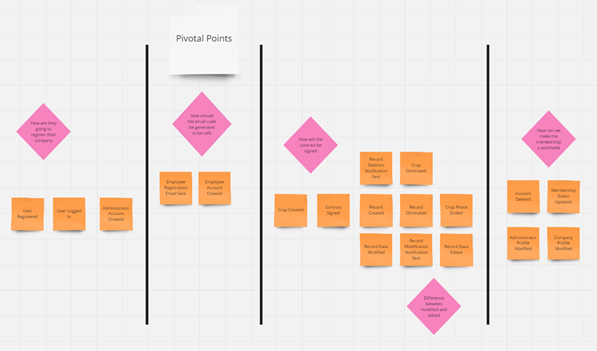

<b>Commands</b>
Los comandos fueron definidos como las acciones que desencadenan cambios dentro del sistema. Cada comando representa una intención específica del usuario o del sistema para modificar el estado. Por ejemplo, la creación de un nuevo pedido o la actualización de un perfil de cliente. Estos comandos jugaron un papel crucial en la implementación de funcionalidades clave, permitiendo una gestión controlada y eficiente de las acciones que afectan al sistema, manteniendo la integridad de los datos y las operaciones.

<b>Policies</b>
Se diseñaron políticas como reglas o restricciones que deben cumplirse antes de que se ejecute un comando o evento en el sistema. Estas políticas fueron fundamentales para garantizar la seguridad, consistencia y cumplimiento normativo dentro del flujo de trabajo. Las políticas también ayudaron a estandarizar decisiones, reduciendo la probabilidad de errores humanos y automatizando las decisiones repetitivas en el sistema. Por ejemplo, las políticas determinaron quién podía ejecutar ciertos comandos y bajo qué condiciones.

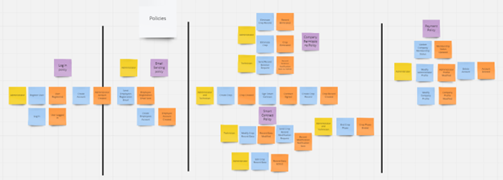

<b>Read Models</b>
Los modelos de lectura son representaciones optimizadas de los datos del sistema, diseñadas específicamente para consultas rápidas y eficientes. A diferencia de los modelos transaccionales, que están diseñados para almacenar y modificar datos, los modelos de lectura están organizados para responder a preguntas y proporcionar vistas instantáneas del estado del sistema. En este caso, gestionamos varios modelos de lectura para proporcionar a los usuarios las vistas más relevantes de la información, lo que permitió consultas rápidas y precisas, sin afectar las operaciones críticas del sistema.

<b>External Systems</b>
Como parte de la implementación, se identificaron y modelaron las interacciones con sistemas externos que proporcionarán datos o servicios esenciales para el proyecto. Estos sistemas externos pueden incluir proveedores de servicios en la nube, APIs de terceros, o sistemas heredados que necesitan ser integrados. La correcta identificación y modelado de estos sistemas externos fue crucial para garantizar una integración sin problemas, minimizando riesgos y asegurando la interoperabilidad entre todos los componentes del sistema.

<b>Aggregates</b>
Los agregados representan entidades clave dentro del sistema que encapsulan un conjunto de datos y comportamientos relacionados en torno a un único concepto del dominio. Cada agregado define límites claros sobre lo que puede o no puede ser modificado, protegiendo la consistencia y coherencia del estado. Durante el proceso, se analizaron los agregados relevantes para el dominio, asegurándonos de que cada entidad clave estuviera correctamente definida y alineada con las reglas del negocio.

<b>Bounded Contexts</b>
Identificamos varios contextos delimitados (bounded contexts) para organizar las áreas funcionales del sistema. Cada contexto delimitado define los límites dentro de los cuales ciertos términos y conceptos tienen un significado claro y consistente. Esto permite segmentar el sistema en componentes manejables, donde cada equipo o módulo tiene responsabilidades bien definidas. Esta separación facilita la escalabilidad y la evolución del sistema, al mismo tiempo que evita problemas de ambigüedad y solapamiento en las funciones del sistema.

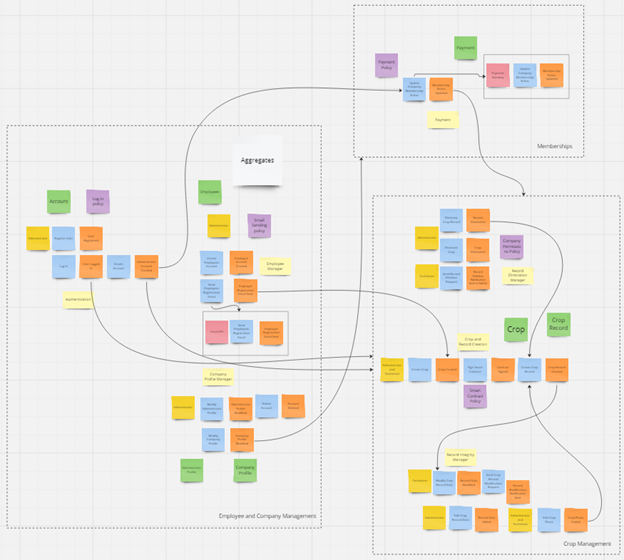

Enlace al [Miro](https://miro.com/app/board/uXjVKhDrVvw=/?share_link_id=611418680068)

<h4 id='4.1.1.1.'>4.1.1.1. Candidate Context Discovery.</h4>

Utilizando la metodología de Event Storming, y aplicando la técnica de "start-with-simple", se inició el proceso con una visión simplificada del dominio. A partir de esta perspectiva inicial, se emplearon líneas de tiempo para mapear eventos clave y actividades dentro del sistema, lo que permitió identificar áreas de interés para la creación de contextos delimitados. Este enfoque ayudó a destacar las interacciones y relaciones críticas dentro del dominio, revelando contextos candidatos que podrían evolucionar en Bounded Contexts claramente definidos. Los contextos identificados fueron los siguientes:

<b>IAM (Identity and Access Management) subdomain:</b>
Este subdominio va a ser el encargado de gestionar todo lo relacionado con la autenticación y autorización de usuarios.

<b>Personas subdomain:</b>
Este subdominio es el encargado de controlar los perfiles personales de las cuentas creadas y los perfiles de las compañías productoras de champiñones.

<b>Crops subdomain:</b>
Maneja todo lo correspondiente con el proceso de los cultivos de champiñones que tiene la empresa.

<b>Memberships subdomain:</b>
Se enfoca en la gestión de cómo las compañías obtienen una mejor suscripción para poder gozar de mayores beneficios al emplear nuestra solución de software.

<b>Mailing subdomain:</b>
Este subdominio se encarga de gestionar el servicio de notificaciones y alertas por correo electrónico para los usuarios.

<b>IoT subdomain: </b>
El subdominio gestiona la interacción con la capa edge y la interacción de la aplicación con los dispositivos IoT para la medición de parámetros.

<h4 id='4.1.1.2.'>4.1.1.2. Domain Message Flows Modeling.</h4>

El proceso de Domain Message Flow Modeling permite identificar las interacciones entre los bounded context previamente definidos. Esto se realiza mediante el modelamiento del flujo de mensajes entre actores, sistemas y bounded contexts en los escenarios propuestos para la aplicación.

<b>1. Scenario: Factory Owner creates an account</b>

El siguiente flujo evidencia el proceso que atraviesan los usuarios administradores de las fábricas al crear una cuenta dentro de la aplicación Greenhouse. En primer lugar, los usuarios acceden a la aplicación web o mobile para ingresar sus datos personales, la información de la empresa que desean registrar y seleccionan la subscripción que desean. A continuación, el sistema registrará las credenciales del usuario, creará una nueva cuenta de administrador y una subscripción vinculada a la cuenta.

<b>2. Scenario: Factory owner creates an employee account</b>

La imagen presentada a continuación evidencia el flujo que atraviesan los mensajes cuando el administrador de la fábrica crea una cuenta de usuario para uno de sus trabajadores. En primer lugar, el administrador ingresa a la aplicación web o móvil e ingresa las credenciales del trabajador que desea crear. Finalmente, la aplicación registra las información ingresada y crea la cuenta del nuevo trabajador.

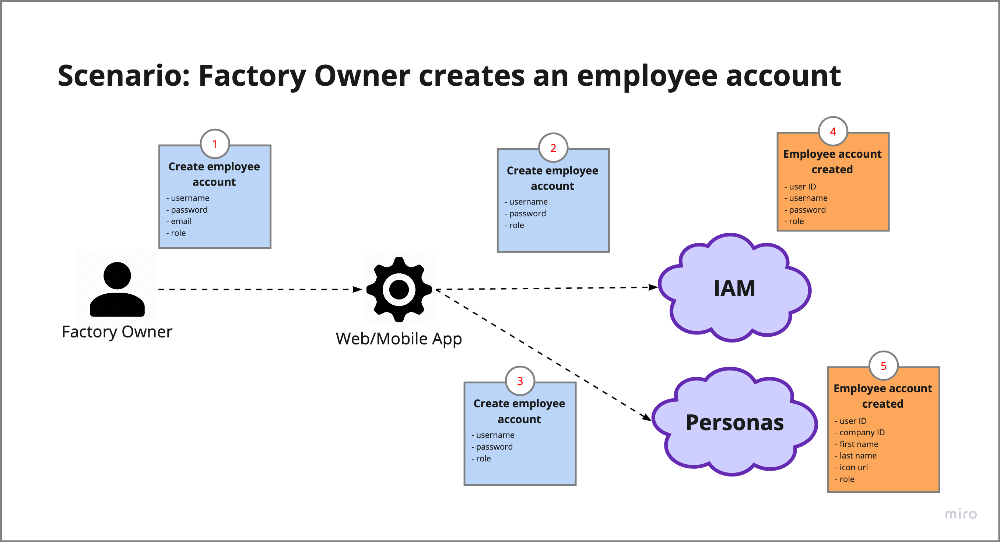

<b>3. Scenario: Technician starts a new crop </b>

El escenario presentado a continuación muestra el flujo de los mensajes al momento de iniciar un nuevo cultivo en Greenhouse. En primer lugar, los técnicos supervisores ingresan a la aplicación web o mobile, y realizan una solicitud de creación de cultivo. A continuación, el sistema asigna la información necesaria (Como un ID único, fecha de inicio, y fase actual), lo almacena en la base de datos.

<b>4. Scenario: Technician registers a new record </b>

El escenario presentado a continuación muestra el flujo de los mensajes al momento de agregar un nuevo registro a un cultivo existente en Greenhouse. En primer lugar, los técnicos supervisores ingresan a la aplicación web o mobile, y realizan una solicitud de registro de información. A continuación, el sistema asigna la información necesaria (Como un ID único, fecha del registro, autor), le concatena la información escrita por el usuario (parámetros ambientales, actividades o comentarios) finalmente, lo almacena en la base de datos.

<b>5. Scenario: IoT device registers a new record </b>

El escenario presentado a continuación muestra el flujo de los mensajes al momento de agregar un nuevo registro a un cultivo existente en Greenhouse mediante el dispositivo IoT. En primer lugar, los sensores obtienen las información necesaria (Como un ID único, fecha del registro, autor), le concatena la información escrita por el usuario (parámetros ambientales, actividades o comentarios) para luego pasarla al servicio de IoT y así registrarlo finalmente en crops, lo almacena en la base de datos.

<h4 id='4.1.1.3.'>4.1.1.3. Bounded Context Canvases.</h4>

El proceso seguido para elaborar los bounded context canvases fue el siguiente:

1. Definición del Bounded Context
   El primer paso es identificar y delimitar los diferentes Bounded Contexts en el sistema. Estos contextos representan áreas específicas donde los conceptos, reglas y entidades son consistentes. Ejemplos en nuestro sistema incluyen IAM, Personas, Memberships, Crops y Mails.

1. Identificación de Entidades y Agregados
   Dentro de cada contexto, se identifican las entidades y agregados principales. Las entidades son objetos con identidad propia, y los agregados agrupan entidades relacionadas bajo una misma regla de negocio. En Crops, por ejemplo, las entidades incluyen "Cultivo" y "Registro de Cultivo".

1. Relaciones entre Contextos
   Se identifican las relaciones clave entre los diferentes Bounded Contexts, ya sea mediante APIs, eventos o comandos. Por ejemplo, IAM se encarga de la autenticación de los usuarios y es utilizado por los contextos de Personas, Memberships y Crops para autorizar el acceso.

1. Definición de Interfaces de Comunicación
   Las interfaces que permiten la interacción entre los contextos se definen, como APIs o eventos. Por ejemplo, Personas puede emitir un evento cuando se registra un nuevo perfil de usuario, lo cual impacta en IAM para autenticar al usuario.

1. Ubiquitous Language
   Se define un lenguaje común y coherente dentro de cada contexto para asegurar que todos los miembros del equipo compartan los mismos términos y definiciones, como "cultivo" o "calidad del cultivo" en el contexto de Crops.

1. Reglas de Negocio
   Cada contexto tiene reglas que rigen su funcionamiento. Por ejemplo, en Crops, las reglas de negocio incluyen la validación de la calidad del cultivo y el envío de alertas cuando los registros superan umbrales predefinidos.

1. Visualización del Canvas
   Finalmente, toda esta información se representa gráficamente en el Bounded Context Canvas, que incluye el nombre del contexto, las entidades, las relaciones, interfaces, el Ubiquitous Language, las reglas de negocio y los modelos de datos. Esto ayuda a facilitar la comprensión y la comunicación entre los equipos de desarrollo.

A continuación se presentan los bounded context identificados:

<b>Identity and Access Management</b>

En este Bounded Context de IAM, se puede visualizar que para la autenticación y registro de nuestros usuarios hemos hecho un desarrollo propio (custom built), el cual se relaciona con los Bounded Context de Personas, Memberships y Crops que hacen uso del Auth Token para que el usuario pueda hacer uso de sus respectivos servicios.

<b>Personas</b>

El Bounded Context de Personas se encarga de manejar los perfiles de los usuarios y compañía a la que pertenezcan. Además de contar con la autorización del Bounded Context IAM para el uso de los endpoints y se relaciona con los Bounded Context de Membership para seleccionar su tipo de membresía y crops para tener el encargado que realizó el registro de la información del cultivo.

<b>Memberships</b>

El Bounded Context de Memberships se encarga de manejar las suscripciones de las compañías. Además de contar con la autorización del Bounded Context IAM para el uso de los endpoints y se relaciona con los Bounded Context de Personas para saber si quién es el encargado y crops para saber qué funcionalidades tiene disponibles con el plan elegido.

<b>Crops</b>

El Bounded Context de Crops se encarga de manejar los cultivos y sus registros, para darles un seguimiento adecuado durante el ciclo de vida del cultivo. Además de contar con la autorización del Bounded Context IAM para el uso de los endpoints y se relaciona con los Bounded Context de Personas para saber si quién es el encargado y memberships para saber qué funcionalidades tiene disponibles con el plan vigente. Además de contar con la funcionalidad de subir imágenes para que estas, sean evaluadas por un modelo de computer vision y de como resultado la calidad del cultivo. Mientras que, por otra parte, si los registros pasan de ciertos umbrales se envían correos de alerta.

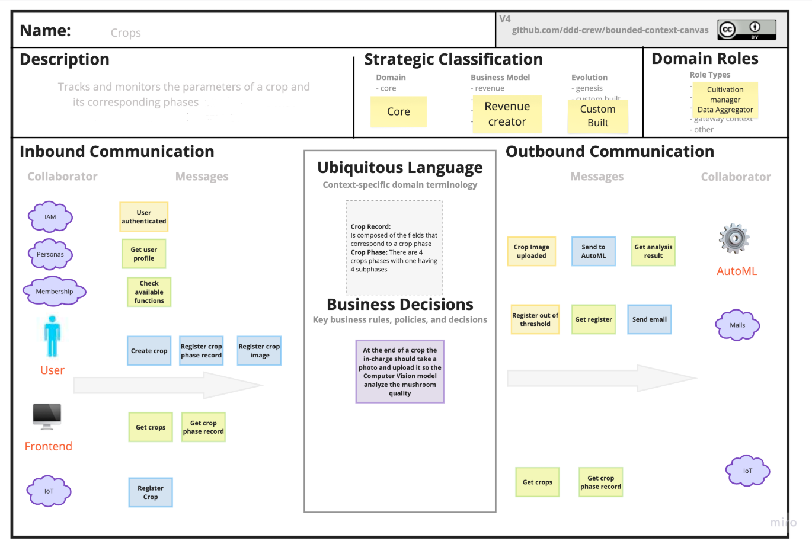

<b>Mails</b>

Este Bounded Context se encarga del envío de correos para permitir lograr que el usuario tenga una mejor noción del estado del cultivo. Los correos se envían cuando un valor registrado se encuentra fuera de los umbrales para cumplir con los estándares y calidad del cultivo, en caso sea una diferencia poco notable no se enviará, sino que se almacenará para un reporte semanal, en caso si sea un desfase considerable se deberá de enviar la notificación de forma inmediata.

<b>IoT</b>

Este Bounded Context se encarga de recopilar la información de los sensores mediante dispositivos IoT para así luego determinar las acciones de los actuadores y a su vez enviar la información a la base de datos para su monitoreo logrando así automatizar el registro manual de dichos cultivos.

<h3 id='4.1.2.'>4.1.2. Context Mapping.</h3>

Después de obtener cuáles serían nuestros Bounded Contexts, se realizó la elaboración de las relaciones estructurales entre estos. Para ello, se tomó en cuenta posibles diseños candidatos para el Context Mapping, planteados previamente en el Candidate Content Discovery, se desarrolló considerando los patrones de relaciones entre Bounden Contexts establecidos en Domain-Driven Desgin, los cuales pueden ser Conformist, Customer/Supplier, Partnership o Shared Kernel. Se utilizó la herramienta online DomoRoboto para elaborar el Context Mapping de la siguiente imagen:

1. Identity and Access Management (IAM) ↔ Personas

- <b>Patrón: Upstream/Downstream (U SUPP)</b>
- <b>Explicación:</b> El contexto de IAM es proveedor de información de autenticación y autorización para <strong>Personas</strong>. La Personas consume los datos y las funcionalidades del contexto IAM para gestionar usuarios y sus perfiles. IAM se considera <strong>Upstream</strong> (proveedor) porque controla la autenticación y autorización, mientras que <strong>Personas</strong> es <strong>Downstream</strong> (consumidor), ya que depende de IAM para validar el acceso.

2. Identity and Access Management (IAM) ↔ Memberships

- <b>Patrón: Upstream/Downstream (U SUPP)</b>
- <b>Explicación:</b> <strong>Memberships</strong> consume los servicios de IAM para gestionar el acceso de los usuarios a las funcionalidades relacionadas con sus membresías. IAM es el proveedor de las reglas de acceso y autenticación, y <strong>Memberships</strong> depende de ello para permitir que los usuarios accedan o gestionen sus membresías.

3. Identity and Access Management (IAM) ↔ Crops

- <b>Patrón: Upstream/Downstream (U SUPP)</b>
- <b>Explicación:</b> El contexto de <strong>Crops</strong> también consume los servicios de IAM para la gestión de acceso de los usuarios que trabajan con los cultivos. <strong>IAM</strong> es el proveedor de los datos de autenticación y autorización, y <strong>Crops</strong> depende de ello para otorgar permisos o registrar acciones.

4. Personas ↔ Crops

- <b>Patrón: Customer/Supplier (D CUST)</b>
- <b>Explicación</b>: En este caso, el <strong>Bounded Context Crops</strong> es el <strong>cliente</strong> (Customer) de <strong>Personas</strong>, porque depende de la información de <strong>Personas</strong> para registrar quién ha realizado las mediciones de los cultivos. <strong>Personas</strong> es el <strong>proveedor</strong> (Supplier) de esta información. Este patrón refleja la dependencia de <strong>Crops</strong> en obtener información de las personas que interactúan con los cultivos.

5. Personas ↔ Memberships

- <b>Patrón: Partner (PTNR)</b>
- <b>Explicación:</b> En este caso, <strong>Personas</strong> y <strong>Memberships</strong> tienen una relación de <strong>Partner</strong> (socio). Ambos contextos colaboran estrechamente porque <strong>Memberships</strong> necesita los perfiles gestionados en <strong>Personas</strong> para aplicar políticas de suscripción o acceso. Al ser socios, ambos contextos comparten información y colaboran sin una clara relación de proveedor/cliente.

6. Memberships ↔ Crops

- <b>Patrón: Customer/Supplier (D CUST)</b>
- <b>Explicación:</b> <strong>Crops</strong> consume los servicios de <strong>Memberships</strong> para validar si una compañía o un usuario tiene acceso a beneficios avanzados relacionados con los cultivos, basados en su nivel de membresía. Aquí <strong>Memberships</strong> es el proveedor de esa información, y <strong>Crops</strong> es el cliente que lo utiliza

7. Personas ↔ Memberships

- <b>Patrón: Upstream/Downstream (U SUPP)</b>
- <b>Explicación:</b> <strong>Memberships</strong> depende de los datos personales de los usuarios proporcionados por <strong>Personas</strong> para gestionar las membresías. <strong>Personas</strong> es el proveedor y <strong>Memberships</strong> es el consumidor de estos datos.

8. Crops ↔ Mails

- <b>Patrón: Customer/Supplier (D CUST)</b>
- <b>Explicación:</b> El contexto de <strong>"Crops"</strong> actúa como cliente (Customer) del contexto <strong>"Mails"</strong>, ya que depende de éste para enviar notificaciones por correo electrónico cuando se detectan registros que están fuera de los umbrales establecidos. <strong>"Mails"</strong> es el proveedor (Supplier) de la funcionalidad de envío de correos electrónicos, asegurándose de que los usuarios pertinentes sean notificados en tiempo real sobre los cultivos.

9. Crops ↔ IoT

- <b>Patrón: Customer/Supplier (D CUST)</b>
- <b>Explicación:</b> El contexto de <strong>"Crops"</strong> actúa como cliente (Customer) del contexto <strong>"IoT"</strong>, ya que depende de éste para realizar registros de los parámetros ambientales de forma automática. <strong>"IoT"</strong> es el proveedor (Supplier) de la funcionalidad registro de valores de parámetros ambientales, asegurandose de que la información se complete de forma automática.

<h3 id='4.1.3.'>4.1.3. Software Architecture.</h3>
<h4 id='4.1.3.1.'>4.1.3.1. Software Architecture System Landscape Diagram.</h4>

El diagrama de landscape es útil para identificar los usuarios y sistemas que interactúan con el programa propuesto, además de proporcionar una visión general de los servicios involucrados. Sin embargo, debido a su enfoque en la arquitectura general, no muestra con detalle las diferencias específicas entre una arquitectura basada en microservicios y una arquitectura monolítica.

<h4 id='4.1.3.2.'>4.1.3.2. Software Architecture Context Level Diagrams.</h4>

El diagrama de contexto es de utilidad para identificar los usuarios y sistemas que interactúan con el programa propuesto, sin embargo, debido al poco detalle que presenta, no muestra ninguna diferencia de una arquitectura basada en microservicios con una arquitectura monolítica.

<h4 id='4.1.3.3.'>4.1.3.3. Software Architecture Container Level Diagrams.</h4>

El diagrama de contenedores presentado a continuación representa cómo interactúan los usuarios y sistemas con los principales componentes del sistema “Greenhouse”, entre los cuales cabe destacar el API gateway, el Identity and Access Management, y los servicios de personas, cultivos, membresías y un servicio por separado para manejar la parte IoT. La separación de estos servicios, cada uno con sus bases de datos independientes, evidencian la intención de desarrollar un producto basado en microservicios.

<h4 id='4.1.3.4.'>4.1.3.4. Software Architecture Deployment Diagrams.</h4>

<h2 id='4.2.'>4.2. Tactical-Level Domain-Driven Design.</h2>
<h3 id='4.2.1.'>4.2.1. Bounded Context: Crops</h3>
Este bounded context se enfoca en las clases y capas relacionadas con el cultivo y sus registros correspondientes a cada una de las fases del cultivo. A continuación, se detallan los principales componentes de este contexto.

<h4 id='4.2.1.1.'>4.2.1.1. Domain Layer</h4>

- <b>Crop:</b> Esta clase representa a un cultivo de champiñones. Contiene atributos como nombre, autor, fase, fecha de inicio, fecha, estado y records.

- <b>Records:</b> Esta clase representa a los registros que se realizan para un cultivo de champiñón. Contiene atributos tales como autor, fase, payload (son los datos que registran para la fase del cultivo es un formato json debido a que cambia por cada fase lo que se debe registrar), crop (cultivo sobre el cual se hacen los registros), created date, updated date.
- <b>Enum:</b>
  - <b>CropPhase:</b> Este enum define las diferentes etapas que tiene el cultivo de champiñones los cuales siguen un orden secuencial: Formula, Preparation Area, Bunker, Tunnel, Incubation, Casing, Induction, Harvest

<h4 id='4.2.1.2.'>4.2.1.2. Interface Layer</h4>

- <b>CropsController:</b> Maneja las solicitudes relacionadas a los cultivos de champiñones. Permite crear, eliminar y actualizar el estado de los cultivos. Además de obtener todos los cultivos, los cultivos por su estado ya sea un cultivo finalizado o un cultivo activo.

- <b>RecordsController:</b> Maneja las solicitudes relacionadas a los registros de los cultivos de champiñones. Permite crear, actualizar y eliminar los registros de los cultivos. Además de poder obtener todos los registros, un registro en específico por su ID o todos los registros correspondientes a la fase de un crop en específico.
- <b>CropVisionFacade:</b> Encapsula la lógica de análisis de calidad de los cultivos de champiñones a través de imágenes. Permite enviar una imagen asociada a un cultivo a un servicio de AutoML para recibir un análisis de calidad del champiñón, devolviendo una evaluación con un puntaje de calidad.

<h4 id='4.2.1.3.'>4.2.1.3. Application Layer</h4>

- <b>Command Handlers:</b>
  - create-crop: Crea un nuevo cultivo el cuál siempre empieza en la fase Formula.
  - create-record: Crea un registro a un cultivo asociado, el cuál puede ser para cada una de las diferentes fases y el cuál tienen un autor.
  - delete-crop: Elimina un cultivo existente por su id.
  - delete-record: Elimina un registro existente por su id.
  - update-crop: Actualiza la fase del cultivo y el estado de un cultivo.
  - update-record: Actualiza el registro de un cultivo.
- <b>Query Handlers:</b>
  - get-crop-by-id: Obtiene la información de un cultivo en base a su id.
  - get-crops-by-state: Obtiene un array de todos los cultivos de una fase en específico.
  - get-crops: Obtienen un array con la información de todos los cultivos.
  - get-record-by-id: Obtiene la información de un registro en base a su id.
  - get-records-by-crop-and-phase: Obtiene un array de todos los registros asociados a un cultivo y a una fase en específico.
  - get-records: Obtiene un array con la información de todos los registros de cultivos.

<h4 id='4.2.1.4.'>4.2.1.4. Infrastructure Layer</h4>

- <b>Repositories:</b>

  - create-crop: Se encarga de crear un nuevo cultivo (crop) en la base de datos o sistema de persistencia. Recibe una entidad de dominio y la convierte en su equivalente persistente.
  - create-record: Similar a create-crop, pero se enfoca en crear un nuevo registro (record), como por ejemplo una entrada de datos relacionada con el cultivo.
  - find-crops: Se encarga de buscar y devolver un cultivo ya sea en base a su Id, a su estado o todos los cultivos almacenados en el sistema. Puede aceptar filtros para encontrar cultivos específicos.
  - find-records: Busca y devuelve registros relacionados con cultivos, mediante su id, su fase, o todos los cultivos, desde el sistema de persistencia.
  - remove-crop: Elimina un cultivo específico del sistema de persistencia, utilizando su ID o alguna clave única.
  - remove-record: Elimina un registro específico asociado a un cultivo del sistema de persistencia, usando un identificador único.
  - save-crop: Guarda o actualiza un registro en el sistema de persistencia.
  - save-record: Guarda o actualiza un registro en el sistema de persistencia.

- <b>Mappers:</b>
  - crop: Convierte un objeto de dominio Crop en un objeto de persistencia CropEntity y viceversa. Esto permite que los datos pasen de la capa de dominio (negocio) a la de persistencia (base de datos) y al revés.
  - record: Realiza el mapeo entre la representación de dominio de un registro (record) y su versión de persistencia (RecordEntity). Permite transformar los registros entre las capas de aplicación y persistencia.

<h4 id='4.2.1.5.'>4.2.1.5. Bounded Context Software Architecture Component Level Diagrams</h4>

<b>Diagrama de componentes del Servicio Crops:</b>

<h4 id='4.2.1.6.'>4.2.1.6. Bounded Context Software Architecture Code Level Diagrams</h4>

<h5 id='4.2.1.6.1.'>4.2.1.6.1. Bounded Context Domain Layer Class Diagrams</h5>

<h5 id='4.2.1.6.2.'>4.2.1.6.2. Bounded Context Database Design Diagram</h5>

### Tabla: crops

| Nombre del atributo | Descripción del atributo                                                                         | Tipo de dato del atributo |
| ------------------- | ------------------------------------------------------------------------------------------------ | ------------------------- |
| id                  | Identificador del cultivo de champiñones, primary key                                            | varchar(255)              |
| name                | Título del cultivo de la fábrica champiñonera                                                    | varchar(255)              |
| created_by          | Identificador del trabajador de la fábrica de champiñones responsable de la creación del cultivo | varchar(255)              |
| created_at          | Fecha de creación del cultivo de champiñones                                                     | timestamp                 |

### Tabla: phases

| Nombre del atributo | Descripción del atributo                                           | Tipo de dato del atributo |
| ------------------- | ------------------------------------------------------------------ | ------------------------- |
| id                  | Identificador de la fase del cultivo de champiñones, primary key   | varchar(255)              |
| name                | Nombre de la fase en la que se encuentra el cultivo de champiñones | varchar(255)              |

### Tabla: records

| Nombre del atributo | Descripción del atributo                                                           | Tipo de dato del atributo |
| ------------------- | ---------------------------------------------------------------------------------- | ------------------------- |
| id                  | Identificador del registro de información, primary key                             | varchar(255)              |
| payload             | Archivo json con la información registrada                                         | json                      |
| created_at          | Fecha en la que se registró la información                                         | timestamp                 |
| updated_at          | Fecha en la que se actualizó la información registrada                             | timestamp                 |
| phase_id            | Identificador de la fase a la que pertenece la información registrada, foreign key | varchar(255)              |
| crop_id             | Identificador del cultivo al que pertenece la información registrada, foreign key  | varchar(255)              |

### Tabla: analysis_requests

| Nombre del atributo | Descripción del atributo                                                                         | Tipo de dato del atributo |
| ------------------- | ------------------------------------------------------------------------------------------------ | ------------------------- |
| id                  | Identificador del request, primary key                                                           | varchar(255)              |
| image_url           | Enlace al archivo json con la información registrada                                             | varchar(255)              |
| created_by          | Identificador del trabajador de la fábrica de champiñones responsable de la creación del cultivo | varchar(255)              |
| created_at          | Fecha en la que se registró la información                                                       | timestamp                 |
| analysis_result     | Archivo json con la información que se obtiene del análisis en AutoML                            | json                      |
| crop_id             | Identificador del cultivo al que pertenece la información registrada, foreign key                | varchar(255)              |

<h3 id='4.2.2.'>4.2.2. Bounded Context: IAM</h3>
Este bounded context se enfoca en las clases y capas relacionadas con los usuarios de la aplicación, sus roles y sus credenciales. A continuación, se detallan los principales componentes de este contexto.
<h4 id='4.2.2.1.'>4.2.2.1. Domain Layer.</h4>

- Users: Esta Clase representa un usuario, registrado en greenhouse. Contiene los atributos rol, username y password.

<h4 id='4.2.2.2.'>4.2.2.2. Interface Layer.</h4>
Controller:

- Users: Define un controlador 'UsersController' en NestJS que gestiona las operaciones de usuario. Utiliza un servicio 'UserService' para manejar comandos de creación, actualización, eliminación y búsqueda de usuarios. Los métodos del controlador transforman los DTOs recibidos en comandos y devuelven resultados apropiados, como listas de usuarios o detalles de un usuario específico.

<h4 id='4.2.2.3.'>4.2.2.3. Application Layer.</h4>

**Command Handlers:**

- create-user: Define una clase que implementa 'ICommandHandler<CreateUserCommand>', con un constructor que inyecta dependencias para crear y guardar usuarios. El método 'execute' verifica si ya existe un usuario con el nombre de usuario proporcionado y, si no, crea un nuevo usuario usando una fábrica y lo guarda en el repositorio.
- delete-user: Define una clase que implementa 'ICommandHandler<DeleteUserCommand>', con un constructor que inyecta repositorios para buscar y eliminar usuarios. El método 'execute' busca un usuario por nombre de usuario, lanza una excepción si no existe y, si lo encuentra, lo elimina usando el repositorio correspondiente.
- update-user: Define una clase que implementa 'CommandHandler<UpdateUserCommand>', con un constructor que inyecta repositorios para buscar y guardar usuarios. El método 'execute' busca un usuario por nombre de usuario, lanza excepciones si no existe o si el rol es inválido, y actualiza el rol y la contraseña del usuario antes de guardarlo.

**Facades:**

- user-facade: Define un servicio 'UsersFacadeService' en NestJS que utiliza el patrón CQRS, inyectando 'CommandBus' y 'QueryBus'. Proporciona métodos para crear un usuario, comparar una contraseña con un nombre de usuario, y obtener el rol e ID de un usuario por su nombre de usuario, utilizando comandos y consultas para manejar la lógica.

**Ports:**

- create-user: Define una clase abstracta 'CreateUserRepository' que especifica un método 'save', el cual debe ser implementado por las clases concretas para guardar un objeto 'User' y devolverlo como una promesa.
- find-user: Define una clase abstracta 'FindUsersRepository' que especifica métodos para buscar usuarios: 'findAll', que devuelve una lista de usuarios, y 'findByUsername', que busca un usuario por su nombre de usuario y devuelve el usuario o 'undefined'.
- remove-user: Define una clase abstracta 'RemoveUserRepository' que especifica un método 'remove', el cual debe ser implementado por las clases concretas para eliminar un objeto User' y devolverlo como una promesa.
- save-user: Define una clase abstracta 'SaveUserRepository' que especifica un método 'save, el cual debe ser implementado por las clases concretas para guardar un objeto 'User' y devolverlo como una promesa.

**Queries Handler:**

- compare-password: Define un manejador de consulta 'ComparePasswordForUsernameQueryHandler' que implementa 'IQueryHandler'. Inyecta repositorios para buscar usuarios y un servicio de hashing. El método 'execute' busca un usuario por nombre de usuario y compara la contraseña proporcionada con la almacenada, devolviendo 'true' o 'false' según el resultado.

- get-user-by-username: Define un manejador de consulta 'GetUserByUsernameQueryHandler' que implementa 'IQueryHandler'. Inyecta un repositorio para buscar usuarios y su método 'execute' busca un usuario por nombre de usuario, lanzando una excepción si no existe, y devolviendo el objeto 'User' encontrado.
- get-users: Define un manejador de consulta 'GetUsersQueryHandler' que implementa 'IQueryHandler'. Inyecta un repositorio para buscar usuarios y su método 'execute' devuelve una lista de todos los usuarios al llamar a 'findAll' en el repositorio.

<h4 id='4.2.2.4.'>4.2.2.4. Infrastructure Layer.</h4>

**Entities:**

- User: Define una entidad 'UserEntity' para la tabla 'users' en TypeORM, con propiedades para ID, nombre de usuario (único y en minúsculas), contraseña y rol (con un valor por defecto).
  Enums:
- Role: Define un enum Role con dos posibles valores: Regular y Admin, representando los roles de usuario en la aplicación.
  Mapper:
- User: Define una clase 'UserMapper' que convierte entre una entidad de usuario ('UserEntity') y un objeto de dominio ('User'), proporcionando métodos para mapear hacia el dominio y hacia la persistencia en la base de datos.
  Repositories:
- create-user: Define un constructor que inyecta un repositorio de 'UserEntity', y un método 'save' que convierte un objeto de dominio 'User' a una entidad, la guarda en la base de datos y devuelve el objeto de dominio correspondiente.
- find-user: Define un constructor que inyecta un repositorio de 'UserEntity' y dos métodos: 'findAll', que recupera todos los usuarios de la base de datos y los convierte a objetos de dominio, y 'findByUsername', que busca un usuario por su nombre de usuario y lo convierte a un objeto de dominio si existe.
- remove-user: Define un constructor que inyecta un repositorio de 'UserEntity' y un método 'remove' que convierte un objeto de dominio 'User' a una entidad, la elimina de la base de datos y devuelve el objeto de dominio correspondiente.
- save-user: Define un constructor que inyecta un repositorio de 'UserEntity' y un método 'save' que convierte un objeto de dominio 'User' a una entidad, la guarda en la base de datos y devuelve el objeto de dominio resultante.

<h4 id='4.2.2.5.'>4.2.2.5. Bounded Context Software Architecture Component Level Diagrams.</h4>

A continuación, se presenta el diagrama de componentes asociado al bounded context IAM

<h4 id='4.2.2.6.'>4.2.2.6. Bounded Context Software Architecture Code Level Diagrams.</h4>

<h5 id='4.2.2.6.1.'>4.2.2.6.1. Bounded Context Domain Layer Class Diagrams.</h5>

A continuación, se presenta el diagrama de clases asociado al bounded context Usuario, el cual incluye las entidades User, Role y UserFactory, así como los manejadores de comandos para la creación, actualización y eliminación de usuarios. Este diagrama resulta de utilidad para expresar visualmente la estructura del sistema en cuanto a clases, atributos, métodos y relaciones.

<h5 id='4.2.2.6.2.'>4.2.2.6.2. Bounded Context Database Design Diagram.</h5>

<table cellpadding="5" cellspacing="0">
  <thead>
    <tr>
      <th>Nombre del atributo</th>
      <th>Descripción del atributo</th>
      <th>Tipo de dato del atributo</th>
    </tr>
  </thead>
  <tbody>
    <tr>
      <td>id</td>
      <td>Identificador del usuario, UUID, primary key</td>
      <td>varchar(255)</td>
    </tr>
    <tr>
      <td>username</td>
      <td>Apodo o nombre con el cual el usuario ingresará a la aplicación</td>
      <td>varchar(255)</td>
    </tr>
    <tr>
      <td>password</td>
      <td>Contraseña del usuario</td>
      <td>varchar(255)</td>
    </tr>
    <tr>
      <td>role</td>
      <td>Rol del usuario dentro de la aplicación</td>
      <td>varchar(255)</td>
    </tr>
  <tbody>
</table>

<h3 id='4.2.3.'>4.2.3. Bounded Context: Mailling</h3>
Este bounded context se enfoca en las clases y capas relacionadas con el envío de correos de notificación sobre algún evento importante de notificar relacionado con el proceso de los cultivos de champiñones mediante el uso del servicio externo de Resend AutoML de Azure. A continuación, se detallan los principales componentes de este contexto.

<h4 id='4.2.3.1.'>4.2.3.1. Domain Layer.</h4>

- MaIl: Esta clase representa el correo electrónico que pertenece a un usuario y contiene atributos como id, userId, userHandle, address y domain. Asimismo, cuenta con el método toString que permite unir el address y domain para obtener el correo formateado.
- MailTemplate<T:>: Esta clase genérica representa una plantilla de correo electrónico que contiene como atributos id, title, body, y dispone un método que permite obtener el template dado un payload del tipo T el cuál permitirá personalizar más la información que se utilizará.
- SendEvent: Esta clase representa el evento de envío de correo electrónico que contiene atributos como id, mail, template, createdAt y name.

<h4 id='4.2.3.2.'>4.2.3.2. Interface Layer</h4>
EmailController: Maneja las solicitudes relacionadas con el envío de correos y la gestión de plantilla y dispone de los siguientes métodos:

- createMail(userHandle: string, address: string, domain: string): Mail
- createTemplate(id: string, title: string, body: string): MailTemplate
- sendMail(mail: Mail, template: MailTemplate): SendEvent
- getMailHistory(userId: string): SendEvent[]

<h4 id='4.2.3.3.'>4.2.3.3. Application Layer.</h4>

**Command Handlers:**

Command Handlers:

- create-mail: Crea una nueva instancia de Mail.
- create-template: Crea una nueva instancia de MailTemplate.
- send-mail: Utiliza ResendFacade para enviar un correo y crea un nuevo SendEvent.

**Queries Handler:**

- get-mail-by-id: Obtiene un Mail específico por su ID.
- get-template-by-id: Obtiene un MailTemplate específico por su ID.
- get-send-events-by-user: Obtiene un array de SendEvent para un usuario específico.

<h4 id='4.2.3.4.'>4.2.3.4. Infrastructure Layer.</h4>

**Repositories:**

- create-mail: Persiste una nueva instancia de Mail en la base de datos.
- create-template: Persiste una nueva instancia de MailTemplate en la base de datos.
- create-send-event: Persiste un nuevo SendEvent en la base de datos.
- find-mail: Busca y devuelve instancias de Mail basadas en diversos criterios.
- find-template: Busca y devuelve instancias de MailTemplate basadas en diversos criterios.
- find-send-events: Busca y devuelve SendEvents basados en diversos criterios.

**Services:**

- ResendFacade: Interactúa con el servicio externo de Resend para gestionar el envío de correos.

**Mappers:**

- mail-mapper: Convierte entre objetos de dominio Mail y su representación en la capa de persistencia.
- template-mapper: Realiza el mapeo entre objetos de dominio MailTemplate y su versión persistente.
- send-event-mapper: Mapea objetos SendEvent entre la capa de dominio y la de persistencia.

<h4 id='4.2.3.5.'>4.2.3.5. Bounded Context Software Architecture Component Level Diagrams.</h4>

A continuación, se presenta el diagrama de componentes asociado al bounded context Mailling

<h4 id='4.2.3.6.'>4.2.3.6. Bounded Context Software Architecture Code Level Diagrams.</h4>

<h5 id='4.2.3.6.1.'>4.2.3.6.1. Bounded Context Domain Layer Class Diagrams.</h5>

A continuación, se presenta el diagrama de clases del microservicio encargado de la gestión de notificaciones por correo electrónico. Este diseño incluye las entidades Mail y MailTemplate, las cuales son procesadas a través de la fachada (ResendFacade), que abstrae la interacción con el servicio de Resend, encargado de ejecutar la lógica de envío de correos. Además, se ha implementado un mecanismo para registrar los eventos asociados al envío de correos, con el fin de garantizar una trazabilidad completa, permitiendo un monitoreo detallado del estado de los envíos y de los destinatarios involucrados, optimizando así el seguimiento y análisis del flujo de notificaciones.

<h5 id='4.2.3.6.2.'>4.2.3.6.2. Bounded Context Database Design Diagram.</h5>

<table cellpadding="5" cellspacing="0">
  <thead>
    <tr>
      <th>Nombre del atributo</th>
      <th>Descripción del atributo</th>
      <th>Tipo de dato del atributo</th>
    </tr>
  </thead>
  <tbody>
    <tr>
      <td>id</td>
      <td>Identificador del mail, UUID, primary key</td>
      <td>varchar(255)</td>
    </tr>
    <tr>
      <td>user_id</td>
      <td>Identificador del usuario, UUID</td>
      <td>varchar(255)</td>
    </tr>
    <tr>
      <td>user_handle</td>
      <td>Apodo preferido para el usuario a usar en los correos</td>
      <td>varchar(32)</td>
    </tr>
    <tr>
      <td>address</td>
      <td>Dirección del correo electrónico</td>
      <td>varchar(24)</td>
    </tr>
    <tr>
      <td>domain</td>
      <td>Dominio del correo electrónico</td>
      <td>varchar(24)</td>
    </tr>
  </tbody>
</table>

<table cellpadding="5" cellspacing="0">
  <thead>
    <tr>
      <th>Nombre del atributo</th>
      <th>Descripción del atributo</th>
      <th>Tipo de dato del atributo</th>
    </tr>
  </thead>
  <tbody>
    <tr>
      <td>id</td>
      <td>Identificador del template, UUID, primary key</td>
      <td>varchar(255)</td>
    </tr>
    <tr>
      <td>title</td>
      <td>Título o asunto que tendrá el correo</td>
      <td>varchar(255)</td>
    </tr>
    <tr>
      <td>body</td>
      <td>Cuerpo del correo que tendrá todo el contenido base que se enviará al usuario</td>
      <td>varchar(32)</td>
    </tr>
  </tbody>
</table>

<table cellpadding="5" cellspacing="0">
  <thead>
    <tr>
      <th>Nombre del atributo</th>
      <th>Descripción del atributo</th>
      <th>Tipo de dato del atributo</th>
    </tr>
  </thead>
  <tbody>
    <tr>
      <td>id</td>
      <td>Identificador del evento de envío de mail, UUID, primary key</td>
      <td>varchar(255)</td>
    </tr>
    <tr>
      <td>mail_id</td>
      <td>Identificador del mail, UUID, foreign key</td>
      <td>varchar(255)</td>
    </tr>
    <tr>
      <td>mail_template_id</td>
      <td>Identificador del template, UUID, foreign key</td>
      <td>varchar(255)</td>
    </tr>
    <tr>
      <td>name</td>
      <td>Nombre personalizado que se le puede dar al evento</td>
      <td>varchar(32)</td>
    </tr>
    <tr>
      <td>created_at</td>
      <td>Timestamp del momento en el que el evento fue creado</td>
      <td>timestamp</td>
    </tr>
  </tbody>
</table>

<h3 id='4.2.4.'>4.2.4. Bounded Context: Memberships</h3>
En esta sección, el equipo presenta las clases identificadas y las detalla a manera de diccionario
A continuación, se presentan las clases identificadas

- **Memberships:**   **Propósito:** Esta clase representa a una membresía ligada a un empresa en el sistema. Incluye detalles del nivel de la membresía, su vigencia y detalles de su estado.   Atributos:   - **id:** string, Identificador único de la membresía   -**companyId:** string, Identificador único de la empresa que posee la membresía   - **membershipLevel:** MembershipLevel, Objeto con el detalle del nivel de la membresía   - **membershipPayment:** MembershipPayment, Objeto con el detalle de la transacción con la cual se adquirió la membresía   - **startDate:** DateTime, Fecha y hora de inicio de la membresía   - **endDate:** DateTime, Fecha y hora de expiración de la membresía   - **status:** string, Estado actual de la membresía (active, inactive, expired)

- **Métodos:**   - **activate():** void, Activa la membresía   - **renew(newEndDate: DateTime):** void, Renueva la membresía extendiendo su vigencia.   - **expire():** void, Marca la membresía como expirada

- **Relaciones:**   - **MembershipLevel:** La clase Memberships utiliza la clase MembershipLevel para la renovación y expiración de membresías, dado que la vigencia de la membresía varía según su grado.   - **MembershipPayment:** La clase Memberships utiliza la clase MembershipPayment para verificar el estado de las transacciones que conciernen a las membresías, además de efectuar el cobro de renovaciones.

- **MembershipLevel:**   - **Propósito:** Define los distintos niveles de membresía, asimismo los permisos y beneficios que estas otorgan.   - **Atributos:**   -**id:** string, Identificador único del nivel de membresía   - **name:** string, Nombre del nivel de membresía   - **benefits:** string[], Lista de beneficios asociados al nivel de la membresía   - **privileges:** string[], Lista de privilegios asociados al nivel de la membresía   - **Métodos:**   - **getBenefit(benefit: string):** string, Devuelve la información o grado de un beneficio   - **updateBenefits(newBenefits: string[]):** void, Actualiza los beneficios del nivel de membresía   - **isPrivilegeAssigned(privilege: string):** bool, Verifica si el nivel de membresía contiene el privilegio consultado   - **Relaciones:**   - **Memberships:** La clase Memberships utiliza la clase MembershipLevel para la renovación y expiración de membresías, dado que la vigencia de la membresía varía según su grado.

- **MembershipPayment:**   - **Propósito:** Registra las transacciones relacionadas a adquisiciones de membresías.   - **Atributos:**   - **id:** string, Identificador único del pago   - **membershipId:** string, Identificador de la membresía asociada   - **amount:** number, Monto del pago asociado a la transacción   - **paymentDate:** Date, Fecha del pago   - **paymentMethod:** string, Método de pago   - **Métodos:**   - **registerPayment(amount: number, method: string):** void, Registra un nuevo pago para una membresía   - **Relaciones:**   - **Memberships:** La clase Memberships utiliza la clase MembershipPayment para verificar el estado de las transacciones que conciernen a las membresías, además de efectuar el cobro de renovaciones.

<h4 id='4.2.4.1.'>4.2.4.1. Domain Layer.</h4>

La clase Memberships representa una parte importante del core de la aplicación. El grado de esta membresía condiciona los límites de uso de las empresas que utilizan el software mediante la cantidad de cultivos activos a la vez, los permisos que tienen sus administradores y el nivel de control sobre sus empleados que podrán mantener dentro de la plataforma.

- Una empresa puede adquirir una única membresía durante su vigencia, la cual puede aumentar o disminuir de grado según sus necesidades.
- Los permisos de membresía de todos los empleados trabajando bajo una empresa son los mismos sin importar su rol o distinción en la aplicación.
- La empresa obtiene 5 días de prórroga de una membresía expirada para gestionar adecuadamente la extensión o fin del término de los permisos correspondientes.

- **MembershipsPayment**: El pago de la membresía y recibo existe independientemente de la vigencia de la propia membresía. Esto es importante de considerar cuando surge la necesidad del administrador de revisar el historial de adquisiciones de una determinada empresa.

- **MembershipLevel**: Cada membresía tiene un grado o nivel de beneficios que esta confiere a la empresa beneficiada. Este nivel está ligado a la entidad de membresía y es consultado cuando algún usuario de la aplicación, perteneciente a una empresa, realiza ciertas acciones.

- **Memberships**: Se considera a una membresía como un aggregate debido a la relación que mantiene con las clases que conciernen el nivel de membresía y su pago. La membresía se encarga de verificar su propio tiempo de vigencia, otorgar beneficios y orquestar eventos según los privilegios de la empresa favorecida.

- **MembershipsPaymentFactory**: Abstrae la complejidad y la lógica de creación de pagos o recibos de las transacciones de membresías.

- **BillingService**: Servicio encargado de conectarse con el sistema externo de pagos, el cual tiene la función de cobrar el precio de la membresía mediante el método de pago especificado por la empresa.

- **MembershipsRepository**: Interfaz que define los métodos a utilizar para la conexión a la base de datos.

<h4 id='4.2.4.2.'>4.2.4.2. Interface Layer.</h4>
En esta sección se presentan las clases que forman parte de la capa de interfaz/presentación para el bounded context de membresías.
  
**Controllers:**
- **MembershipsController:** Maneja la creación, eliminación, búsqueda de permisos y actualización de estados de las membresías al nivel de la API. Es el método llamado cuando se realizan las consultas al microservicio de memberships.

<h4 id='4.2.4.3.'>4.2.4.3. Application Layer.</h4>

En esta sección se presentan las clases que manejan los flujos del proceso de membresías en el negocio.

CommandHandlers:

- create-membership: Clase encargada de crear una nueva membresía.
- renew-membership: Clase encargada de actualizar el tiempo de expiración de una membresía
- expire-membership: Actualiza el estado de una membresía a expirada.
- update-benefit: Actualiza algún beneficio de un determinado nivel de membresía.
- create-payment: Crea un nuevo registro de pago de membresía

QueryHandlers:

- get-membership-benefits-by-level: Obtiene todos los beneficios de un determinado nivel de membresía
- get-membership-by-company-id: Obtiene detalles de la membresía adquirida por una determinada empresa.

<h4 id='4.2.4.4.'>4.2.4.4. Infrastructure Layer.</h4>

En esta sección se presentan las clases que acceden a servicios externos en el bounded context de membresías.

Repositories (Class):

MembershipRepository:

- create-membership: Crea una nueva membresía asignada a una empresa en la base de datos.
- update-membership: Actualiza los detalles respecto a una membresía dentro de la base de datos.
- get-membership-by-company-id: Obtiene una membresía de la base de datos según el id de la compañía.

MembershipLevelRepository:

- update-benefit: Actualiza la lista de beneficios de un determinado nivel de membresía.
- get-membership-benefits-by-level: Obtiene la lista de beneficios para el nivel de membresía.

MembershipPaymentRepository:

- create-payment: Crea un nuevo pago en la base de datos correspondiente a una adquisición de membresía.

Mappers:

- MembershipDao: Realiza el mapeo o conversión entre el objeto de membresía del dominio y el objeto que representa los datos ingresados a la persistencia.
- MembershipLevelDao: Realiza el mapeo o conversión entre el objeto de beneficios de la membresía del dominio y el objeto que representa los datos ingresados a la persistencia.
- MembershipPaymentDao: Realiza la conversión entre el objeto de pago de membresía del dominio y el objeto persistence que ingresa la información a la base de datos.

<h4 id='4.2.4.5.'>4.2.4.5. Bounded Context Software Architecture Component Level Diagrams.</h4>

A continuación, se presenta el diagrama de componentes asociado al bounded context Memberships

<h4 id='4.2.4.6.'>4.2.4.6. Bounded Context Software Architecture Code Level Diagrams.</h4>

En esta sección se exponen los diagramas que muestran en un mayor detalle las clases del contenedor Memberships presentado.

<h5 id='4.2.4.6.1.'>4.2.4.6.1. Bounded Context Domain Layer Class Diagrams.</h5>

Se muestra el diagrama de clases con las clases y métodos explicados en las anteriores secciones.

<h5 id='4.2.4.6.2.'>4.2.4.6.2. Bounded Context Database Design Diagram.</h5>

<table cellpadding="5" cellspacing="0">
  <thead>
    <tr>
      <th>Nombre del atributo</th>
      <th>Descripción del atributo</th>
      <th>Tipo de dato del atributo</th>
    </tr>
  </thead>
  <tbody>
    <tr>
      <td>id</td>
      <td>Identificador de la membresía de la fábrica champiñonera, primary key</td>
      <td>varchar(255)</td>
    </tr>
    <tr>
      <td>start_date</td>
      <td>Fecha de inicio de la membresía</td>
      <td>date</td>
    </tr>
    <tr>
      <td>end_date</td>
      <td>Fecha de fin de la membresía</td>
      <td>date</td>
    </tr>
    <tr>
      <td>company_id</td>
      <td>Id de la fábrica champiñonera que adquiere la membresía</td>
      <td>varchar(255)</td>
    </tr>
  </tbody>
</table>

<table cellpadding="5" cellspacing="0">
  <thead>
    <tr>
      <th>Nombre del atributo</th>
      <th>Descripción del atributo</th>
      <th>Tipo de dato del atributo</th>
    </tr>
  </thead>
  <tbody>
    <tr>
      <td>id</td>
      <td>Identificador del nivel de membresía, primary key</td>
      <td>varchar(255)</td>
    </tr>
    <tr>
      <td>name</td>
      <td>Nombre del nivel de la membresía</td>
      <td>varchar(255)</td>
    </tr>
    <tr>
      <td>amount</td>
      <td>Precio de adquisición del nivel de membresía</td>
      <td>decimal(4,2)</td>
    </tr>
  </tbody>
</table>

<table cellpadding="5" cellspacing="0">
  <thead>
    <tr>
      <th>Nombre del atributo</th>
      <th>Descripción del atributo</th>
      <th>Tipo de dato del atributo</th>
    </tr>
  </thead>
  <tbody>
    <tr>
      <td>id</td>
      <td>Identificador del beneficio asociado a una membresía, primary key</td>
      <td>varchar(255)</td>
    </tr>
    <tr>
      <td>name</td>
      <td>Nombre del beneficio asociado a una membresía</td>
      <td>varchar(255)</td>
    </tr>
  </tbody>
</table>

<table cellpadding="5" cellspacing="0">
  <thead>
    <tr>
      <th>Nombre del atributo</th>
      <th>Descripción del atributo</th>
      <th>Tipo de dato del atributo</th>
    </tr>
  </thead>
  <tbody>
    <tr>
      <td>id</td>
      <td>Identificador de la solicitud para adquirir membresía, primary key</td>
      <td>varchar(255)</td>
    </tr>
    <tr>
      <td>amount</td>
      <td>Precio de adquisición final de la membresía ya adquirida</td>
      <td>decimal(4,2)</td>
    </tr>
    <tr>
      <td>payment_date</td>
      <td>Fecha de la transacción de adquisición de membresía</td>
      <td>date</td>
    </tr>
    <tr>
      <td>payment_method</td>
      <td>Método de pago utilizado para la compra</td>
      <td>varchar(255)</td>
    </tr>
  </tbody>
</table>

<h3 id='4.2.5.'>4.2.5. Bounded Context: IoT</h3>
En esta sección, el equipo presenta las clases identificadas y las detalla a manera de diccionario
A continuación, se presentan las clases identificadas

**IoTDataMeasurement**

**Propósito:**  
Representa la medición automática de temperatura y humedad capturada por el dispositivo IoT y enviada al sistema para su almacenamiento y análisis.

**Atributos:**

- `id`: string - Identificador único de la medición.
- `device`: IoTDevice - Identificador del dispositivo IoT (ESP32) que realizó la medición.
- `timestamp`: DateTime - Fecha y hora en que se tomó la medición.
- `temperatureAir`: number - Temperatura del aire medida (°C).
- `humidityAir`: number - Humedad relativa del aire medida (%).
- `alertTriggered`: boolean - Indica si el LED de alerta fue activado durante la medición.

**Métodos:**

- `registerMeasurement(data: MeasurementDTO): void` - Registra una nueva medición en el sistema realizando llamadas a microservicio de Crops.
- `validateThresholds(): boolean` - Verifica si los valores de temperatura o humedad exceden los umbrales de seguridad.
- `triggerAlert(): void` - Activa el LED de alerta en caso de valores fuera de rango.

**Relaciones:**

- **IoTDevice:** La clase IoTDataManagement actúa en base a la clase IoTDevice, que representa el dispositivo específico que originó la medición.

**IoTDevice**

**Propósito:**  
Representa un dispositivo IoT físico basado en ESP32, encargado de medir temperatura, humedad y activar una alerta visual en caso de condiciones ambientales no seguras en el cultivo de champiñones.

**Atributos:**

- `id`: string - Identificador único del dispositivo.
- `serialNumber`: string - Número de serie del ESP32.
- `status`: string - Estado actual del dispositivo (active, inactive, maintenance).
- `lastSync`: DateTime - Última vez que el dispositivo sincronizó mediciones exitosamente.
- `thresholdTemperature`: number - Umbral máximo permitido para la temperatura (°C).
- `thresholdHumidity`: number - Umbral máximo permitido para la humedad (%).

**Métodos:**

- `sendMeasurement(data: MeasurementDTO): void` - Envía una medición al sistema.
- `updateThresholds(tempThreshold: number, humidityThreshold: number): void` - Actualiza los umbrales de alerta del dispositivo.
- `syncTime(): void` - Sincroniza la hora interna del dispositivo con el servidor.

**Relaciones:**

- **IoTDataMeasurement:** La clase IoTDevice se relaciona con instancias de IoTDataMeasurement, dado que puede generar múltiples registros de mediciones.
- **DeviceSyncLog:** La clase IoTDevice se relaciona con la clase DeviceSyncLog, el dispositivo registra sus propios eventos de sincronización.

**DeviceSyncLog**

**Propósito:**  
Registrar eventos de sincronización de los dispositivos IoT, ya sea exitosos o fallidos, para el control de integridad de los datos.

**Atributos:**

- `id`: string - Identificador único del evento de sincronización.
- `device`: IoTDevice - Identificador del dispositivo que realizó la sincronización.
- `syncTimestamp`: DateTime - Fecha y hora de la sincronización.
- `syncStatus`: string - Estado de la sincronización (successful, failed).
- `errorMessage`: string - Mensaje de error en caso de fallo.

**Métodos:**

- `registerSyncEvent(status: string, message?: string): void` — Registra un nuevo evento de sincronización.

**Relaciones:**

- **IoTDevice:** Cada clase IoTDevice, o dispositivo IoT, posee un gestor de eventos de sincronización.

<h4 id='4.2.5.1.'>4.2.5.1. Domain Layer.</h4>

La clase **IoTDevice** representa una parte importante del core de la aplicación, ya que permite la digitalización automática de los parámetros ambientales esenciales para el cultivo de champiñones. Cada dispositivo es responsable de medir y reportar las condiciones de temperatura y humedad en las naves, así como activar alertas locales mediante un LED cuando se superan los umbrales críticos.

- Un dispositivo puede configurarse con distintos valores de umbrales de seguridad para temperatura y humedad según las necesidades de la planta.
- Si los valores medidos superan los umbrales configurados, el LED de alerta en el dispositivo debe activarse para notificar visualmente el riesgo en el ambiente de cultivo.

- **IoTDataMeasurement**: Representa cada conjunto de mediciones que el dispositivo IoT envía al sistema. Cada medición incluye la temperatura, la humedad y un indicador de si se activó el LED de alerta.

- **DeviceSyncLog**: Registro independiente de los eventos de sincronización de cada dispositivo. Este historial es importante para detectar posibles desconexiones, fallos de comunicación o errores de medición.

- **IoTDevice**: Se considera a un dispositivo como un aggregate debido a su responsabilidad de gestionar su estado, registrar sus propias mediciones, activar alertas locales y orquestar eventos de sincronización con el sistema.

- **MeasurementFactory**: Abstrae la lógica de creación de objetos de medición (**IoTDataMeasurement**) a partir de los datos crudos enviados por los dispositivos. Facilita la validación, la conversión de formatos y el aseguramiento de integridad antes de almacenar las mediciones en el sistema.

- **AlertService**: Servicio encargado de evaluar si una medición supera los umbrales configurados y, de ser así, activar el LED del dispositivo correspondiente. Este servicio separa la lógica de monitoreo de alertas de las funciones de captura de datos.

- **IoTDeviceRepository**: Interfaz que define los métodos necesarios para la gestión de dispositivos, tales como registrar dispositivos, actualizar configuraciones, consultar estados y obtener registros de mediciones.

<h4 id='4.2.5.2.'>4.2.5.2. Interface Layer.</h4>
En esta sección se presentan las clases que forman parte de la capa de interfaz/presentación para el bounded context de IoT.
  
**Controllers:**
- **IoTController:** Maneja las solicitudes que se hacen al microservicio de IoT, específicamente aquellas que están relacionadas con la medición de temperatura y humedad, así como la gestión de alertas al nivel de la API. Es el método llamado cuando se realizan las consultas al microservicio de IoT.

<h4 id='4.2.5.3.'>4.2.5.3. Application Layer.</h4>

CommandHandlers:

- create-iot-device: Clase encargada de crear un nuevo dispositivo IoT.
- create-processed-measurement: Clase encargada de crear un objeto record en base a una medición hecha por un dispositivo IoT.
- create-alert: Crea una alerta cuando alguna medición supera los umbrales seguros.
- update-processed-measurement: Actualiza la información de una medición de algún dispositivo IoT.

QueryHandlers:

- get-measurements-by-grow-room: Obtiene el historial de mediciones de una nave específica
- get-iot-devices-status: Obtiene el estado actual de los dispositivos IoT registrados.
- get-active-alerts: Obtiene las alertas que se encuentran activas.

<h4 id='4.2.5.4.'>4.2.5.4. Infrastructure Layer.</h4>

En esta sección se presentan las clases que acceden a servicios externos en el bounded context de IoT.

**Repositories (Class):**
IoTDeviceRepository:

- `save-device`: Registra un nuevo dispositivo ESP32 en la base de datos.
- `find-by-serial`: Obtiene un dispositivo por su número de serie.
- `update-device-status`: Actualiza el estado (active/inactive) de un dispositivo.
- `update-thresholds`: Modifica los umbrales de temperatura/humedad de un dispositivo.
- `log-sync-event`: Registra un evento de sincronización del dispositivo.

IoTDataMeasurementRepository:

- `save-measurement`: Almacena una nueva medición de sensor en la base de datos.
- `find-by-device`: Obtiene mediciones por dispositivo en un rango de tiempo.
- `check-threshold-violations`: Verifica mediciones que exceden umbrales de seguridad.

DeviceSyncLogRepository:

- `save-sync-log`: Registra un evento de sincronización (éxito/fallo).
- `find-last-sync`: Obtiene el último estado de sincronización de un dispositivo.

**Mappers:**

IoTDeviceDao: Realiza el mapeo entre la entidad `IoTDevice` (dominio) y su modelo de persistencia.

IoTDataMeasurementDao: Realiza el mapeo entre la entidad `IoTDataMeasurementDao` (dominio) y su modelo de persistencia.

DeviceSyncLogDao: Realiza el mapeo entre la entidad `DeviceSyncLog` (dominio) y su modelo de persistencia.

<h4 id='4.2.5.5.'>4.2.5.5. Bounded Context Software Architecture Component Level Diagrams.</h4>

A continuación, se presenta el diagrama de componentes asociado al bounded context IoT.
 

<h4 id='4.2.5.6.'>4.2.5.6. Bounded Context Software Architecture Code Level Diagrams.</h4>

En esta sección se exponen los diagramas que muestran en un mayor detalle las clases que conforman el diagrama de componentes presentado.

<h5 id='4.2.5.6.1.'>4.2.5.6.1. Bounded Context Domain Layer Class Diagrams.</h5>

Se muestra el diagrama de clases con las clases y métodos explicados en las anteriores secciones.

<h5 id='4.2.5.6.2.'>4.2.5.6.2. Bounded Context Database Design Diagram.</h5>

El presente bounded context no cuenta con una instancia en la base de datos, dado que no es su responsabilidad garantizar la presistencia de la información. Este bounded context hace uso de la instancia del bounded context crops para grabar las mediciones realizadas.

<h1 id='5.'>5. Capítulo V: Solution UI/UX Design</h1>
<h2 id='5.1.'>5.1. Style Guidelines</h2>

En la siguiente sección, se presentan las especificaciones de diseño de interfaz de usuario asociadas al proyecto Greenhouse. Enlace para acceder al [Figma](https://www.figma.com/design/wPpvosGW28c7blfOfbBo2n/Integradis---Wireframes-Greenhouse---Emergentes?node-id=115-172&t=NhQBBIFdnfNgF1z4-1)

<h3 id='5.1.1.'>5.1.1. General Style Guidelines</h3>

Un "style guideline" o guía de estilo es un conjunto de reglas y pautas que establecen la forma en que se deben escribir, diseñar o presentar documentos, contenido web, software, o cualquier otro tipo de trabajo creativo. A continuación, se presentan los parámetros implementados en la estructura del proyecto.

 

- **Colores:** Los colores toman protagonismo de la primera percepción visual de los usuarios. Es así que, guiados por los principios de la psicología del color, se destinó al color verde como tonalidad principal de la paleta cromática en la implementación de la plataforma. El verde simboliza balance, crecimiento y prestigio, uno de los alcances de la startup. Por otra parte, el pigmento verde se asocia con la agricultura, el rubro al que se direcciona la plataforma; y, al concepto de armonía, lo cual se busca ofrecer al usuario dentro de la interacción en el servicio. Como tonalidades secundarias se tienen a: variedades cromáticas del color blanco y azul.

  

- **Tipografía:** La tipografía establece jerarquía entre los diversos grupos de contenido de la página. Asimismo, cumple un rol importante al momento de guiar al usuario a través de la interfaz. En relación al proyecto, la fuente seleccionada fue "Inria Sans" en estilos Light, Medium, Regular, Semibold y Bold para los títulos, y "Noto Sans" para los párrafos.

  

<h3 id='5.1.2.'>5.1.2. Web, Mobile and IoT Style Guidelines</h3>

El enfoque de Greenhouse para la aplicación web y mobile consiste en transmitir una interfaz limpia y sencilla, a partir de la cual los usuarios podrán realizar sus objetivos con eficiencia.

- **Tarjetas:** Se hace uso del componente "card" para agrupar los principales componentes de la aplicación. Las tarjetas incluyen un título, un subtítulo, un párrafo descriptivo y representarán un hipervínculo para la obtención de más información.

- **Imágenes:** En el diseño de la aplicación, se incluirán imágenes tanto descriptivas como ornamentales. En primer lugar, la imagen de perfil del usuario y de la empresa en la cual está registrado dentro de la aplicación se encontrarán en todo momento en la parte superior derecha (En el caso de la aplicación web), y en la barra de navegación inferior (En el caso de la aplicación móvil). Esto con el objetivo de ayudar al usuario a identificar la sesión en la que se encuentra y ayudarlo a navegar rápidamente a su perfil. Adicionalmente, se contará con imágenes decorativas en las pantalla de inicio de sesión y creación de cuenta, únicamente con el propósito de captar la atención del usuario.

- **Campo de entrada de texto:** Se hace uso de cuadros de escritura con la finalidad de que el usuario introduzca información de diversos tipos, como por ejemplo, sus credenciales en el apartado de creación de cuenta o inicio de sesión, nombres/ID de cultivos en la sección cultivos en progreso o archivo de cultivos, nombres de trabajadores en la sección del directorio de empleados, etc. Estos campos de entrada deben ser lo suficientemente anchos como para encajar la mayor cantidad de texto esperada por el usuario, estableciendo como tamaño mínimo 10 caracteres.

- **Botones:** En la aplicación web, se suelen encontrar en la parte inferior de las tarjetas o al extremo derecho de los cuadros de escritura. Estos botones permiten al usuario realizar acciones tales como cambiar de página, abrir un diálogo, editar un campo, etc. Adicionalmente, se deben mostrar botones de confirmación para las acciones que involucren agregar o eliminar información de la base de datos. En general, todos los botones cuentan con un estilo distintivo y un alto contraste con los colores del resto de la aplicación. Se utiliza la teoría del color en los botones de color rojo para representar acciones que eliminen procesos o los den por finalizados.

- **Diálogos/Modales:** Los diálogos o modales son ventanas secundarias que tienen el objetivo de confirmar acciones clave para el funcionamiento del negocio y con gran repercusión en el mismo. Los diálogos cuentan con colores con un valor de matiz mayor que sus contrapartes pasteles del resto de la aplicación web. Además, su aparición oscurece el resto de la pantalla para generar un efecto de contraste. Este efecto busca transmitir la importancia de la resolución del asunto de la pantalla emergente antes de que el usuario continúe con la navegación en la app.

<h2 id='5.2.'>5.2. Information Architecture</h2>

Al ser Greenhouse un software que optimiza el flujo asociado a la documentación de información, es importante que en todo momento el usuario esté consciente del proceso que está realizando y el lugar dónde se encuentra dentro de la aplicación. La información de las fases o los procesos que forman un todo se encuentra categorizada y ubicada de forma secuencial. El usuario sigue a una unidad que representa el proceso general, un cultivo, y progresivamente registra las fases que sigue el cultivo hasta su finalización vía diferentes pantallas de la solución web. Mediante la vista de "Home", se muestra una interfaz más generalizada de las funcionalidades de la aplicación que se involucran a un nivel superior con el desarrollo de los procesos. De esta manera, se logra una distinción notable entre el registro de procesos y el análisis que se realiza a partir de estos.

<h3 id='5.2.1.'>5.2.1. Organization Systems</h3>

La organización visual de contenido se realizará de tres formas diferentes en las varias vistas de las aplicaciones. La organización de forma jerárquica presenta al usuario con un orden de importancia para los elementos que se muestran en pantalla. Se utilizó este orden para las pantallas de log-in y los perfiles de las empresas que los representan. Los títulos de los datos acaparan mayor parte de la pantalla en comparación a los datos ingresados o que deben ingresarse. Adicionalmente, las opciones de modificación de información para los perfiles se encuentran en un color gris claro que armoniza con el color blanco de la aplicación y no causa una impresión fuerte, por lo que se espera que el usuario vea las opciones de modificación después de leer sus datos personales.

El proceso núcleo de negocio de las fases de cultivo utiliza una organización secuencial de la información. El elemento Stepper presente en la app móvil y web guía al usuario a través del ciclo de vida del cultivo de champiñones y le indica en qué fase se encuentra. El contenido de los procesos está categorizado de forma cronológica, es importante para los técnicos supervisores mantener un registro de los cultivos que llevan más tiempo en producción. Estos últimos cultivos tienen requisitos específicos y diferentes a los cultivos que apenas empiezan a ser producidos.

Para la sección "Home", es necesario ofrecer al cliente una vista general de la aplicación mediante una organización matricial. El panel principal se concentra en una vista general del uso de la aplicación Greenhouse por parte de la empresa. En esta vista, se mostrará un listado de los cultivos que actualmente están en progreso, su fecha de inicio y la fase en la que se encuentran.

Para las pantallas de la información de la "Empresa", la categorización de los empleados que la componen será de tipo alfabético en base a los nombres completos de los empleados, y de tipo jerárquico en base al rol que poseen (Administrador o técnico). El propósito de esta categorización es dar a los administradores una vista que sea similar a los registros presenciales con los que ya cuentan en medios físicos.

Por último, la sección de "Historial de cultivos" tendrá una organización matricial. Los usuarios verán un detalle de los cultivos concluidos junto con su calidad final.

<h3 id='5.2.2.'>5.2.2. Labeling Systems</h3>

A continuación se incluye una lista detallada de todas las secciones informativas que componen la landing page:

- Inicio/Home: La sección principal que da la bienvenida y presenta el propósito de la página.
- Beneficios/Benefits: Muestra las ventajas o características destacadas del producto o servicio.
- Precios/Pricing: Detalla los planes, tarifas o costos del producto o servicio.
- FAQ: Responde a las preguntas más frecuentes de los usuarios.
- Sobre Nosotros/About: Proporciona información sobre la empresa, su misión y valores.
- Contacto/Contact: Ofrece formas de comunicación, como formularios, teléfonos o direcciones.

En cuanto a las etiquetas que conforman a las aplicaciones web y mobile, cabe destacar:

- Login/Sign up: Secciones que permiten el acceso y registro a la aplicación Greenhouse.
- Inicio/Home: La sección principal que da la bienvenida al usuario. Incluye una vista general de los cultivos en progreso y su estado actual.
- Cultivos en progreso: Incluye un listado de los cultivos actualmente activos.
- Historial de Cultivos: Sección donde se almacenan y consultan los cultivos finalizados.
- Empresa: Sección que muestra información asociada a la empresa, como su razón social, sus trabajadores, su logo.

<h3 id='5.2.3.'>5.2.3. SEO Tags and Meta Tags</h3>

Las meta tags no son visualizadas en los sitios web, pues en su lugar, son leídas por los navegadores o rastreadores web. Además, estas etiquetas ayudan en el posicionamiento de nuestra aplicación web en los navegadores. A continuación, se presentan las meta tags utilizadas:

- **Título:**
  El título de la página se muestra en la pestaña del navegador y es importante tanto para los usuarios como para el SEO. Debe ser conciso, relevante y reflejar claramente el contenido o propósito de la página. También se utiliza en los resultados de búsqueda de los motores como Google, por lo que es clave para atraer clics. `<title>{title}</title>`

- **Descripción**
  La meta descripción es un resumen breve del contenido de la página. Aparece en los resultados de búsqueda debajo del título de la página y tiene un papel crucial en atraer a los usuarios a hacer clic en el enlace. Debe ser informativa, persuasiva y contener las palabras clave más importantes de la página. `<meta name="description" content={description} />`

- **Palabras Claves**
  Las palabras clave son términos o frases que representan el contenido de la página. Ayudan a los motores de búsqueda a entender de qué trata la página y cómo debe indexarse. Aunque su importancia ha disminuido en el SEO moderno, siguen siendo útiles para organizar y definir el contenido del sitio. `<meta name="keywords" content={keywords} />`

- **Autor**
  Este meta tag indica quién es el autor de la página o del contenido. Es útil para dar crédito y puede ayudar en términos de transparencia y credibilidad, especialmente en sitios donde el contenido es de carácter técnico, científico o académico. `<meta name="author" content="Alan Galavis">`

- Copyright
  El meta tag de copyright informa sobre los derechos de autor de la página. Este tag puede servir como una declaración de propiedad del contenido, protegiendo los derechos del autor o la organización que lo publica, en este caso, Greenhouse. `<meta name="copyright" content="Greenhouse" />`

<h3 id='5.2.4.'>5.2.4. Searching Systems</h3>

Los sistemas de búsqueda fueron diseñados utilizando un lenguaje claro y adecuado, lo que facilita la comprensión de las funciones que realizan.

| Elemento                      | Función                                                                                                                                                        |
| ----------------------------- | -------------------------------------------------------------------------------------------------------------------------------------------------------------- |
| Ícono de filtro por fecha     | Este elemento mostrará un calendario que permite seleccionar una fecha específica para visualizar todos los cultivos o registros correspondientes a esa fecha. |
| Barra de filtrado por fase    | Este elemento permite localizar cultivos utilizando su fase como pivote.                                                                                       |
| Barra de filtrado por calidad | Este elemento permite localizar cultivos en base a su calidad final de producción.                                                                             |

<h3 id='5.2.5.'>5.2.5. Navigation Systems</h3>

El sistema de navegación desarrollado permite a los usuarios buscar cultivos o registros de diversas maneras, incluyendo la búsqueda por fecha y por identificador único. Esta funcionalidad optimiza y agiliza la identificación de la información, facilitando a los usuarios encontrar rápidamente lo que necesitan.

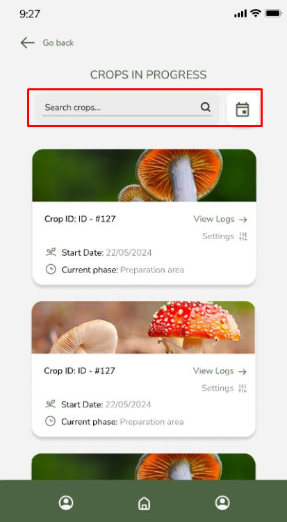

<h2 id='5.3.'>5.3. Landing Page UI Design</h2>
A continuación, se presentará la propuesta de landing page, comenzando con los wireframes, que delinean la estructura y funcionalidad básica, seguidos por los mockups, los cuales reflejan el diseño visual completo. Ambos son cruciales para alinear la visión del equipo con los objetivos del proyecto. Para el desarrollo de estos entregables, se utilizó Figma, una herramienta versátil que no solo permite la creación de prototipos interactivos y de alta fidelidad, sino que también facilita la colaboración en tiempo real. Esta funcionalidad de trabajo en conjunto es esencial para equipos distribuidos, ya que permite recibir retroalimentación instantánea, realizar ajustes en vivo y asegurar que todas las partes interesadas estén alineadas en cada etapa del proceso de diseño.

<h3 id='5.3.1.'>5.3.1. Landing Page Wireframe</h3>
Los wireframes son herramientas clave en el proceso de diseño de interfaces. Los wireframes son esquemas básicos que representan la estructura funcional de una página o aplicación, enfocándose en la disposición de los elementos y el flujo de navegación sin profundizar en el diseño visual. Son esenciales para establecer la lógica y jerarquía de la información. En contraste, los mockups son representaciones visuales detalladas que muestran cómo se verá el producto final, incorporando aspectos como colores, tipografías, imágenes y otros elementos de diseño gráfico. En este informe, se presentarán los mockups del landing page de Greenhouse, una empresa/producto, para ilustrar cómo se traduce la estructura esbozada en los wireframes en un diseño visual completo y listo para su evaluación. Esto permitirá demostrar cómo el diseño responde a las necesidades del usuario y los objetivos del proyecto.

<h3 id='5.3.2.'>5.3.2. Landing Page Mock-up</h3>

Los mockups son representaciones visuales estáticas que muestran el diseño de una página o aplicación sin interactividad. Se utilizan para ilustrar la apariencia final de una interfaz, detallando la disposición de elementos como imágenes, textos y botones, antes de pasar a la fase de desarrollo. Estos prototipos ayudan a comunicar la visión del proyecto y permiten recibir retroalimentación temprana. A continuación, se presentarán los mockups del landing page de Greenhouse, destacando su estructura y diseño.

<h2 id='5.4.'>5.4. Applications UX/UI Design</h2>
<h3 id='5.4.1.'>5.4.1. Applications Wireframes</h3>

<h4 id='5.4.1.1.'>5.4.1.1. Web Application Wireframes </h4>

<b>Inicio de sesión y creación de cuenta de empresa</b>
Las siguientes imágenes evidencian el wireframe de la sección de inicio de sesión y de creación de cuenta de empresa. En estas, se muestran los campos que el usuario debe de completar para poder acceder a la empresa registrada en Greenhouse.

<b>Perfil de usuario y de empresa</b>
A continuación, se contemplan los wireframes del diseño para el perfil del usuario administrador, además de las vistas de cambio de contraseña y de la empresa con la cual está registrado en Greenhouse.

<b>Menú principal</b>
La imagen presentada a continuación representa la vista principal de Greenhouse. Los usuarios cuya identidad haya sido validada con éxito, podrán utilizar este portal para acceder a las demás funcionalidades que ofrece la aplicación.

<b>Stepper</b>
El stepper permite a los usuarios acceder a las diversas fases que componen un cultivo. Se mostrará un círculo con borde en caso de que la fase haya finalizado, un número sombreado para representar la fase actual del cultivo, y números con contorno ligero para indicar las fases que aún se han alcanzado.

<b>Historial de cultivos</b>
El siguiente wireframe representa las vistas de los cultivos archivados por los técnicos supervisores.

<b>Reportes estadísticos</b>
La sección de reportes estadísticos es accesible desde el menú principal. En esta vista, los administradores podrán visualizar gráficos que evidencian el rendimiento de la fábrica en el tiempo.

<h4 id='5.4.1.2.'>5.4.1.2. Mobile Application Wireframes </h4>

<b>Inicio de sesión y creación de cuenta de empresa</b>
Las siguientes imágenes evidencian los wireframes de la sección de inicio de sesión y de creación de cuenta de empresa. En estas, se muestran los campos que el usuario debe de completar para poder acceder a la empresa registrada en Greenhouse.

<b>Menú principal</b>
La imagen presentada a continuación representa la vista principal de Greenhouse. Los usuarios cuya identidad haya sido validada con éxito, podrán utilizar este portal para acceder a las demás funcionalidades que ofrece la aplicación.

<b>Cultivos en progreso</b>
La sección cultivos en progreso es accesible desde el menú principal. En esta vista, los usuarios podrán visualizar una lista de cultivos que están actualmente activos

<b>Filtrar por fecha </b>
Las imágenes presentadas a continuación representan el dialog que visualizará el usuario en caso desee filtrar la información de los registros o cultivos por fecha.

<b>Stepper</b>
El siguiente wireframe incluye el stepper, desde el cual es posible visualizar las diferentes fases que debe de atravesar un cultivo de champiñones.

<b>Información de cultivos</b>
En la siguiente imagen se evidencia una lista de los registros realizados por los usuarios para una fase determinada de un cultivo en específico. En esta vista, los administradores podrán deslizar a la izquierda u oprimir sobre el botón situado en la esquina superior derecha para eliminar por completo un registro realizado. Los administradores podrán utilizar la información presentada para tomar decisiones informadas sobre la empresa.

<b>Edición de información registrada</b>
Los administradores tendrán la posibilidad de modificar los registros realizados por los técnicos supervisores, con el objetivo de garantizar la integridad de la información. Esta vista es accesible tras oprimir el botón de edición situado en la esquina superior derecha de cada registro.

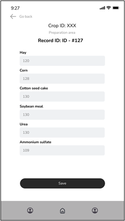

<b>Historial de cultivos</b>
Los siguientes wireframes representan las vistas de los cultivos archivados por los técnicos supervisores.

<b>Perfil de usuario y de empresa, y cambio de contraseña</b>
Finalmente, se contemplan los wireframes del diseño para el perfil del usuario administrador, además de las vistas de cambio de contraseña y de la empresa con la cual está registrado en Greenhouse.

<b>Invitación a técnico supervisor a empresa en Greenhouse</b>
Los administradores podrán completar el formulario presentado a continuación para enviar una invitación por correo electrónico a los técnicos supervisores para que comiencen a disfrutar de los beneficios que ofrece la aplicación.

<b>Reportes estadísticos</b>
La sección de reportes estadísticos es accesible desde el menú principal. En esta vista, los administradores podrán visualizar gráficos que evidencian el rendimiento de la fábrica en el tiempo.

<h3 id='5.4.2.'>5.4.2. Applications Wireflow Diagrams</h3>

A continuación se presentarán los wireflow diagrams con el objetivo de proporcionar una visión general de cómo se conectan las diversas pantallas de las dos aplicación móviles para visualizar la experiencia del usuario de principio a fin. De esta forma, estos diagramas ayudan a identificar posibles problemas de usabilidad.

🔗 **[Enlace para acceder al Lucidchart](https://lucid.app/lucidchart/3044ab2c-ab1e-4e74-9655-08e3d050b2cc/edit?viewport_loc=-14929%2C-2432%2C37223%2C18249%2C0_0&invitationId=inv_94ff9667-e3e2-450a-8592-b35aa3336db1)**

---

#### Web Application Wireflow Diagrams

---

##### **User Goal: Registrar empresa**

**User persona:** Administradores  
**Explicación del flujo:**  
En primer lugar, los administradores deberán ingresar a la aplicación web. A continuación, deberán dirigirse al apartado de "Sign up", dentro del cual se mostrará un formulario que solicitará ingresar información relevante para la creación de la cuenta, como, por ejemplo, razón social, RUC, nombre del registrante y contraseña de la cuenta. Posteriormente, se mostrarán dos botones, uno que representa la confirmación del usuario de haber leído los términos y condiciones de uso, y otro que confirma su intención de crear una cuenta. Una vez confirmada la intención de crear una cuenta, se redirigirá al usuario a la vista principal.

---

##### **User Goal: Iniciar sesión**

**User persona:** Administradores y técnicos supervisores  
**Explicación del flujo:**  
En primer lugar, el usuario deberá de acceder a la aplicación web. Posteriormente, visualizará en pantalla un formulario que solicitará sus datos de inicio de sesión, en este caso, correo usuario y contraseña. En caso de que estos sean validados, el sistema redirigirá al usuario al menú principal. Caso contrario, se mantendrá en la pestaña de inicio de sesión y se le solicitará introducir sus credenciales.

---

##### **User Goal: Navegar por el menú principal**

**User persona:** Administradores  
**Explicación del flujo:**  
Una vez que el usuario inicie sesión, será redirigido al menú principal, en donde visualizará una serie de opciones. La primera, llamada "Crops in progress", permitirá al administrador revisar los cultivos en progreso y sus respectivos registros. La segunda, denominada "Crops Archive", redirigirá al usuario a la sección homónima, desde la cual podrá visualizar el historial de cultivos finalizados. En tercer lugar se encuentra la opción "Statistical reports", la cual mostrará reportes estadísticos de valor para el usuario, como son el estado de las naves, número de registros por cultivo en progreso, insumos utilizados dentro de los cultivos, etc. Finalmente, la sección “My company” permitirá a los usuarios acceder al perfil de su empresa.

---

##### **User Goal: Iniciar un nuevo cultivo**

**User persona:** Técnicos supervisores  
**Explicación del flujo:**  
En primer lugar el usuario debe de acceder a la sección "Crops in progress", dentro de la cual podrá encontrar una lista de registros de cultivos creados y catalogados como "En proceso". Cuando el usuario presione el botón ubicado en la parte inferior de la pantalla, se desplegará un mensaje emergente que solicitará confirmar su intención de crear una nueva cosecha. En caso de ser confirmada, se redireccionará al usuario a la nueva siembra creada.

---

##### **User Goal: Registrar progreso de cultivo**

**User persona:** Técnicos supervisores  
**Explicación del flujo:**  
En primer lugar, el usuario debe presionar el botón situado en la parte inferior de la tabla de registros de un cultivo. A continuación, se redirigirá al usuario a una sección con un formulario, dentro de las cuales los usuarios podrán registrar la información necesaria. Cabe destacar que el presente flujo sienta las bases del registro de procesos en cada una de las 8 fases existentes.

---

##### **User Goal: Ver registro pasado en cultivo finalizado**

**User persona:** Administradores y técnicos supervisores  
**Explicación del flujo:**  
En primer lugar, el usuario debe de presionar sobre el botón “Crops archive”, el cual está situado en el menú principal. A continuación, visualizará una tabla con todos los cultivos finalizados. Posteriormente, podrá presionar sobre alguno de los cultivos para revisar los registros asociados al mismo.

#### Mobile Application Wireflow Diagrams

**User Goal:** Registrar empresa  
**User persona:** Administradores  
**Explicación del flujo:**  
En primer lugar, los administradores deberán ingresar a la aplicación móvil. A continuación, deberán dirigirse al apartado de "Sign up", dentro del cual se mostrará un formulario que solicitará ingresar información relevante para la creación de la cuenta, como, por ejemplo, razón social, RUC, nombre del registrante y contraseña de la cuenta. Posteriormente, se mostrarán dos botones, uno que representa la confirmación del usuario de haber leído los términos y condiciones de uso, y otro que confirma su intención de crear una cuenta. Una vez confirmada la intención de crear una cuenta, se redirigirá al usuario a la vista principal.

---

**User Goal:** Iniciar sesión  
**User persona:** Administradores y técnicos supervisores  
**Explicación del flujo:**  
En primer lugar, el usuario deberá de acceder a la aplicación móvil. Posteriormente, visualizará en pantalla un formulario que solicitará sus datos de inicio de sesión, en este caso, correo usuario y contraseña. En caso de que estos sean validados, el sistema redirigirá al usuario al menú principal. Caso contrario, se mantendrá en la pestaña de inicio de sesión y se le solicitará introducir sus credenciales.

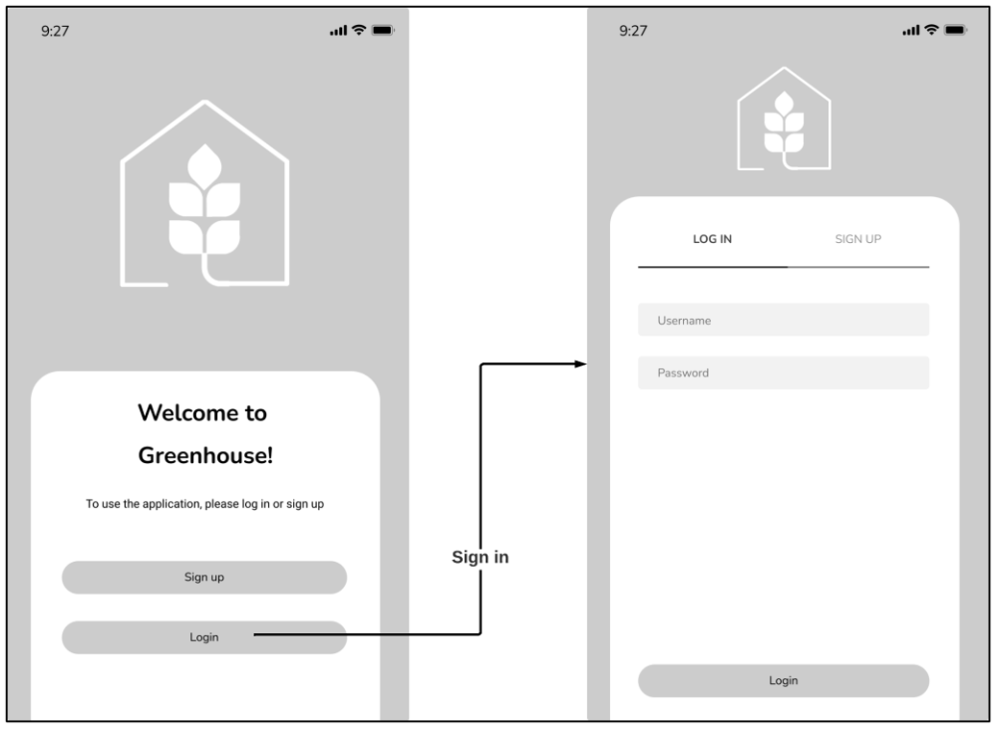

---

**User Goal:** Navegar por el menú principal  
**User persona:** Administradores  
**Explicación del flujo:**  
Una vez que el usuario inicie sesión, será redirigido al menú principal, en donde visualizará una serie de opciones. La primera opción, llamada "Crops in progress", permitirá al administrador revisar los cultivos en progreso y sus respectivos registros. La segunda, denominada "Crops Archive" redirigirá al usuario a la sección homónima, desde la cual podrá visualizar el historial de cultivos finalizados. En tercer lugar se encuentra la opción "Statistical reports", la cual mostrará reportes estadísticos de valor para el usuario, como son el estado de las naves, número de registros por cultivo en progreso, insumos utilizados dentro de los cultivos, etc. Finalmente, la sección “Recent records” permitirá al administrador visualizar con facilidad los registros realizados durante las últimas 24 horas por los técnicos supervisores.

---

**User Goal:** Iniciar un nuevo cultivo  
**User persona:** Técnicos supervisores  
**Explicación del flujo:**  
Explicación del flujo: En primer lugar el usuario debe de acceder a la sección "Crops in progress", dentro de la cual podrá encontrar una lista de registros de cultivos creados y catalogados como "En proceso". Cuando el usuario presione el botón flotante ubicado en la parte inferior de la pantalla, se desplegará un mensaje emergente que solicitará confirmar su intención de crear una nueva cosecha. En caso de ser confirmada, se redireccionará al usuario a la nueva siembra creada.

---

**User Goal:** Registrar progreso de cultivo  
**User persona:** Técnicos supervisores  
**Explicación del flujo:**  
En primer lugar, el usuario debe presionar el botón flotante situado en la parte inferior. A continuación, se redirigirá al usuario a una sección con un formulario, dentro de las cuales los usuarios podrán registrar la información necesaria. Cabe destacar que el presente flujo sienta las bases del registro de procesos en cada una de las 8 fases existentes.

---

**User Goal:** Ver registro pasado en cultivo finalizado  
**User persona:** Administradores y técnicos supervisores  
**Explicación del flujo:**  
En primer lugar, el usuario debe de presionar sobre el botón “Crops archive”, el cual está situado en el menú principal. A continuación, visualizará una lista vertical de todos los cultivos finalizados. Posteriormente, podrá presionar sobre alguno de los cultivos para revisar los registros asociados al mismo.

**User Goal:** Editar registro
**User persona:** Técnicos supervisores  
**Explicación del flujo:**  
En primer lugar, el usuario debe de presionar sobre el botón “Editar”, el cual está situado en cada tarjeta de registro. A continuación, visualizará una sección desde la cual podrá modificar la información registrada. Una vez que termine de hacer este proceso, se visualizará un dialog que indica que su solicitud fue enviada a un administrador. Para que la edición se haga efectiva, un administrador deberá aprobar la solicitud.

---

**User Goal:** Editar perfil
**User persona:** Administrador y técnicos supervisores  
**Explicación del flujo:**  
En primer lugar, el usuario debe de presionar sobre el botón “Perfil”, el cual está situado en el toolbar inferior de la aplicación. A continuación, visualizará una sección desde la cual podrá modificar la información asociada a su perfil personal. Adicionalmente, encontrará un botón que indica “Reset your password”, el cual luego de ser presionado, redirigirá al usuario a una vista desde la cual podrá cambiar su contraseña.

---

**User Goal:** Invitar a un trabajador a la empresa en Greenhouse
**User persona:** Administrador  
**Explicación del flujo:**  
En primer lugar, el usuario debe de presionar sobre el botón “Perfil”, el cual está situado en el toolbar inferior de la aplicación. A continuación, deberá de presionar sobre el botón “Company”, el cual redirigirá al usuario a una vista con los detalles de la empresa que dirige. Finalmente, en esta pantalla deberá de oprimir sobre el botón “Invite employees” para poder completar un formulario desde el cual se ingresarán las credenciales de los usuarios que serán invitados a formar parte de la empresa en “Greenhouse”.

<h3 id='5.4.3.'>5.4.3. Applications Mock-ups</h3>

Esta sección presenta los mock-ups de nuestra aplicación web y móvil, las cuales fueron diseñadas con el propósito de tener representaciones visuales de cómo se verá la interfaz de usuario una vez desarrollada. Los mock-ups se caracterizan por ser detallados, ya que incluye el diseño, agrupación de elementos, tipografía, colores, entre otros, ya definidos en el general style guidelines.

<h4 id='5.4.3.1'>5.4.3.1 Web Application Mock-ups</h4>

<b>Inicio de sesión</b>
Las siguientes imágenes evidencian los mock-ups de la sección de inicio de sesión. En estas, se muestran los campos que el usuario debe de completar para poder acceder a la empresa registrada en Greenhouse.

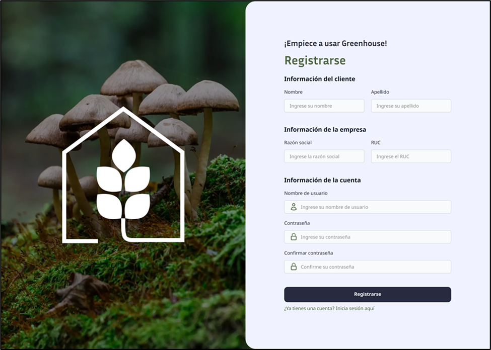

<b>Cultivos en progreso</b>
La sección cultivos en progreso es accesible desde el menú principal. En esta vista, los usuarios podrán visualizar una lista de cultivos que están actualmente activos. Adicionalmente, se observa la presencia de un botón flotante en la parte inferior, desde el cual los usuarios podrán crear un nuevo cultivo.

<b>Stepper</b>
El stepper permite a los usuarios acceder a las diversas fases que componen un cultivo. Se mostrará un círculo con borde negro en caso de que la fase haya finalizado, un número sombreado de verde para representar la fase actual del cultivo, y números con contorno ligero para indicar las fases que aún se han alcanzado.

<b>Historial de cultivos</b>
Los siguientes mock-ups representan las vistas de los cultivos archivados por los técnicos supervisores.

<b>Perfil de usuario y de empresa</b>

Finalmente, se contemplan los mock-ups del diseño para el perfil del usuario.

<h4 id='5.4.3.2'>5.4.3.2 Mobile Application Mock-ups</h4>

<b>Inicio de sesión</b>
Las siguientes imágenes evidencian los mock-ups de la sección de inicio de sesión. En estas, se muestran los campos que el usuario debe de completar para poder acceder a la empresa registrada en Greenhouse.

<b>Menú principal</b>
La imagen presentada a continuación representa la vista principal de Greenhouse. Los usuarios cuya identidad haya sido autenticada con éxito, podrán utilizar este portal para acceder a las demás funcionalidades que ofrece la aplicación.

<b>Cultivos en progreso</b>
La sección cultivos en progreso es accesible desde el menú principal. En esta vista, los usuarios podrán visualizar una lista de cultivos que están actualmente activos. Adicionalmente, se observa la presencia de un botón flotante en la parte inferior, desde el cual los usuarios podrán crear un nuevo cultivo.

<b>Filtrar por fecha</b>
Las imágenes presentadas a continuación representan el dialog que visualizará el usuario en caso desee filtrar los registros o cultivos por fecha.

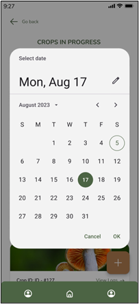

<b>Stepper</b>
El stepper permite a los usuarios acceder a las diversas fases que componen un cultivo. Se mostrará un “check” en caso de que la fase haya finalizado, un número sombreado para representar la fase actual del cultivo, y números con contorno ligero para indicar las fases que aún se han alcanzado.

<b>Información de cultivos</b>
En la siguiente imagen se evidencia una lista de los registros realizados por los usuarios para una fase determinada de un cultivo en específico. En esta vista, los usuarios tendrán la opción de presionar el botón flotante de la parte inferior derecha para crear un nuevo registro, o el de la parte inferior izquierda para finalizar la fase actual y habilitar la siguiente.

<b>Registro de información de cultivos</b>
La sección presentada a continuación es accesible mediante el botón flotante de la parte inferior izquierda mostrado en la vista anterior, o al presionar el botón de editar situado en cada tarjeta de registro. En esta sección, los técnicos supervisores podrán ingresar la información asociada a las actividades y procesos realizados en la fábrica, al igual que las condiciones actuales de los cultivos en progreso.

<b>Historial de cultivos</b>
Los siguientes mock-ups representan las vistas de los cultivos archivados por los técnicos supervisores.

<b>Perfil de usuario y de empresa, y cambio de contraseña</b>
Finalmente, se contemplan los mock-ups del diseño para el perfil del usuario técnico supervisor, además de las vistas de cambio de contraseña y de la empresa con la cual está registrado en Greenhouse.

<b>Reportes estadísticos</b>
La sección de reportes estadísticos es accesible desde el menú principal. En esta vista, los administradores podrán visualizar gráficos que evidencian el rendimiento de la fábrica en el tiempo.

<h3 id='5.4.4.'>5.4.4. Applications User Flow Diagrams</h3>

A continuación se mostrarán los user flow diagrams, los cuales permiten visualizar el recorrido completo que el usuario sigue dentro de la aplicación para alcanzar un objetivo específico (_user goal_). Desde el inicio hasta la finalización de la tarea, los _user flow diagrams_ muestran las acciones y decisiones que los usuarios toman en cada paso, así como las pantallas y funcionalidades involucradas en el proceso.

### Web Application User Flow Diagrams

Enlace para visualizar los Web Application User [Flow Diagrams](https://www.figma.com/design/wPpvosGW28c7blfOfbBo2n/Integradis---Wireframes-Greenhouse---Emergentes?node-id=1000-524&t=FlAr7jhT05KdpvtA-1)

#### **User Goal:** Crear cuenta e Iniciar sesión

**User Persona:** Administrador

**Explicación del flujo:**  
En primer lugar, los administradores deberán ingresar a la aplicación móvil. A continuación, deberán dirigirse al apartado de _Sign up_, dentro del cual se mostrará un formulario que solicitará ingresar información relevante para la creación de la cuenta, como, por ejemplo, razón social, RUC, nombre del registrante y contraseña de la cuenta. Seguidamente, se mostrarán dos botones, uno que representa la confirmación del usuario de haber leído los términos y condiciones de uso, y otro que confirma su intención de crear una cuenta. Una vez confirmada la intención de crear una cuenta, se redirigirá al usuario a la vista crops in progress donde podrá elegir una membresia.

Por otro lado, en caso de que el usuario haya creado previamente una cuenta en Greenhouse, y desee iniciar sesión, deberá completar el formulario que le solicita su usuario y contraseña. En caso de que estos sean validados, el sistema redirigirá al usuario al menú principal. Caso contrario, se mantendrá en la pestaña de inicio de sesión y se le solicitará introducir sus credenciales. En caso de que rechace cualquiera de estas dos operaciones, el usuario será redirigido a la vista inicial de bienvenida.

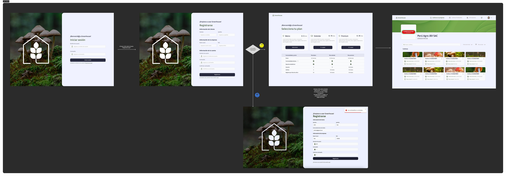

---

#### **User Goal:** Ver registros del cultivo.

**User Persona:** Administrador

**Explicación del flujo:**

En primer lugar, los administradores deberán ingresar a la aplicación web.Luego, cuando este en el home hace clic sobre un cultivo. Entonces, el sistema muestra la sección de los registros del cultivo junto con gráficos de varias características.

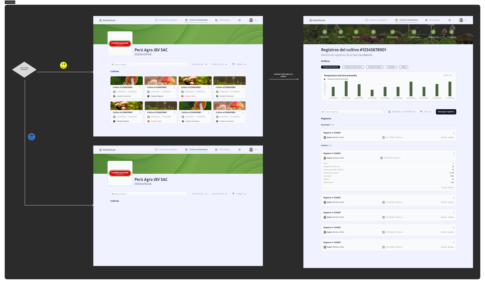

---

#### **User Goal:** Ver, editar y eliminar a un trabajador.

**User Persona:** Administrador

**Explicación del flujo:**  
Cuando el usuario observe el directorio de trabajadores y presiona el icono de acción. Se muestra al trabajador con su nombre rol y todos los permisos activados por defecto. Si se hace clic sobre el icono de editar nombre se puede editar el texto. Luego, si se hace clic en el icono de edición de rol, se puede elegir entre los roles disponibles. Finalmente, si se presiona en el botón de eliminar trabajor. Entonces, el trabajor será eliminado.

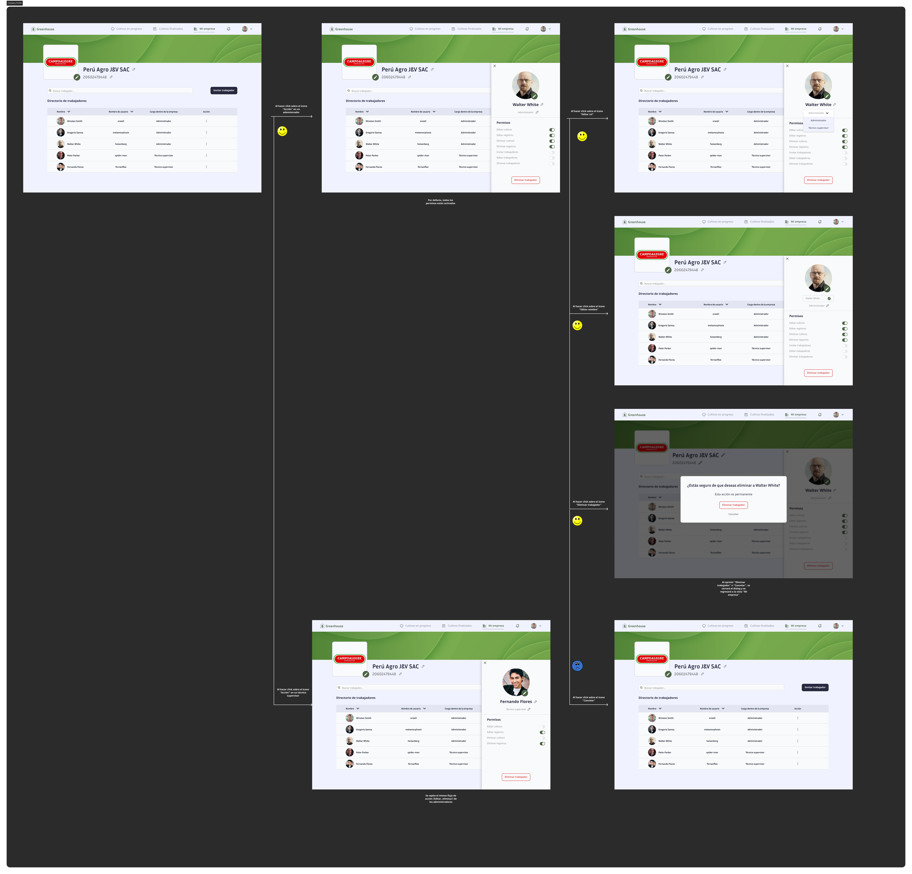

---

#### **User Goal:** Invitar a un trabajador

**User Persona:** Administrador

**Explicación del flujo:**  
En primer lugar, el usuario se encuentra observando el directorio de trabajadores. Si hace clic sobre el botón "Invitar a trabajador", aparece un formulario que solicita información del trabajador y al oprimir "Enviar invitación por correo" o "cancelar", se cerrará el dialog y se regresará a la vista mi empresa.

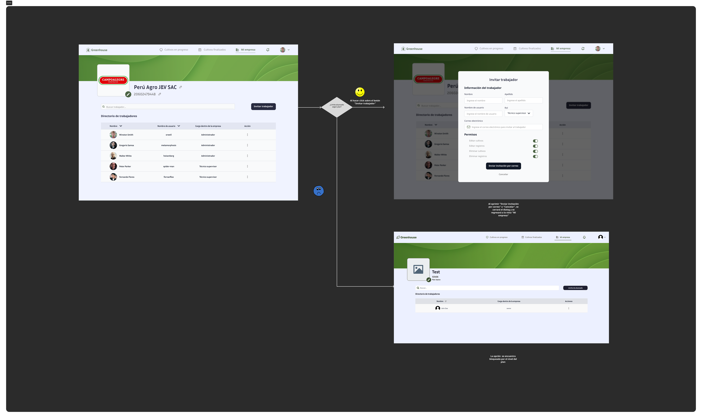

#### **User Goal:** Ver las notificaciones

**User Persona:** Administrador

**Explicación del flujo:**

En primer lugar, el usuario observa el home. En caso, haga clic en el icono de la campana se abre un apartado con todas las notificaciones para el usuario.

## Mobile Application User Flow Diagrams

Los _user flow diagrams_ son representaciones visuales del flujo que atraviesa un usuario para cumplir con un objetivo en específico dentro de la aplicación. A continuación, se presentan los user flow diagramas asociados a la aplicación móvil.

---

### User Goal: Iniciar sesión y crear cuenta

**User persona:** Administrador  
**Explicación del flujo:**  
En primer lugar, los administradores deberán ingresar a la aplicación móvil. A continuación, deberán dirigirse al apartado de "Sign up", dentro del cual se mostrará un formulario que solicitará ingresar información relevante para la creación de la cuenta, como razón social, RUC, nombre del registrante y contraseña. Luego se mostrarán dos botones: uno para confirmar que se han leído los términos y condiciones, y otro para confirmar la creación de la cuenta. Una vez confirmado, se redirige al usuario a la vista principal.

Por otro lado, si el usuario ya tiene una cuenta, debe llenar el formulario de inicio de sesión con su usuario y contraseña. Si son válidos, será redirigido al menú principal. Si no, permanecerá en la pestaña de inicio de sesión para reingresar las credenciales. Si rechaza ambas operaciones, será redirigido a la vista inicial de bienvenida.

---

### User Goal: Iniciar sesión

**User persona:** Técnico supervisor  
**Explicación del flujo:**  
El técnico supervisor debe ingresar a la aplicación móvil y completar el formulario de inicio de sesión con su usuario y contraseña. Si son validados, será dirigido al menú principal. Si no, se quedará en la pestaña de inicio de sesión para reintentar. Si se rechaza la operación, será redirigido a la vista inicial de bienvenida.

---

### User Goal: Ver y editar perfil de usuario

**User persona:** Administrador y Técnicos supervisores  
**Explicación del flujo:**  
El usuario debe presionar el botón “Perfil” ubicado en el toolbar inferior. Desde allí, podrá modificar su información personal y acceder a la opción "Reset your password", la cual lo llevará a una vista donde podrá cambiar su contraseña.

---

### User Goal: Filtrar cultivos por fecha

**User persona:** Administrador y Técnicos supervisores  
**Explicación del flujo:**  
Dado que el usuario se encuentre en la vista de cultivos en progreso o de registros de información, luego de que oprima sobre el botón de filtrado situado en la parte superior derecha de la pantalla, se mostrará un dialog con un calendario. En este último, el usuario podrá filtrar la información presentada según su fecha.

---

### User Goal: Cambiar contraseña

**User persona:** Administrador y Técnicos supervisores  
**Explicación del flujo:**  
Cuando el usuario ingrese a su perfil, desde el toolbar situado en la parte inferior de la pantalla, y oprima sobre el botón “Forgot your password?”, será redirigido a una vista desde la cual podrá llenar un formulario que le solicita ingresar la nueva contraseña y confirmar su decisión de cambio. En caso de que la acepte, será redirigido a la vista anterior. Caso contrario, sucederá lo mismo pero la operación solicitada no será procesada por el sistema.

---

### User Goal: Registrar información

**User persona:** Técnico Supervisor  
**Explicación del flujo:**  
El técnico supervisor es el encargado de registrar información de las actividades realizadas y del estado de los cultivos por medio de la aplicación Greenhouse. Para cumplir este objetivo, el técnico debe de acceder a la sección de cultivos en progreso, para luego dirigirse al stepper, elegir una fase y finalmente oprimir sobre el botón flotante situado en la esquina inferior derecha para agregar un registro. En caso de que desee eliminar información, bien sea un cultivo entero, o un registro en particular, deberá de deslizar hacia la izquierda u oprimir sobre el botón indicado. Esto abrirá una solicitud que será enviada a los administradores para su posterior confirmación.

---

### User Goal: Ver registros archivados

**User persona:** Técnico supervisor  
**Explicación del flujo:**  
En primer lugar, el técnico supervisor debe de acceder a la sección de “Crops Archive”, la cual está disponible desde la vista principal “Home”. Dentro de crops archive, el usuario deberá elegir alguno de los cultivos archivados, y tras oprimirlo, será redirigido al stepper. Dentro del stepper podrá visualizar la fecha de inicio y fin del cultivo, y las diversas fases que atravesó. Al elegir una fase en concreto, podrá visualizar todos los registros realizados en dicha etapa.

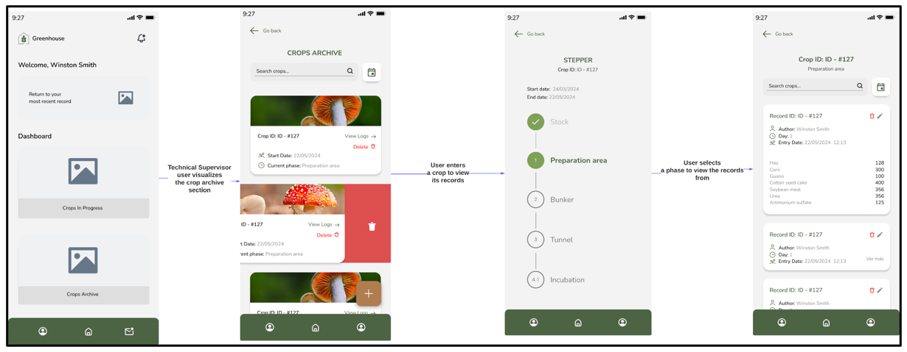

---

### User Goal: Atender solicitudes de eliminación o edición

**User persona:** Administrador  
**Explicación del flujo:**  
El administrador es el encargado de la verificación de la información ingresada a la aplicación Greenhouse. Para cumplir este objetivo el administrador realiza el siguiente flujo, el cual representa el proceso de atender las solicitudes de edición o eliminación generadas por los técnicos supervisores.

<h2 id='5.5.'>5.5. Applications Prototyping</h2>

Para poder elaborar los prototipos de la interfaz de usuario destinados a Web Browser y Mobile, se siguieron una serie de criterios fundamentales, entre ellos:

1. Claridad y Facilidad: El enfoque fue lograr que la navegación en la aplicación sea intuitiva y comprensible, con el objetivo de que los usuarios puedan comprender plenamente las funciones de la aplicación, como son el registro de procesos y la visualización de reportes estadísticos.
2. Diseño Responsive: Se ha tenido en cuenta la importancia del diseño "responsive" para garantizar que la aplicación sea compatible con una variedad de tamaños de pantalla, de tal manera que los usuarios no se vean limitados por el dispositivo que utilicen.
3. Priorización de Información Relevante: El diseño de la aplicación se enfoca en mostrar únicamente la información más importante para los usuarios pertenecientes al segmento objetivo.

<h3 id='5.5.1.'>5.5.1. Web Applications Prototyping</h3>

A continuación, se presenta la explicación del prototipo de la web app Greenhouse, la cual está destinada a los usuarios administradores de la empresa, y desde la cual podrán visualizar un resumen general de la situación de la fábrica. En la explicación se detalla el flujo que recorre el usuario y los user goals que debe alcanzar.

Enlace para acceder al video de explicación del [Web Applications Prototyping](https://upcedupe-my.sharepoint.com/:v:/g/personal/u202110223_upc_edu_pe/EQ0js7d08jxLl9IdgeJ2ahIBtXMuE6vtvdG05D4ujo_dog?e=fjomEb&nav=eyJyZWZlcnJhbEluZm8iOnsicmVmZXJyYWxBcHAiOiJTdHJlYW1XZWJBcHAiLCJyZWZlcnJhbFZpZXciOiJTaGFyZURpYWxvZy1MaW5rIiwicmVmZXJyYWxBcHBQbGF0Zm9ybSI6IldlYiIsInJlZmVycmFsTW9kZSI6InZpZXcifX0%3D)

Enlace para acceder al [Flujo](https://www.figma.com/proto/wPpvosGW28c7blfOfbBo2n/Integradis---Wireframes-Greenhouse---Emergentes?node-id=543-936&p=f&t=bO8peSzQWn0HOsZV-1&scaling=scale-down&content-scaling=fixed&page-id=115%3A172&starting-point-node-id=543%3A936)

<h3 id='5.5.2.'>5.5.2. Mobile Applications Prototyping</h3>

A continuación, se presenta la explicación del prototipo de la mobile app Greenhouse, la cual está destinada a los usuarios técnicos supervisores de la empresa, y desde la cual podrán visualizar un resumen general de la situación de la fábrica. En la explicación se detalla el flujo que recorre el usuario y los user goals que debe alcanzar.

Enlace para acceder al video de explicación del [Mobile Applications Prototyping](https://upcedupe-my.sharepoint.com/:v:/g/personal/u202110223_upc_edu_pe/EUXQQYS6xoxOvbNxm5hCWDMB5-wC85iHXVq2wzoTTVPX9A?e=YcJHc3&nav=eyJyZWZlcnJhbEluZm8iOnsicmVmZXJyYWxBcHAiOiJTdHJlYW1XZWJBcHAiLCJyZWZlcnJhbFZpZXciOiJTaGFyZURpYWxvZy1MaW5rIiwicmVmZXJyYWxBcHBQbGF0Zm9ybSI6IldlYiIsInJlZmVycmFsTW9kZSI6InZpZXcifX0%3D)

Enlace para acceder al [Flujo](https://www.figma.com/proto/wPpvosGW28c7blfOfbBo2n/Integradis---Wireframes-Greenhouse---Emergentes?node-id=543-1064&t=lyOdfgUOBGZ3p1j4-1&scaling=min-zoom&content-scaling=fixed&page-id=533%3A476)

<h1 id='6.'>6. Capítulo VI: Product Implementation, Validation & Deployment </h1>

En el presente capítulo, se presentan las configuraciones del entorno de desarrollo, despliegue, convenciones de código, etc. que permiten establecer los lineamientos de trabajo del equipo.

<h2 id='6.1.'>6.1. Software Configuration Management.</h2>

Enlace para acceder al repositorio de la [Landing Page](https://github.com/Greenhouse-IoT/landing-page)

Enlace para acceder al repositorio de la [Web App](https://github.com/Greenhouse-IoT/web-app)

Enlace para acceder al repositorio del [Server Side App](https://github.com/Greenhouse-IoT/backend)

<h3 id='6.1.1.'>6.1.1. Software Development Environment Configuration.</h3>

**Requirements Management**

1. Trello: Es una herramienta utilizada para gestionar el flujo de trabajo de proyectos principalmente basados en marcos de trabajos ágiles. Será empleado para visualizar y actualizar el estado actual de las tareas e historias de usuario pertenecientes al sprint a desarrollar. Ruta de referencia [https://trello.com/es](https://trello.com/es)

**Product UX/UI Design**

1. Figma: Plataforma de elaboración de prototipos y edición gráfica, principalmente utilizado para el diseño digital. En el caso del proyecto, será utilizado para el prototipado de la aplicación y sus versiones de Desktop y Mobile Web Browser. Ruta de referencia [https://www.figma.com/login](https://www.figma.com/login)
2. Lucidchart: Aplicación para diagramar flujos. Empleado para el diseño de wireflows, user-flows y el diagrama de clases asociado a la aplicación. Ruta de referencia [https://www.lucidchart.com/](https://www.lucidchart.com/)

**Software Testing**

1. Gherkin: Es un sistema de etiquetado utilizado para describir los criterios de aceptación de estructura de una user story. Ruta de referencia [https://cucumber.io/docs/gherkin/](https://cucumber.io/docs/gherkin/)
2. K6: Es una herramienta de código abierto diseñada para realizar pruebas de carga y pruebas de estrés en aplicaciones web modernas. Ruta de referencial: [https://k6.io/](https://k6.io/)
3. Jest: Es un framework de pruebas de JavaScript mantenido por Facebook. Se utiliza principalmente para pruebas unitarias de código JavaScript y React. Ruta de referencial: [https://jestjs.io/](https://jestjs.io/)

**Software Development**

1. Visual Studio Code: Entorno de desarrollo integrado elegido para la elaboración y compilación del código por motivos de dominio por parte de los integrantes del equipo de trabajo. Utilizar este IDE supone de valor para el desarrollo del proyecto puesto que incluye la posibilidad de agregar extensiones de utilidad, soporte de edición de texto en múltiples lenguajes de programación, disponibilidad en múltiples sistemas operativos, entre otros beneficios. Ruta de referencia [https://code.visualstudio.com/](https://code.visualstudio.com/)
2. HTML5: HyperText Markup Language, o por sus siglas HTML, es un lenguaje de etiquetado para páginas web. Será empleado en el desarrollo del proyecto para la presentación del contenido en la aplicación. Ruta de referencia [https://www.w3schools.com/html/html5_syntax.asp](https://www.w3schools.com/html/html5_syntax.asp)
3. CSS: Cascading Style Sheets es un lenguaje que maneja el diseño y presentación de las páginas web, el cual va de la mano con HTML. Ruta de referencia [https://google.github.io/styleguide/htmlcssguide.html](https://google.github.io/styleguide/htmlcssguide.html)
4. JavaScript: Es un lenguaje de programación interpretado y orientado a objetos. Se utilizará para elaborar la interfaz de usuario dentro de la aplicación. Ruta de referencia [https://developer.mozilla.org/es/docs/Web/JavaScript](https://developer.mozilla.org/es/docs/Web/JavaScript)
5. React: Es una biblioteca de JavaScript de código abierto utilizada para construir interfaces de usuario (UI) interactivas y dinámicas para aplicaciones web. Ruta de referencia [https://es.react.dev/](https://es.react.dev/)
6. NestJS: Marco de trabajo para construir aplicaciones de servidor escalables y eficientes en Node.js. Provee una arquitectura modular que permite a los desarrolladores organizar su código de manera clara y mantenible, facilitando la construcción de aplicaciones complejas. Ruta de referencia [https://nestjs.com/](https://nestjs.com/)
7. PM2: Es un administrador de procesos para aplicaciones Node.js que facilita la administración de aplicaciones en producción. PM2 permite gestionar, monitorear y mantener aplicaciones Node.js, garantizando un alto nivel de disponibilidad y rendimiento. Fuente de referencia: [https://pm2.keymetrics.io/](https://pm2.keymetrics.io/)
8. PostgreSQL: Es un sistema de gestión de bases de datos relacionales y de código abierto. Es conocido por su robustez, capacidad para manejar grandes volúmenes de datos y su soporte para características avanzadas como transacciones ACID y replicación. Ruta de referencia: [https://www.postgresql.org/](https://www.postgresql.org/)
9. Docker: Es una plataforma de software que permite la creación, el despliegue y la ejecución de aplicaciones en contenedores. Los contenedores permiten empaquetar una aplicación junto con todas sus dependencias en una unidad estándar, que la aplicación se ejecute rápidamente y de forma fiable en diferentes entornos. Ruta de referencia: [https://www.docker.com/](https://www.docker.com/)
10. Flutter: Framework open source de desarrollo de aplicaciones multiplataforma desde una única base de código. Resulta de utilidad para elaborar aplicaciones compatibles con Android e iOS. Ruta de referencia: [https://flutter.dev/](https://flutter.dev/)
11. Active MQ: ActiveMQ es un agente de mensajes de código abierto que implementa el protocolo Java Message Service (JMS). Es utilizado para la comunicación asíncrona entre aplicaciones distribuidas, facilitando la transmisión de mensajes entre clientes y servidores o entre sistemas dispares. Será empleado en el proyecto para gestionar la mensajería en tiempo real, permitiendo la publicación y suscripción a tópicos. Ruta de referencia: [https://activemq.apache.org/](https://activemq.apache.org/)
12. YOLO (You Only Look Once): YOLO es un modelo de aprendizaje profundo para la detección de objetos en tiempo real. Es conocido por su rapidez y precisión, lo que lo hace ideal para tareas de visión por computadora que requieren identificar y localizar objetos en imágenes. En este proyecto, YOLO será utilizado para analizar imágenes y determinar características específicas de cultivos o productos. Ruta de referencia: [https://github.com/ultralytics/yolov5](https://github.com/ultralytics/yolov5)
13. Firebase Storage: Firebase Storage es un servicio de almacenamiento de archivos proporcionado por Firebase, ideal para almacenar y servir contenido generado por el usuario como imágenes, videos o documentos. En este proyecto, se usará para gestionar de manera segura los archivos subidos por los usuarios desde las aplicaciones. Ruta de referencia: [https://firebase.google.com/products/storage](https://firebase.google.com/products/storage)
14. Arduino IDE: Entorno de desarrollo utilizado para programar placas compatibles con Arduino, como el ESP32. Este IDE permite la escritura, compilación y carga de código en los microcontroladores mediante un entorno sencillo y especializado, facilitando la depuración y prueba de sensores y actuadores en proyectos embebidos. Ruta de referencia: [https://www.arduino.cc/en/software](https://www.arduino.cc/en/software)

**Software Deployment**

1. Azure: Plataforma de computación en la nube para construir, probar, desplegar y administrar aplicaciones y servicios mediante el uso de sus centros de datos. Ruta de referencia [https://azure.microsoft.com/es-es/resources/cloud-computing-dictionary/what-is-azure](https://azure.microsoft.com/es-es/resources/cloud-computing-dictionary/what-is-azure)
2. Amazon Web Services: Plataforma de servicios de computación en la nube que ofrece una amplia gama de servicios para construir, desplegar y escalar aplicaciones. Incluye infraestructura como servicio (IaaS), plataforma como servicio (PaaS) y software como servicio (SaaS). Ruta de referencia: [https://aws.amazon.com/es/](https://aws.amazon.com/es/)
3. Netlify: Plataforma de alojamiento y despliegue de sitios web y aplicaciones web estáticas. Ofrece una variedad de servicios para desarrolladores web que facilitan la creación, el despliegue y la gestión de sitios estáticos. Ruta de referencia [https://www.netlify.com/](https://www.netlify.com/)
4. Nginx: Es un servidor web ligero de rendimiento alto y proxy inverso. Además de su principal servidor como web, Nginx también puede utilizarse como balanceador de carga, proxy HTTP, servidor de correo electrónico IMAP/POP3, y más. Es conocido por su capacidad para manejar grandes cargas de tráfico de manera eficiente. Ruta de referencial: [https://nginx.org/](https://nginx.org/)
5. Docker-compose: Es una herramienta que permite definir y gestionar múltiples contenedores Docker como una aplicación. Utiliza un archivo YAML para configurar los servicios de la aplicación y su entorno de red, lo que simplifica el despliegue y la gestión de las aplicaciones complejas en contenedores en Docker. Ruta de referencial: [https://docs.docker.com/compose/](https://docs.docker.com/compose/)
6. Bash: Abreviatura de "Bourne Again Shell", es un intérprete de comandos ampliamente utilizado en sistemas operativos Unix y Unix-like, como Linux. Funciona como una interfaz de línea de comandos (CLI) que permite a los usuarios interactuar con el sistema operativo mediante comandos textuales. Además de ejecutar comandos individuales, Bash es ideal para escribir scripts (archivos de comandos) que automatizan tareas repetitivas o complejas. Ruta de referencial: [https://www.gnu.org/software/bash/](https://www.gnu.org/software/bash/)
7. Github Actions: Es un servicio de integración continua y entrega continua (CI/CD) ofrecido por GitHub. Permite automatizar tareas de desarrollo como pruebas, compilación y despliegue de código directamente desde repositorios GitHub. Ruta de referencia: [https://docs.github.com/en/actions](https://docs.github.com/en/actions)
8. Amazon MQ: Amazon MQ es un servicio de agente de mensajes administrado que facilita la configuración y operación de agentes de mensajes populares como ActiveMQ o RabbitMQ. Es útil para aplicaciones que requieren mensajería confiable en sistemas distribuidos, lo que asegura la entrega de mensajes incluso en caso de fallos del sistema. Ruta de referencia: [https://aws.amazon.com/amazon-mq/](https://aws.amazon.com/amazon-mq/)
9. Route 53: Amazon Route 53 es un servicio de sistema de nombres de dominio (DNS) escalable y de alta disponibilidad diseñado para dirigir a los usuarios finales a aplicaciones de internet de manera confiable. Proporciona registro de dominios, enrutamiento de tráfico, y supervisión de salud. Será empleado en el proyecto para gestionar los nombres de dominio y garantizar un enrutamiento óptimo del tráfico. Ruta de referencia: [https://aws.amazon.com/route53/](https://aws.amazon.com/route53/)
10. Resed: Resend es una plataforma de envío de correos electrónicos transaccionales en la nube. Permite enviar correos electrónicos de manera rápida y escalable, ideal para aplicaciones que necesitan gestionar comunicaciones como notificaciones, verificaciones o mensajes automatizados. Será útil para enviar correos electrónicos en el proyecto, como alertas o confirmaciones a los usuarios de la aplicación. Ruta de referencia: [https://resend.com](https://resend.com)

**Software Documentation and Project Management**

1. Git: Herramienta de control de versiones que permite registrar y gestionar las diferentes versiones del programa. Se utilizará para mantener un historial de cambios y simplificar la corrección de errores. Los miembros del equipo accederán a través de la línea de comandos en sus sistemas locales. Ruta de referencia [https://git-scm.com/](https://git-scm.com/)
2. Github: Plataforma basada en la nube que alojará los repositorios de código del proyecto. Facilitará la colaboración en tiempo real y la revisión de contribuciones de cada miembro del equipo. Los miembros del equipo accederán a través de sus navegadores web. Ruta de referencia [https://github.com/](https://github.com/)

<h3 id='6.1.2.'>6.1.2. Source Code Management.</h3>
El proyecto seguirá las convenciones de flujo de trabajo establecidas por el modelo GitFlow para el control de versiones, utilizando GitHub como plataforma y sistema de control de versiones. A continuación, se detallará cómo se implementará GitFlow como Workflow de control de versiones, además de proporcionar los URL de los repositorios de GitHub para cada producto: Landing Page, Web Services y Frontend Web Applications.

**Repositorio de GitHub:** Enlace para acceder a la organización en GitHub Enlace para acceder al repositorio de la Landing Page Enlace para acceder al repositorio del Frontend Web Application

**Flujo de trabajo GitFlow:** El flujo de trabajo a utilizar para el desarrollo del proyecto fue el planteado por Vincent Driessen en "A successful Git branching model".

**Estructura de branches (Ramas):**

**Master branch** (Rama principal): Esta rama será considerada como la principal para la aplicación, y contendrá versiones estables y finales del desarrollo. Solo se permitirán cambios que hayan sido previamente probados y verificados en otras ramas de prueba.

**Develop branch** (Rama de desarrollo): El propósito de esta rama es llevar a cabo los avances del proyecto en equipo y de mantener los archivos centrales del desarrollo continuo.

**Feature branches** (Ramas de funcionalidad): Cada funcionalidad desarrollada por el equipo o separada del enfoque actual del desarrollo tendrá su propia rama. Una vez que una funcionalidad esté completamente trabajada, se fusionará con la rama de desarrollo del proyecto. Las convenciones para nombrar las ramas de funcionalidad seguirán un patrón descriptivo y único, por ejemplo, "feature/nombre-de-la-funcionalidad".

**Release branches** (Ramas de lanzamiento): Estas ramas se utilizarán para mantener una instancia de la rama develop que esté próxima a ser incluida en la rama principal. Se seguirá el sistema de versionamiento semántico (Semantic Versioning) para nombrar las Releases.

**Hotfix branches** (Ramas de corrección): Se crearán para abordar de manera puntual y eficiente la corrección de errores identificados en la rama principal que afecten significativamente la experiencia de los usuarios.

**Versionamiento Semántico**: Para nombrar las Releases, se aplicará el sistema de versionamiento semántico (Semantic Versioning 2.0.0).

**Convenciones de Commits**: Para los mensajes de los commits realizados, se utilizará la especificación Conventional Commits basada en Angular Commit Guidelines. La estructura a seguir será la siguiente:

git commit \-m "\<type\>\[optional scope\]:\<title\>" \-m"\<description"\>

<h3 id='6.1.3.'>6.1.3. Source Code Style Guide & Conventions.</h3>

**HTML:** Algunas de las prácticas que deben de seguirse para alcanzar un código coherente, sostenible y ordenado son las siguientes:

1. Cerrar todos los elementos HTML: Por ejemplo, \<p\>Esto es un párrafo.\</p\>
2. A pesar de que HTML permite combinar mayúsculas y minúsculas en los nombres de los elementos y atributos, se limitará al uso de minúsculas para mantener el orden y garantizar la legibilidad.
3. Utilizar comillas en caso de que los atributos contengan espacios entre sí.
4. Procurar especificar el texto alt y las dimensiones width y height de las imágenes, ya que de esta manera se facilitará la disponibilidad del contenido. Por ejemplo: \

**CSS:** Entre las prácticas empleadas se mencionan:

1. Los nombres de las clases deben de ser breves y auto descriptivos.
2. Separar los nombres de las clases y ID con un guión, por ejemplo: \#video-id y .hero-shadow{}
3. Evitar especificar la unidad de medida luego de usar el valor 0\.
4. Separar las declaraciones y selectores en nuevas líneas para agilizar la legibilidad.

**Gherkin:** Es un lenguaje de dominio específico, el cual busca solucionar un problema concreto, la comunicación entre los negocios y la parte técnica al trabajar con Behavior Driven Development, abreviado por sus siglas en inglés como BBD. En busca de una buena práctica, se ocuparon los saltos de línea para mejorar el orden de los diversos tipos de escenarios y diferenciarlos de forma más óptima. Adicionalmente, se utilizaron las palabras clave "Given", "When", "Then" y "And" para estructurar los escenarios.

<h3 id='6.1.4.'>6.1.4. Software Deployment Configuration.</h3>

**Web App:**

Para la aplicación web se realizó el despliegue mediante Netlify. Este se vincula con el repositorio de Github y a partir de allí es que se realiza un despliegue continuo a partir de la rama que se selecciona.

Como un segundo paso se tiene que realizar la creación de un archivo \_redirects dentro de la carpeta public para que este se encargue de que la navegación funcione correctamente, el contenido de dicho archivo es el siguiente:  
/\* /index.html 200

**Mobile App:**

Para Mobile App se realizó se realizará el despliegue para Android de la siguiente manera:

En la carpeta del proyecto se ingresa al terminal y se tiene que ejecutar el comando:

- flutter build apk \--release

En el cual se genera el archivo resultante en:

- Built build/app/outputs/flutter-apk/app-release.apk (28.0MB)

Luego de ello se sube el archivo a Google Drive y se genera un código QR con el enlace del archivo de Google Drive.

Se utiliza una instancia de Amazon EC2 free tier con Amazon Linux 2023\. En ella se almacenan un Dockerfile y un docker-compose.yml.

El Dockerfile es el siguiente:

\# Use the Alpine base image

FROM alpine:latest

\# Install required packages

RUN apk update && \\

    apk add \--no-cache git nodejs npm docker docker-compose

\# Initialize Git repository

RUN git init

\# Clone the application repository

RUN git clone https://github.com/re-greenhouse/backend-gh.git

\# Set working directory

WORKDIR /backend-gh

\# Checkout the desired branch

RUN git checkout feature/env

\# Install npm dependencies

RUN npm install

\# Copy the environment file

RUN cp .env.example .env

\#Update the .env file with resend api

RUN sed \-i 's/RESEND*API_KEY=.\*/RESEND_API_KEY=\*\*\_ColocarAcáElApiKey*\*\*/' .env

\# Install PM2 globally

RUN npm install pm2 \-g

\# Build the application

RUN npm run build api-gateway && \\

    npm run build iam && \\

    npm run build personas && \\

    npm run build crops && \\

    	npm run build mailing && \\

    npm run build memberships

\# Expose the ports

EXPOSE 3000

\# Start the PM2 processes using the configuration file

CMD \["pm2-runtime", "start", "pm2.config.js"\]

Básicamente se levanta todo el proyecto en una imagen de docker de alpine. Cabe destacar el archivo pm2.config.js el cuál corresponde a la configuración con la cuál se van a ejecutar los microservicios en diferentes procesos mediante PM2:

module.exports \= {

apps: \[

    {

name: "api-gateway",

script: "dist/apps/api-gateway/src/main.js",

instances: 1,

autorestart: true,

watch: false,

max_memory_restart: '1G',

env: {

    	NODE\_ENV: 'production',

    	PORT: 3000

}

    },

    {

name: "api-gateway-2",

script: "dist/apps/api-gateway/src/main.js",

instances: 1,

autorestart: true,

watch: false,

max_memory_restart: '1G',

env: {

    	NODE\_ENV: 'production',

    	PORT: 3010

}

    },

    {

name: "iam",

script: "dist/apps/iam/src/main.js",

instances: 1,

autorestart: true,

watch: false,

max_memory_restart: '1G',

env: {

    	NODE\_ENV: 'production'

}

    },

    {

name: "personas",

script: "dist/apps/personas/src/main.js",

instances: 1,

autorestart: true,

watch: false,

max_memory_restart: '1G',

env: {

    	NODE\_ENV: 'production'

}

    },

    {

name: "crops",

script: "dist/apps/crops/src/main.js",

instances: 1,

autorestart: true,

watch: false,

max_memory_restart: '1G',

env: {

    	NODE\_ENV: 'production'

}

    }

\]

};

Como se puede observar se levantan todos los microservicios y para lograr alta disponibilidad se está levantando un segundo api-gateway en un puerto diferente que más adelante veremos cómo es utilizado con Nginx.

Tras esto se tiene el archivo docker-compose.yml, en el que podemos observar que se está levantando una base de datos de postgres por cada microservicio, y además se está levantando la imagen del backend con los microservicios en monorepo y con los puertos 3000 y 3010 (correspondientes a API-Gateway expuestos), cabe destacar que para realizar la conexión a la base de datos desde los microservicios se utilizó un custom network de modo que cuando se levante el docker-compose las bd tengan una IPV4 estática y se pueda realizar la conexión satisfactoriamente:

version: "3.9"

services:

pg-iam:

    image: postgres

    restart: always

    environment:

POSTGRES_PASSWORD: pass123

    networks:

custom_network:

    	ipv4\_address: 172.16.238.10

pg-personas:

    image: postgres

    restart: always

    environment:

POSTGRES_PASSWORD: pass123

    networks:

custom_network:

    	ipv4\_address: 172.16.238.11

pg-crops:

    image: postgres

    restart: always

    environment:

POSTGRES_PASSWORD: pass123

    networks:

custom_network:

    	ipv4\_address: 172.16.238.12

pg-mailing:

    image: postgres

    restart: always

    environment:

POSTGRES_PASSWORD: pass123

    networks:

custom_network:

    	ipv4\_address: 172.16.238.13

pg-memberships:

    image: postgres

    restart: always

    ports:

\- "5436:5432"

    environment:

POSTGRES_PASSWORD: pass123

    networks:

custom_network:

    	ipv4\_address: 172.16.238.14

backend-gh:

    image: backend:latest

    restart: always

    ports:

\- "3000:3000"

    depends\_on:

\- pg-iam

\- pg-personas

\- pg-crops

\- pg-mailing

\- pg-memberships

    networks:

custom_network:

    	ipv4\_address: 172.16.238.15

backend-gh-2:

    build:

context: .

dockerfile: Dockerfile

    restart: always

    ports:

\- "3010:3000"

    depends\_on:

\- pg-iam

\- pg-personas

\- pg-crops

\- pg-mailing

\- pg-memberships

    networks:

custom_network:

    	ipv4\_address: 172.16.238.16

networks:

custom_network:

    driver: bridge

    ipam:

config:

    	\- subnet: 172.16.238.0/24

Com estos dos archivos se levantan con los siguientes comandos:

$ docker build \-t backend:latest

$ docker compose up \-d

Con ello nuestro backend estaría levantado sin embargo se decidió usar nginx para realizar un reverse proxy a la vez que un balanceador de carga y así al ejecutarse en el puerto 80 tener salida a internet desde la VM.

Para Nginx se optó descarglo en la VM en lugar del container de docker. Se ejecutaron los siguientes comandos:

$ sudo yum install nginx

$ sudo systemctl enable nginx && sudo systemctl start nginx

$ sudo nano /etc/nginx/nginx.conf

En este último se realizaron los cambios en la configuración de Nginx para que se adapte a nuestras necesidades, en este caso tener un upstream con ambos api-gateway de modo que distribuya la carga entre ambos procesos, y en caso se caiga uno siga ejecutándose en el otro. Este es la configuración que se colocó:

upstream api_gateway_upstream {

    	server 127.31.44.186:3000;

    	server 127.31.44.186:3010;

    }

    server {

    listen 80;

    listen \[::\]:80;

    server\_name ec2-18-119-14-190.us-east-2.compute.amazonaws.com;

    location / {

    	proxy\_pass http://api\_gateway\_upstream;

    	proxy\_set\_header Host $host;

    	proxy\_set\_header X-Real-IP $remote\_addr;

    	proxy\_set\_header X-Forwarded-For $proxy\_add\_x\_forwarded\_for;

    	proxy\_set\_header X-Forwarded-Proto $scheme;

    }

De este modo quedaría corriendo Ngnix como reverse proxy y mostrando desde el puerto 80 nuestro backend. Luego se ejecuta lo siguiente:

$ sudo nginx \-t

$ sudo systemctl restart nginx

Para automatizar este proceso de despliegue igualmente se realizaron scripts que actualicen el despliegue tras luego correrlos, el primero un script the bash que detiene el docker compose, luego elimina el container e imagen del backend, y vuelve a crear la imagen y correr el docker compose con la nueva imagen. Mientras que a su vez se utilizó un github actions workflow para que cuando detecté que hay un push a la branch correspondiente, se conecte al servidore y ejecute el comando update.sh.

- update.sh:

  \#\!/bin/bash

  \# Stop Docker containers

  docker-compose stop

  \# Delete the container (if it exists)

  docker rm \-f ec2-user-backend-gh-1

  docker rm \-f ec2-user-backend-gh-2-1

  \# Delete the existing Docker image (if it exists)

  docker rmi \-f backend:latest

  \# Build the Docker image

  docker build \--no-cache \-t backend:latest .

  \# Start Docker containers

  docker-compose up \-d

- Github Actions Workflow:

name: Deploy on Push

on:

push:

    branches:

\- feature/deploy \# Specify your deployment branch here

jobs:

deploy:

    runs-on: ubuntu-latest

    steps:

    \- name: Checkout code

uses: actions/checkout@v2

    \- name: Set up SSH

uses: webfactory/ssh-agent@v0.5.3

with:

    	ssh-private-key: ${{ secrets.SSH\_PRIVATE\_KEY }}

    \- name: Copy SSH key

run: |

    	mkdir \-p \~/.ssh

    	echo "${{ secrets.SSH\_PRIVATE\_KEY }}" \> \~/.ssh/gh.pem

    	chmod 600 \~/.ssh/gh.pem

    \- name: Execute update script on server

run: |

    	ssh \-o StrictHostKeyChecking=no \-i \~/.ssh/gh.pem ec2-user@ec2-18-119-14-190.us-east-2.compute.amazonaws.com 'bash \-c "/home/ec2-user/[update.sh](http://update.sh)"'

**Embedded App:**

Para el caso de la aplicación Iot embebida está será instalada mediante Arduino Ide y una conexión usb, a la cuál se le subirá el código al microcontrolador ESP32.

<h2 id='6.2.'>6.2. Landing Page, Services & Applications Implementation.</h2>
<h3 id='6.2.1.'>6.2.1. Sprint 1.</h3>

<h4 id='6.2.1.1.'>6.2.1.1. Sprint Planning 1.</h4>

<table border="1">
  <tr>
    <th>Sprint #</th>
    <td>1</td>
  </tr>
  <tr>
    <th colspan="2">Sprint Planning Background</th>
  </tr>
  <tr>
    <th>Date</th>
    <td>2025-05-05</td>
  </tr>
  <tr>
    <th>Time</th>
    <td>20:00 PM</td>
  </tr>
  <tr>
    <th>Location</th>
    <td>Reunión virtual mediante la aplicación Discord</td>
  </tr>
  <tr>
    <th>Prepared By</th>
    <td>Nicolas Espinoza</td>
  </tr>
  <tr>
    <th>Attendees (to planning meeting)</th>
    <td>Astuyauri, Jherson   Espinoza, Nicolás   Galavis, Alan   Seminario, Carlo   Soto, Andrés</td>
  </tr>
  <tr>
    <th>Sprint n – 1 Review Summary</th>
    <td>No corresponde</td>
  </tr>
  <tr>
    <th>Sprint n – 1 Retrospective Summary</th>
    <td>No corresponde</td>
  </tr>
  <tr>
    <th colspan="2">Sprint Goal & User Stories</th>
  </tr>
  <tr>
    <th>Sprint 1 Goal</th>
    <td>
Our focus is on creating a fully functional and informative landing page for the Greenhouse application.
We believe it delivers clear communication and attracts potential users by showcasing the key benefits of the platform.
This will be confirmed when visitors can access the landing page, understand the value of the application, and navigate to the sign-up page for further engagement.</td>
  </tr>
  <tr>
    <th>Sprint 1 Velocity</th>
    <td>Para este sprint, se consideró aceptar como máximo 26 story points.</td>
  </tr>
  <tr>
    <th>Sum of Story Points</th>
    <td>26</td>
  </tr>
</table>

<h4 id='6.2.1.2.'>6.2.1.2. Aspect Leaders and Collaborators.</h4>

<table border="1">
  <tr>
    <th>Team Member (Last Name, First Name)</th>
    <th>GitHub Username</th>
    <th>Diseño visual de la landing page Leader (L) / Collaborator (C)</th>
    <th>Desarrollo de la estructura de la landing page Leader (L) / Collaborator (C)</th>
    <th>Redacción del Contenido textual y descriptivo (L) / Collaborator (C)</th>
    <th>Despliegue de la landing page Leader (L) / Collaborator (C)</th>
    <th>Documentacion en el informe de la landing page Leader (L) / Collaborator (C)</th>
  </tr>
  <tr>
    <td>Astuyauri Calderon, Jherson David</td>
    <td>JHS-Sama24</td>
    <td>C</td>
    <td>C</td>
    <td>L</td>
    <td>C</td>
    <td>C</td>
  </tr>
  <tr>
    <td>Espinoza Rodríguez, Nicolás Antonio</td>
    <td>EspinozaNaer</td>
    <td>L</td>
    <td>C</td>
    <td>C</td>
    <td>C</td>
    <td>C</td>
  </tr>
    <tr>
    <td>Galavis Du Bois, Alan Enrique</td>
    <td>TrabajosUPC-AlanGalavis</td>
    <td>C</td>
    <td>L</td>
    <td>C</td>
    <td>C</td>
    <td>C</td>
  </tr>
  </tr>
    <tr>
    <td>Seminario Garbín, Carlo Luca</td>
    <td>CarloLSG</td>
    <td>C</td>
    <td>C</td>
    <td>C</td>
    <td>L</td>
    <td>C</td>
  </tr>
    </tr>
    <tr>
    <td>Soto Kong Requena, Andrés Eduardo</td>
    <td>asotito231</td>
    <td>C</td>
    <td>C</td>
    <td>C</td>
    <td>C</td>
    <td>L</td>
  </tr>
</table>

<h4 id='6.2.1.3.'>6.2.1.3. Sprint Backlog 1.</h4>

El objetivo principal del Sprint 2 fue entrenar, probar, conectar e implementar el modelo de inteligencia artificial para poder analizar las imágenes de cultivos de champiñones y de esta manera evaluar la calidad final de los cultivos.

| Sprint \# 1          |                                                                                   |               |                                                                |                                                                                                                    |                    |                   |        |
| -------------------- | --------------------------------------------------------------------------------- | ------------- | -------------------------------------------------------------- | ------------------------------------------------------------------------------------------------------------------ | ------------------ | ----------------- | ------ |
| Technical User Story |                                                                                   | WorkItem/Task |                                                                |                                                                                                                    |                    |                   |        |
| ID                   | Title                                                                             | ID            | Title                                                          | Description                                                                                                        | Estimation (Hours) | Assigned To       | Status |
| US05                 | Acceso a Datos Históricos                                                         | TK01          | Realizar vista de datos historicos                             | Generar seccion donde se van a mostrar todos los datos que hay                                                     | 1                  | Andres Soto       | Done   |
| US08                 | Iniciar sesion                                                                    | TK02          | Realizar vista de inicio de sesion                             | Generar seccion donde se va a mostrar el inicio de sesion                                                          | 1                  | Carlo Seminario   | Done   |
|                      |                                                                                   | TK03          | Realizar proceso de autenticacion                              | Desarrollar proceso de autenticacion                                                                               | 1                  | Andres Soto       | Done   |
| US09                 | Crear cuenta empresa                                                              | TK04          | Creacion de cuenta de la empresa                               | Desde la web app permitir al usuario generar su cuenta de empresa                                                  | 1                  | Carlo Seminario   | Done   |
| US10                 | Crear cuenta tecnico supervisor                                                   | TK05          | Creaion de la cuenta del tecnico supervisor                    | Permitir que solo los administradores puedan crear cuenta de tecnico supervisor para sus empleados                 | 1                  | Alan Galavis      | Done   |
| US11                 | Iniciar Nuevo Cultivo                                                             | TK06          | Realizar funcionalidad de creacion de nuevo cultivo            | Permitir que los usuarios tecnicos supervisores creen nuevos cultivos                                              | 1                  | Nicolas espinoza  | Done   |
| US12                 | Editar y Eliminar Cultivos                                                        | TK07          | Permitir que se pueda editar o eliminar cultivos               | Desde la web app o app movil permitir que los usuarios puedan modificar informacion de los cultivos o eliminarlos. | 1                  | Jherson Astuyauri | Done   |
| US13                 | Documentar registros durante la preparación, cocción y pasteurización del compost | TK08          | Documentar los registros en las ultimas fases de produccion    | Permitir que los usuarios registren informacion en las ultimas fases del desarrollo                                | 1                  | Nicolas Espinoza  | Done   |
| US14                 | Ver Listado de Cultivos en Progreso                                               | TK09          | Visualizacion de cultivos en progreso                          | Permitir a los usuarios ver los cultivos que se encuentran en progreso                                             | 1                  | Alan Galavis      | Done   |
| US15                 | Avanzar Etapa de un Cultivo                                                       | TK10          | Permitir avanzar de etapa al finalizar el registro de cultivos | Desde la app móvil permitir que el técnico avanzar de etapa postarior al llenado de registros.                     | 1                  | Jherson Astuyauri | Done   |
| US19                 | Acceder a la aplicación desde la landing page                                     | TK11          | Conectar landing con web app                                   | Desde la landing page poder ingresar a la web app.                                                                 | 1                  | Alan Galavis      | Done   |
| US20                 | Descripción de la aplicación                                                      | TK12          | Seccion de la descripcion                                      | Desde la landing page visualizar la descipcion de la aplicacion                                                    | 1                  | Andres Soto       | Done   |

<h4 id='6.2.1.4.'>6.2.1.4. Development Evidence for Sprint Review.</h4>
  
| Repository | Branch | Commit ID | Commit Message | Committed on (Date) |
| ----- | ----- | ----- | ----- | ----- |
| landing-page | main | 99c198a | feat: Add image assets | 13/05 |
| landing-page | main | 90e11b4 | feat: Add cards components | 13/05 |
| landing-page | main | 217e3bd | feat: Add layout | 13/05 |
| landing-page | main | 5f72642 | feat: Add landing page sections | 13/05 |
| landing-page | main | 6eef270 | feat: Add pages | 13/05 |
| landing-page | main | 2f529s8 | feat: Add models and interfaces | 13/05 |
| landing-page | main | f7c385 | feat: Add strings for translated content | 13/05 |
| web-app | development | 35df242 | feat: changed get crops endpoint to obtain the crop according to a company id | 06/05 |
| web-app | development | c5946ef | fix: fixed sorting of crops in progress | 07/05 |
| web-app | development | 9e30c28 | feat: added edit company component and function on service to edit the company | 07/05 |
| web-app | development | 19e64df | feature: suscription test feature | 08/05 |
| web-app | development | 71c60bd | feat: changed filter component to recieve react component | 09/05 |
| web-app | development | 5869e00 | feature: new atributes for archived crop to show quality and image added of the crop | 09/05 |
| web-app | development | 468d3bc | chore: Export to Excel now separates payload data | 10/05 |
| web-app | development | 63077bb | chore: Update filter | 10/05 |
| web-app | development | 9a733a3 | fix: Responsive issue with Dialog components | 11/05 |
| web-app | development | 3411104 | fix: Record chart empty record list case message | 11/05 |
| web-app | development | 8fc29d7 | chore: Centered stepper component | 11/05 |
| web-app | development | 42b86d4 | chore: Update chart color | 11/05 |
| web-app | development | 5d67c79 | feat: Add card animation on hover | 11/05 |
| web-app | development | eed21e8 | fix: Fix issue with trailing icon on TextField | 11/05 |
| web-app | development | 13d1b44 | chore: Fix issue with stomp protocol | 12/05 |
| web-app | development | ef7ce53 | fix: Fix delete dialog background not working | 12/05 |
| web-app | development | 9f9c228 | feat: added new type of notification | 12/05 |
| web-app | development | 73a3785 | fix: SideBar component stays fix in screen | 12/05 |
| web-app | development | c80e2e8 | feat: Add SideBar component | 12/05 |
| web-app | development | b6da1b9 | chore: Update close dialog location | 12/05 |
| web-app | development | 81b4da7 | feat: added notification functionality to receive messages from a broker | 12/05 |
| web-app | development | e4e416e | fix: Fix issue with route change on company edit | 12/05 |
| web-app | development | 1b9813e | feat: Add edit user profile | 12/05 |
| web-app | development | fe5b28c | fix: bugs | 12/05 |
| web-app | development | 0fbbee9 | feat: added membership components, services and models to make the different levels of memberships work in each company | 12/05 |

<h4 id='6.2.1.5.'>6.2.1.5. Testing Suite Evidence for Sprint Review.</h4>

En la siguiente sección se presentan los cambios en el repositorio de testing de la aplicación durante el desarrollo del presente sprint. En este repositorio se encuentran los archivos Gherkin, los cuales forman parte del enfoque BDD de la aplicación.

|       Repository       | Branch  | Commit ID |             Commit Message              | Committed on (Date) |
| :--------------------: | :-----: | :-------: | :-------------------------------------: | :-----------------: |
| Greenhouse-IoT/testing | testing |  9cdd357  |  docs: added membership .feature file   |     10/05/2025      |
| Greenhouse-IoT/testing | testing |  3163a45  | docs: added notifications .feature file |     10/05/2025      |

<h4 id='6.2.1.6.'>6.2.1.6. Execution Evidence for Sprint Review.</h4>

En esta sección se presentarán capturas de las request a los distintos endpoints de nuestros microservicios utilizando Postman:

**Auth endpoints:**

El endpoint público POST /api/v1/auth/sign-up permite que los usuarios se registren en la aplicación Greenhouse.

El endpoint público POST /api/v1/auth/sign-in permite que los usuarios inicien sesión. Si las credenciales son válidas, se retorna un token, a través del cual podrá utilizar los endpoints protegidos.

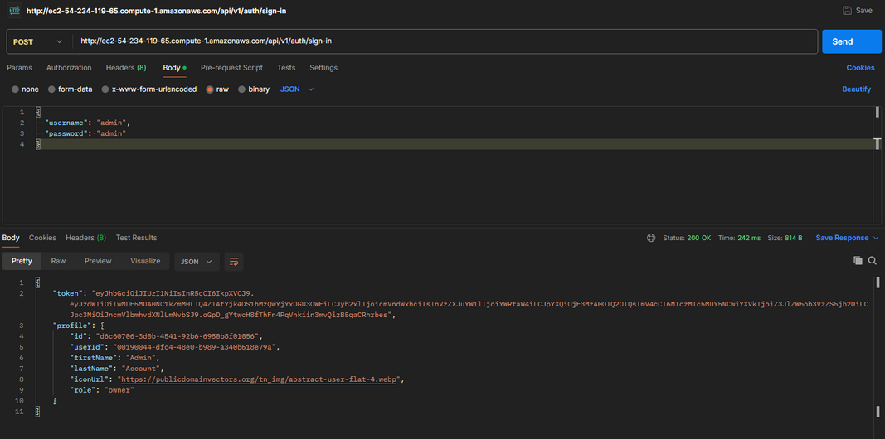

**Profiles endpoints:**

El endpoint GET /api/v1/profiles/users/me permite obtener la información asociada al perfil del usuario autenticado

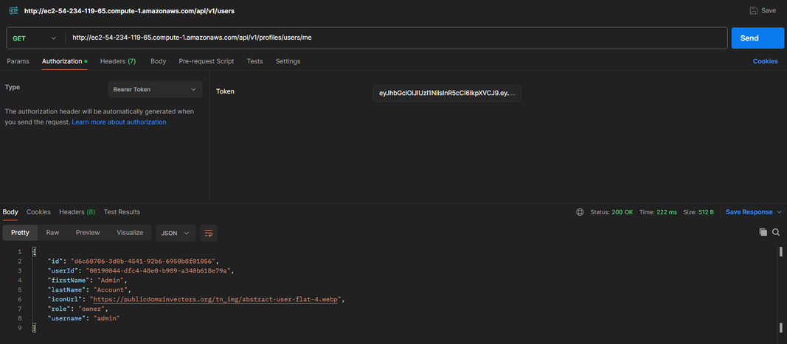

El endpoint GET /api/v1/profiles/companies/{companyId} permite obtener la información asociada a la empresa a la cual pertenece el usuario autenticado

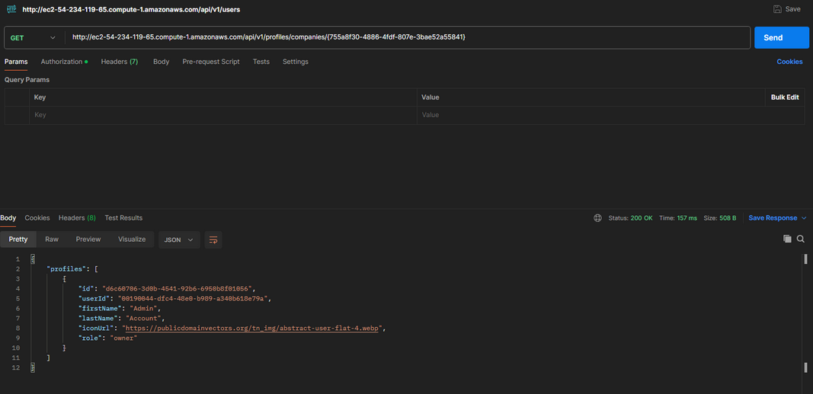

El endpoint PATCH /api/v1/profiles/{profileId} permite editar los nombres y la foto del perfil seleccionado.

**Companies endpoints:**

El endpoint POST /api/v1/companies permite registrar una empresa y vincularla al usuario autenticado.

El endpoint GET /api/v1/companies permite obtener la empresa a la cual pertenece el usuario autenticado.

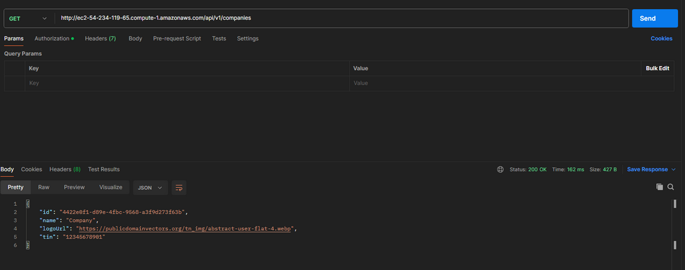

**Crops endpoints:**

El endpoint POST /api/v1/crops permite iniciar un nuevo cultivo para una empresa.

El endpoint GET /api/v1/crops/{cropId} permite recuperar un cultivo según su ID.

El endpoint PATCH /api/v1/crops/{cropId} permite actualizar la fase y el estado de un cultivo según su ID.

El endpoint DELETE /api/v1/crops/{cropId} permite eliminar los cultivos en base a su ID.

**Mail endpoints:**

El endpoint POST /api/v1/templates permite crear un template de correo electrónico a partir de un cuerpo en HTML.

El endpoint POST /api/v1/mails permite enviar correos electrónicos a partir de un template seleccionado.

<h4 id='6.2.1.7.'>6.2.1.7. Services Documentation Evidence for Sprint Review.</h4>

A continuación, se presentan los endpoints correspondientes a cada microservicio:

**IAM endpoints:**

**Personas endpoints:**

**Companies endpoints:**

**Mail endpoints:**

**Crops endpoints:**

**Records endpoints:**

<h4 id='6.2.1.8.'>6.2.1.8. Software Deployment Evidence for Sprint Review.</h4>

**Landing Page:**

Landing page deploy on netlify via Github:

Enlace al despliegue de la landing page: [https://landing-greenhouse.netlify.app/](https://landing-greenhouse.netlify.app/)

<h4 id='6.2.1.9.'>6.2.1.9. Team Collaboration Insights during Sprint.</h4>

A continuación se presentan las insights de la colaboración del equipo durante el presente Sprint 1. En este entregable, se finalizó con el desarrollo de la landing page.

**Landing Page**

| Integrante   | Funcionalidad Asignada                        |
| ------------ | --------------------------------------------- |
| Alan Galavis | Desarrollo de la landing page en su totalidad |

**Web-app**

| Integrante        | Funcionalidad Asignada                                         |
| ----------------- | -------------------------------------------------------------- |
| Andres Soto       | Desarrollo de componentes de crop in progress y crop done      |
| Carlo Seminario   | Desarrollo de vista dashboard                                  |
| Jherson Astuyauri | Desarrollo de funcionalidad de eliminacion y creacion de crops |
| Nicolas Espinoza  | Desarrollo de vista crop records                               |

<h2 id='6.2.'>6.2. Landing Page, Services & Applications Implementation.</h2>
<h3 id='6.2.1.'>6.2.1. Sprint 2.</h3>

<h4 id='6.2.2.1.'>6.2.2.1. Sprint Planning 2.</h4>

<table border="1">
  <tr>
    <th>Sprint #</th>
    <td>2</td>
  </tr>
  <tr>
    <th colspan="2">Sprint Planning Background</th>
  </tr>
  <tr>
    <th>Date</th>
    <td>2025-06-07</td>
  </tr>
  <tr>
    <th>Time</th>
    <td>20:00 PM</td>
  </tr>
  <tr>
    <th>Location</th>
    <td>Reunión virtual mediante la aplicación Discord</td>
  </tr>
  <tr>
    <th>Prepared By</th>
    <td>Nicolas Espinoza</td>
  </tr>
  <tr>
    <th>Attendees (to planning meeting)</th>
    <td>Astuyauri, Jherson   Espinoza, Nicolás   Galavis, Alan   Seminario, Carlo   Soto, Andrés</td>
  </tr>
  <tr>
    <th>Sprint 1 Review Summary</th>
    <td> </td>
  </tr>
  <tr>
    <th>Sprint 1 Retrospective Summary</th>
    <td> </td>
  </tr>
  <tr>
    <th colspan="2">Sprint Goal & User Stories</th>
  </tr>
  <tr>
    <th>Sprint 2 Goal</th>
    <td> </td>
  </tr>
  <tr>
    <th>Sprint 2 Velocity</th>
    <td>Para este sprint, se consideró aceptar como máximo N story points.</td>
  </tr>
  <tr>
    <th>Sum of Story Points</th>
    <td> N </td>
  </tr>
</table>

<h4 id='6.2.2.2.'>6.2.2.2. Aspect Leaders and Collaborators.</h4>

<table border="1">
  <tr>
    <th>Team Member (Last Name, First Name)</th>
    <th>GitHub Username</th>
    <th>Leader (L) / Collaborator (C)</th>
    <th>Leader (L) / Collaborator (C)</th>
    <th>Leader (L) / Collaborator (C)</th>
    <th>Leader (L) / Collaborator (C)</th>
    <th>Leader (L) / Collaborator (C)</th>
  </tr>
  <tr>
    <td>Astuyauri Calderon, Jherson David</td>
    <td>JHS-Sama24</td>
    <td>L</td>
    <td>C</td>
    <td>C</td>
    <td>C</td>
    <td>C</td>
  </tr>
  <tr>
    <td>Espinoza Rodríguez, Nicolás Antonio</td>
    <td>EspinozaNaer</td>
    <td>C</td>
    <td>L</td>
    <td>C</td>
    <td>C</td>
    <td>C</td>
  </tr>
    <tr>
    <td>Galavis Du Bois, Alan Enrique</td>
    <td>TrabajosUPC-AlanGalavis</td>
    <td>C</td>
    <td>C</td>
    <td>L</td>
    <td>C</td>
    <td>C</td>
  </tr>
  </tr>
    <tr>
    <td>Seminario Garbín, Carlo Luca</td>
    <td>CarloLSG</td>
    <td>C</td>
    <td>C</td>
    <td>C</td>
    <td>L</td>
    <td>C</td>
  </tr>
    </tr>
    <tr>
    <td>Soto Kong Requena, Andrés Eduardo</td>
    <td>asotito231</td>
    <td>C</td>
    <td>C</td>
    <td>C</td>
    <td>C</td>
    <td>L</td>
  </tr>
</table>

<h4 id='6.2.2.3.'>6.2.2.3. Sprint Backlog 2.</h4>

El objetivo principal del Sprint 2 fue entrenar, probar, conectar e implementar el modelo de inteligencia artificial para poder analizar las imágenes de cultivos de champiñones y de esta manera evaluar la calidad final de los cultivos.

| Sprint \# 2          |       |               |       |             |                    |             |        |
| -------------------- | ----- | ------------- | ----- | ----------- | ------------------ | ----------- | ------ |
| Technical User Story |       | WorkItem/Task |       |             |                    |             |        |
| ID                   | Title | ID            | Title | Description | Estimation (Hours) | Assigned To | Status |
|                      |       | TK01          |       |             |                    |             |        |

<h4 id='6.2.2.4.'>6.2.2.4. Development Evidence for Sprint Review.</h4>
  
| Repository | Branch | Commit ID | Commit Message | Committed on (Date) |
| ----- | ----- | ----- | ----- | ----- |
| |  |  | | |

<h4 id='6.2.2.5.'>6.2.2.5. Testing Suite Evidence for Sprint Review.</h4>

En la siguiente sección se presentan los cambios en el repositorio de testing de la aplicación durante el desarrollo del presente sprint. En este repositorio se encuentran los archivos Gherkin, los cuales forman parte del enfoque BDD de la aplicación.

|       Repository       | Branch  | Commit ID | Commit Message | Committed on (Date) |
| :--------------------: | :-----: | :-------: | :------------: | :-----------------: |
| Greenhouse-IoT/testing | testing |           |                |                     |
| Greenhouse-IoT/testing | testing |           |                |                     |

<h4 id='6.2.2.6.'>6.2.2.6. Execution Evidence for Sprint Review.</h4>

En esta sección se presentarán capturas de las request a los distintos endpoints de nuestros microservicios utilizando Postman:

**Auth endpoints:**

El endpoint público POST /api/v1/auth/sign-up permite que los usuarios se registren en la aplicación Greenhouse.

El endpoint público POST /api/v1/auth/sign-in permite que los usuarios inicien sesión. Si las credenciales son válidas, se retorna un token, a través del cual podrá utilizar los endpoints protegidos.

**Profiles endpoints:**

El endpoint GET /api/v1/profiles/users/me permite obtener la información asociada al perfil del usuario autenticado

El endpoint GET /api/v1/profiles/companies/{companyId} permite obtener la información asociada a la empresa a la cual pertenece el usuario autenticado

El endpoint PATCH /api/v1/profiles/{profileId} permite editar los nombres y la foto del perfil seleccionado.

**Companies endpoints:**

El endpoint POST /api/v1/companies permite registrar una empresa y vincularla al usuario autenticado.

El endpoint GET /api/v1/companies permite obtener la empresa a la cual pertenece el usuario autenticado.

**Crops endpoints:**

El endpoint POST /api/v1/crops permite iniciar un nuevo cultivo para una empresa.

El endpoint GET /api/v1/crops/{cropId} permite recuperar un cultivo según su ID.

El endpoint PATCH /api/v1/crops/{cropId} permite actualizar la fase y el estado de un cultivo según su ID.

El endpoint DELETE /api/v1/crops/{cropId} permite eliminar los cultivos en base a su ID.

**Mail endpoints:**

El endpoint POST /api/v1/templates permite crear un template de correo electrónico a partir de un cuerpo en HTML.

El endpoint POST /api/v1/mails permite enviar correos electrónicos a partir de un template seleccionado.

<h4 id='6.2.2.7.'>6.2.2.7. Services Documentation Evidence for Sprint Review.</h4>

A continuación, se presentan los endpoints correspondientes a cada microservicio:

**IAM endpoints:**

**Personas endpoints:**

**Companies endpoints:**

**Mail endpoints:**

**Crops endpoints:**

**Records endpoints:**

<h4 id='6.2.2.8.'>6.2.2.8. Software Deployment Evidence for Sprint Review.</h4>

**Landing Page:**

Landing page deploy on netlify via Github:

Enlace al despliegue de la landing page: [https://landing-greenhouse.netlify.app/](https://landing-greenhouse.netlify.app/)

**Web App:**

Deploy of Web App on Netlify via Github:

Environment variables on netlify:

Enlace al despliegue: [https://app-greenhouse.netlify.app](https://app-greenhouse.netlify.app)

**Backend:**

Contenedores de docker en ejecución dentro de la instancia, se evidencian las bases de datos y el backend:

Los procesos que se ejecutan dentro del contenedor de Docker correspondiente al backend donde se evidencian los microservicios.

La instancia se encuentra en ejecución:

Enlace al swagger: [https://greenhouse.integradis.shop/api](https://greenhouse.integradis.shop/api)

**Mobile App**:

Para el deployment evidence de la mobile app se tiene que ejecutar el comando:

- flutter build apk \--release

En el cual se genera el archivo resultante en:

- Built build/app/outputs/flutter-apk/app-release.apk (28.0MB)

Luego de ello se sube el archivo a Google Drive y se genera un código QR con el enlace del archivo de Google Drive

Se creó un código QR

**Message Broker:**

Se desplegó un message broker de Active MQ mediante el servicio de Amazon MQ, el cuál es utilizado para las notificaciones en tiempo real.

**Firebase Storage:**

Se utilizó firebase storage para almacenar las imágenes de los cultivos que se suban desde la aplicación para que luego se pueda acceder a estar desde la aplicación web.

**Computer Vision Model:**

El modelo de computer visión se entrenó desde ultralytics el mismo te brinda un endpoint de deploy con el cuál puedes hacer uso del modelo.

**Route 53:**

<h4 id='6.2.2.9.'>6.2.2.9. Team Collaboration Insights during Sprint.</h4>

A continuación se presentan las insights de la colaboración del equipo durante el presente Sprint 2.

**Landing Page**

| Integrante        | Funcionalidad Asignada |
| ----------------- | ---------------------- |
| Alan Galavis      |                        |
| Andres Soto       |                        |
| Carlo Seminario   |                        |
| Jherson Astuyauri |                        |
| Nicolas Espinoza  |                        |

**Web-app**

| Integrante        | Funcionalidad Asignada |
| ----------------- | ---------------------- |
| Alan Galavis      |                        |
| Andres Soto       |                        |
| Carlo Seminario   |                        |
| Jherson Astuyauri |                        |
| Nicolas Espinoza  |                        |

**Back end**

| Integrante        | Funcionalidad Asignada |
| ----------------- | ---------------------- |
| Alan Galavis      |                        |
| Andres Soto       |                        |
| Carlo Seminario   |                        |
| Jherson Astuyauri |                        |
| Nicolas Espinoza  |                        |

**Mobile-app**

| Integrante        | Funcionalidad Asignada |
| ----------------- | ---------------------- |
| Alan Galavis      |                        |
| Andres Soto       |                        |
| Carlo Seminario   |                        |
| Jherson Astuyauri |                        |
| Nicolas Espinoza  |                        |

<h1 id='conclusiones'>Conclusiones</h1>
El desarrollo de los problem statements y assumptions demostró aproximarse bastante al comportamiento de nuestros segmentos objetivos de arrendador y arrendatario. Esto se debió a un correcto análisis (previo a la realización de entrevistas) sobre cómo planteamos llevar a cabo el proceso de alquiler de bicicletas y qué es lo que esperan los ciclistas en general en base a nuestros propios conocimientos, experiencia e investigación.
Nuestras aproximaciones planteadas en el anterior punto se vieron más detalladas una vez realizado el proceso de entrevistas de validación, donde se pudo confirmar de que la redacción planteada en un inicio (de los problem statements y assumptions) estuvieron satisfactoriamente alineados a lo que se especificó con anterioridad.

Los hypotheses statements identificados en conjunto con los criterios de éxito (pertenecientes al proceso de Lean UX) tuvieron una aproximación a la realidad en las entrevistas de validación en su gran mayoría. El principal problema que se logró identificar fue que en algunos casos se plantearon hypotheses statements muy específicos que, a menos que se realicen preguntas igual de específicas, no podríamos validar. Además, en caso de realizar este tipo de preguntas, podría llegar a condicionar a nuestros entrevistados a hablar sobre un aspecto que a lo mejor no notaron, no recuerdan o desconocen al respecto. Por lo tanto, recomendamos de que para próximos trabajos se busque redactar hypothesis statements y criterios de éxito que no están tan centrados en features puntuales, sino más en cómo el usuario interactúa con las distintas aplicaciones.

Consideramos fuertemente que las etapas más importantes de todo el proceso/roadmap de los productos digitales se encuentran en realizar buenas entrevistas para conocer a nuestros segmentos objetivos y para validar nuestro producto, Así como toda la parte que corresponde al diseño de la aplicación: mockups, wireframes, diagramas de clases y base de datos, etc. Ya que, estos forman parte del core del desarrollo del informe y proyecto para la parte de documentación e implementación correspondiente.

<h1 id='referencias'>Referencias Bibliográficas</h1>
Cajo Hernandez, J. A., & Rosales Caururu, A. N. (2022). Sistema de control y gestión para los cultivos agrícolas aplicando tecnologías emergentes en el Perú. [Tesis de licenciatura, Universidad Peruana de Ciencias Aplicadas]. Repositorio Académico UPC. https://repositorioacademico.upc.edu.pe/bitstream/handle/10757/660718/Cajo_HJ.pdf?sequence=3

EmpresasRUC (2024). PACCU S A. https://empresasruc.com/empresa/paccu-s-a---20100873924

Tang, Y., & Chen, M. (2022). The impact of agricultural digitization on the high-quality development of agriculture: An empirical test based on provincial panel data. Land, 11(12), 2152. https://www.mdpi.com/2073-445X/11/12/2152

MacPherson, J., Voglhuber-Slavinsky, A., Olbrisch, M., Schöbel, P., Dönitz, E., Mouratiadou, I., & Helming, K. (2022). Future agricultural systems and the role of digitalization for achieving sustainability goals: A review. Agriculture and Human Values, 39(4), 825-837. https://link.springer.com/article/10.1007/s13593-022-00792-6

Chakraborty, A., Bhattacharjee, A., Ghadge, H. L., Mawley, D., Paulzagde, A., & Jaronde, P. (2024). A Synergistic Integration of IoT, Machine Learning, and Flutter Technology for Precise Crop Management. https://doi.org/10.1007/978-981-97-1329-5_24

Kusuma, M., Rifani, A. H., & Sugiantoro, B. (2023). Comparison analysis of Jetpack Compose and Flutter in Android-based application development using Technical Domain. In Eighth International Conference on Informatics and Computing (ICIC) (pp. 1-5). Manado, Indonesia. https://ieeexplore.ieee.org/document/10381987

Wangereka, H. (2024). Mastering Kotlin for Android 14: Build powerful Android apps from scratch using Jetpack libraries and Jetpack Compose. Packt Publishing. https://ieeexplore.ieee.org/document/10522576

<h1 id='anexos'>Anexos</h1>
